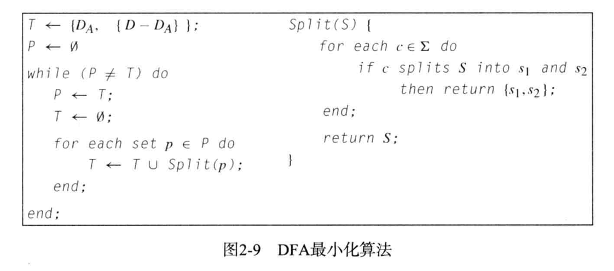

Scanning(Lexical Analysis)

<!--more-->

<style>
  .page__header .header__brand path {
    fill: rgba(255, 255, 255, .95);
  }
</style>
<br/>


# 1. Scanning Process

scanner的任务是从源代码中读取字符并且将它们组织成逻辑单元，供后续parser处理。由scanner生成的逻辑单元称为token.

Tokens是通常被定义为枚举类型的逻辑实体, 比如：

```cpp
typedef enum 
{IF, THEN, ELSE, PLUS, MINUS, NUM, ID, ...}
TokenType;
```


### Token分类

* Identifier: 用户定义的串
* Integer
* Floating point
* String
* Comment
* Keyword: if else while break
* Symbol: + * { } ++ << 


token record

```cpp
typedef struct {
  TokenType tokenval;
  char* stringval;
  int numval;
} TokenRecord;
```

or possibly as a union

```cpp
typedef struct {
  TokenType tokenval;
  union {
    char* stringval;
    int numval;
  } attribute;
} TokenRecord;
```


# 2. Regular Expression

正则表达式表示了字符串的pattern. 一个正则表达式$r$被他所匹配的字符串完全定义。这个字符串的集合叫做language generated by the regular expression并且被写作$L(r)$。

## 2.1 正则表达式的定义

正则表达式是以下的一种

* 基本正则表达式由一个字符标$\Sigma$中的单子符$a$, 以及元字符$\varepsilon$(表示空串)或元字符$\phi$(表示空集)组成。
  * $L(a)=\{a\}$
  * $L(\varepsilon)=\{\varepsilon\}$
  * $L(\phi)=\{\}$

> 注意$\{\}$不包含任何串，$\{\varepsilon\}$包含一个没有任何字符的串

* $R\vert S$格式的表达式: 其中$R,S$都是正则表达式，以下也都是。$L(R\vert S)=L(R)\cup L(S)$
* $RS$格式的表达式: $L(RS)=L(R)L(S)$ (concatenation)
* $R*$格式的表达式：$ R*=\epsilon\vert R\vert RR\vert RRR\vert RRRR\cdots$
* $(R)$格式的表达式: $L((R))=L(R)$。括号不改变语言，只会调整运算的优先级

<br>

Precedence Rules and Parentheses

$$alternation<concatenation<repetition$$


#### Example

1.$\Sigma=\{a,b,c\}$

* the set of all strings over this alphabet that contain exactly one b

$$(a\vert c)^*b(a\vert c)^*$$

<br>

2.$\Sigma=\{a,b,c\}$

* the set of all strings that contain at most one b

$$(a\vert c)^*\vert (a\vert c)^*b(a\vert c)^*$$

$$(a\vert c)^*(b\vert \epsilon)(a\vert c)^*$$

<br>

3.$\Sigma=\{a,b\}$

* the set of strings consists of a single b surrounded by the same number of a's

$S={b, aba, aabaa,,, \cdots}={a^nba^n\vert n\not=0}$

{warning:.}

This set can not be described by a regular expression. Regular expression can't count !

<br>

## 2.2 正则表达式的扩展

* $R+:$  one or more string from $L(R)$: $R(R*)$

* $R?$:  optional $R$   &emsp;$ (R\vert \epsilon)$

* **.** : "."匹配任意字符
* 字符范围
  * \[abce]: one of the lsited characters: $(a\vert b\vert c\vert e)$
  * \[a-z]: one character from this range$(a\vert b\vert \cdots\vert z)$
  * \[ ^ab]:  anything but one of the listed chars 任何非a,b的字符
  * \[ ^a-z]: one character not from this range


<br>

## 2.3 Regular Expressions for programming language tokens

1.Numbers: 自然数，消暑，带有指数的数(由E表示)

$nat=[0-9]+$

$signedNat=(+\vert -)?nat$

$number=signedNat("."nat)?(E\;signedNet)?$

<br/>

2.Reserved Words and Identifiers

$reserved=if\vert while\vert do\vert\cdots$

$letter=[a-zA-z]$

$digit=[0-9]$

标识符必须由一个字母开头且只包含字母和数2字

$identifier=letter(letter\vert digit)*$

<br/>

3.Comment

<br/>

4.Ambiguity

Ambiguity: some  strings  can  be  matched  by  several  different regular expressions.

> * An identifier or a keyword--> choose keyword
> * A single token or a sequence of several tokens--->choose single token(最长字串原理)

但是在使用最长字串原理时会出现token delimiter的问题。究竟在遇到哪些符号时，我们认为两个字符串隔开了呢？

$whitespace= (newline\vert blank\vert tab\vert comment)^+$

lookahead: buffering of input characters, marking places for backtracing

<br>

# 3. Finite Automata

* ***Transition***:  record a change from one state to another upon a match of the character or characters by which they are labeled.

* ***start state***: the recognition process begins. drawing an **unlabeled arrowed line**  to it coming "from nowhere"

* ***accepting states***: represent the end of the recognition process. drawing a <u>double-line</u> border around the state in the diagram.

$$identifier=letter(letter\vert digit)^*$$


识别`xtemp`的过程可以表示为


## 3.1 Definite of Deterministic finite automation(DFA)

### A.Definition:

A DFA M consist of 

* an alphabet $\Sigma$
* a set of states S, 
* a transition function $T:S\times\Sigma\rightarrow S$, 
* a start state $s_0\in S$
* a set of acceepting states $F\subset S$

The language accepted by $M$, written $L(M)$, is defined to be the set of string of characters $c_1c_2\cdots c_n$ with each $c_i\in \Sigma$ such that there exist states $s_1=t(s_0,c_1), s_2=t(s_1,c_2), s_n=T(s_{n-1},c_n)$ with $s_n$ is an element of F.


DFA的next state由current state和input character唯一确定


### B.Example:


## 3.2 Lookahead, backtracking and nondeterministic automata

Typical actions

1. ***making a transition***: move the character from the input string to a string (the token string value or lexeme of the token)

2. ***reaching an accepting state*** : return the token just recognized, along with any associated attributes.

3. ***reaching an error state*** : either back up in the input (backtracking) or to generate an error token.


## 3.3 NFA(nondeterministic finite automaton)

***$\varepsilon$ -transition***: transition that may occur without consulting the input string (and without consuming any characters) . It may be viewed as a "match" of the **empty string**.

> ***$\varepsilon$ -transition*** are useful in two ways:
>
> * Express a choice of alternatives in a way that **does not involve combining states**. Advantage: keeping the original automata intact and only adding a new start state to connect them.
>
> * Describe a match of the empty string explicitly.


### A. Definition

An NFA M consists of

* an alphabet $\Sigma$
* a set of states S
* a transition function $T:S\times(\Sigma \cup\{\varepsilon\})\rightarrow\wp(S)$
* a start state $s_0$ from S
* a set of accepting states A from S

The language accepted by $M$, written $L(M)$, is defined to be the set of strings of characters $c_1c_2\cdots c_n$ with each $c_i$ from $\Sigma\cup\{\varepsilon\}$ such that there exist state $s_1$ in $T(s_0,c_1)$, $s_2$ in $T(s_1,c_2)$,$\cdots$, $s_n$ in $T(s_{n-1},c_n)$ with $s_n$ an element of A

<br>

Example:


下面两个转换序列都可以接受`abb`


## 3.3 Implementation of Finite Automata in Code


```pascal
{ starting in state 1 }
if the next chatacter is a letter then
  advance the input;
  { now in state 2 }
  while the next character is a letter or a digit do
  	advance the input; { stay in state 2 }
  end while;
  { go to state 3 without advancing the input }
  accept;
else 
	{ error or other cases }
end if;
```

但是这种方法在状态和路径增加时会变得很复杂

```pascal
state := 1; {start}
while state = 1 or 2 do
	case state of
	1: case input character of
			letter: advance the input;
							state := 2;
       else state := ... {error or other};
     end case;
  2: case input chatacter of
  		letter, digit: advance the input;
     								 state := 2; {actually unnecessary}
      else state := 3;
     end case
  end case;
end while;
if state = 3 then accept else error;
```

在前面的示例中， DFA被“硬连”进代码之中，此外还有可能将 DFA表示为数据结构并写成实现来自该数据结构的行为的generic code。转换表（ transition table），或二维数组就是符合这个目标的简单数据结构，它由表示转换函数T值的状态和输入字符来索引


```pascal
state := 1;
ch := next input character;
while not Accept[state] and not error(state) do
	newstate := T[state, ch];
	if Advance[state, ch] then ch := next input char;
	state := newstate;
end while;
if Accept[state] then accept;
```


## 3.4 From Regular Expression To DFAs

### A. Algorithm process


### B. from a Regular Expression to an NFA

#### Thompson’s construction

ε-transitions: to "glue together" the machine of each piece of a regular expression to form a machine that corresponds to the whole expression.

* $rs$


* $r\vert s$


* $r*$


Example:

根据Thompson结构将正则表达式$ab\vert a$表达为NFA

首先为正则表达式$a$和$b$分别构造machine


再为$ab$构造machine


再为$ab\vert a$构造完整的NFA


### C. from an NFA to a DFA

The algorithm is called ***subset construction***:

1. the $\varepsilon$ -closure of a Set of states

the $\varepsilon$ -closure of a single state s is the set of states reachable by a series of ***zero or more $\varepsilon$-transitions.***

the $\varepsilon$ -closure of a set of states : the union of the $\varepsilon$ -closures of each individual state.

<br>

Example: regular a*


$\bar{1}=\{1,2,4\},\bar{2}=\{2\}, \bar{3}=\{2,3,4\}, \bar{4}=\{4\}$

The $\varepsilon$ -closure of a set of states : the union of the $\varepsilon$ -closures of each individual state. 

$$\bar{S}=\underset{s\in S}\cup \bar{s}$$

$\overline{\{1,3\}}=\bar{1}\cup\bar{3}=\{1,2,4\}\cup\{2,3,4\}=\{1,2,3,4\}$

<br>

2. ***subset construction***

给定一个NFA: $M$, 构造他的DFA: $\overline{M}$

*  计算$M$的初始状态的$\varepsilon$-transition closure, 这个闭包成为$\overline{M}$的初始状态。
*  给定状态集$S$和字母表中的字符a, 计算集合$S_a'$ = { t $\vert$  for some s in S there is a transition from s to t on a }. 然后计算$S_a'$ 的$\varepsilon$ -closure。这样我们就构造出了一个新状态和一个新的转换$S\stackrel{a}{\longrightarrow}\overline{S_a'}$
* 继续这个过程直到不再产生新的状态或转换。

Mark as accepting those states constructed in this manner that contain an accepting state of $M$.


| S       | S'      | $\overline{S'_a}$ | $\overline{S'_b}$ |
| ------- | ------- | ----------------- | ----------------- |
| 1       | 1,2,6   | 3,4,7,8           |                   |
| 3,4,7,8 | 3,4,7,8 |                   | 5,8               |
| 5,8     | 5,8     |                   |                   |


### D. Minimizing the number of states in a DFA

上述算法生成的DFA可能会比较复杂


对于正则表达式$a*$, 下面的DFA同样是可以的:


<br>

自动机理论中有一个很重要的结果：

对于任意给定的DFA, 都有一个含有最少量状态的等价的DFA，而且这个最小状态的DFA是唯一的。

<br>



这个算法构造出DFA状态到一个集合划分$P=\{p_1,p_2,\cdots,p_m\}$

属于同一个集合$p_i$到两个DFA状态$d_{i1},d_{i2}$, 对于所有相同的输入字符都有相同的行为

$$d_{i1}\stackrel{a}{\longrightarrow}d_x,d_{12}\stackrel{a}{\longrightarrow}d_y$$

其中$d_x,d_y$属于同一个集合$p_j$

<br>

这个算法的开始，先进行初始划分, 创建两个集合(做一个等价类的划分)

* $p_0$包含了所有的accepting states
* $p_1$包含了所有的 nonaccepting states

重复考察$p_i\in P$, 寻找$p_i$中对某个输入字符串具有不同行为的状态，改进初始划分。

划分条件为:

> * 如果要让$d_{ik},d_{is}$同时保留在$p_i$中，则对于每个输入字符$a\in\Sigma$, 二者必须产生等价的转移，即$d_{ik}\stackrel{a}{\longrightarrow}{d_x},d_{is}\stackrel{a}{\longrightarrow}d_y$, 其中$d_x,d_y\in p_j$
>
> * 如果对于$a\in\Sigma$即$d_{ik}\stackrel{a}{\longrightarrow}{d_x},d_{is}\stackrel{a}{\longrightarrow}d_y$, 其中$d_x\in p_j,d_y\notin p_j$。那么$d_{ik}$和$d_{is}$就不能在同一个划分中
> * 如果$d_{ik}$对$a$有状态转移，而$d_{is}$对$a$没有状态转移，那么$d_{ik},d_{is}$也不能在同一个状态划分中


<br>

Example:


