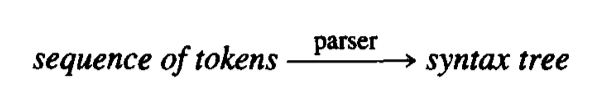

Context-Free Grammars and Parsing

<!--more-->

<style>
  .page__header .header__brand path {
    fill: rgba(255, 255, 255, .95);
  }
</style>

<br/>


语法分析器的主要任务是，确定输入程序在源语言中是否是一个语法上有效的语句。

我们既需要一种形式化的机制来规定源语言的语法，又需要一种系统化的方法，来判定输入程序是否属于这种形式化定义的语言(成员资格问题)。

通过将源语言的形式限制到一个成为上下文无关语言的语言集，我们可以确保语法分析器能够高效地回答成员资格问题。

人们已经提出许多算法来回答CFG的成员资格问题，如果recursive-descent parser等

# 1. the parsing process



`语法分析`{:.error}

{:.warning}

给出token stream s 和语法G，找到G中生成s的一个推导。

Parser可以被视为一个函数

***input***: the sequence of tokens produced by the scanner

***output***: syntax tree

```cpp
syntaxTree = parse();
```

1. The parser calls a scanner procedure such as `getToken`(e.g. `yylex`) to fetch the ***next token*** from the input. 

2. 在single-pass compiler中,  parser合并编译器中所有的其他阶段，这还包括了代码生成, 就不需要构造显式的parse tree了，就调用 parse( ) 

3. 更多情况下, compiler 是 **multi-pass** 的，syntax tree会成为之后passes的input

<br>

### structure of syntax tree

* syntax tree的结构很大程度上依赖于 <u>syntactic structure of the language</u>
* syntax tree通常被定义为动态数据结构
  * 每个节点都由一个记录组成，而这个记录的fields包括了后续编译过程需要的**attribute**

### problem

在parser中有一个比在scanner中更为复杂的问题，这就是对于错误的处理。

1. Error in the scanner

* 生成一个 error token并且consume(delete) 这个offending character.

2. Error in the parser

* 报告一个error message
* 从错误状态恢复并继续进行分析(去找到尽可能多的错误)
* 有时会parser执行 error repair

.


# 2. Context-free grammars(CFG)

## 2.1 为什么不使用正则表达式

先来考虑识别变量和运算符+-\*/构成的代数表达式的问题。我们可以将变量定义为能够匹配 $ RE[a-z]([a-z][0-9])^* $的任意字符串，我们可以定义如下表达式

$$[a-z]([a-z][0-9])^*((+\vert-\vert*\vert/)[a-z]([a-z][0-9])^*)^*$$

这个RE可以匹配 $a+b*c$和 $fee/fie*foe$, 但是RE中没有什么信息表明了运算优先级的概念，在 $a+b*c$中，到底哪个运算符首先执行呢？

为了实施其他的求值顺序规则，标准的代数表示法中包含了括号

把括号添加到RE中的适当位置有点棘手。实际上，我们无法写出一个RE，来匹配括号左右平衡的所有表达式。(成对结构，如begin和end或者then和else)。这是RE的一个固有的限制

为了描述程序设计语言语法，我们需要一种比正则表达式更强大的符号表示法。传统的解决方案是使用上下文无关语法。

<br>

## 2.2 Specification of CFG

正则表达式是上下文无关文法的子集

* A  context-free  grammar  is  a  specification  for  the syntactic structure of a programming language. 

* A context-free grammar involves recursive rules.

$ exp\rightarrow exp\;op\;exp\vert (exp)\vert number$

$op\rightarrow+\vert-\vert*$

<br>

`definition`{:.warning}

A Context-Free Grammar is a 4-tuple $(V,\Sigma,S,\rightarrow)$

* V is a finite set of <u>nonterminal</u> symbols
* $\Sigma$ is a finite set of <u>terminal</u> symbols
* $S\in V$ is a distinguished <u>nonterminal</u>, the start symbol
* $\rightarrow\subseteq V\times(V\cup\Sigma)^*$ is a finite relation, the productions

<br>

## 2.3 Derivations and the Language Defined by a Grammar

### A. Derivations

Grammar: Let $G=(V,\Sigma,S,\rightarrow)$ be a CFG. The directly derives relation $\Rightarrow$ is defined as $\{(\alpha A\gamma, \alpha\beta\gamma)\vert A\rightarrow \beta\}$


推导就是用规则不断替换产生式的过程。如果符号全部是终结符，那么推导结束。

请注意，推导步骤使用了与文法规则中的箭头元符号$\rightarrow$不同的箭头$\Rightarrow$

$$L(G)=\{s\vert exp\Rightarrow^* s\}$$

* G代表表达式文法
* s 代表任意的string of token symbols(sometime called a sentence)。由终结符组成的串叫做sentence
* $\Rightarrow^*$表示推导任意多次
* $L(G)$表示文法能产生的串的集合，即文法所能表达的语言

<br>

* ***the start symbol***: the most general structure is listed first in the grammar rules.

*  ***nonterminals*** (struct names): 他们在derivation中必须被进一步替换

* ***terminals***: 在字母表中的符号叫做terminals, 因为他们终止了一个derivation。Terminals通常是编译应用程序中的tokens.

<br>

> Example: Consider the following extremely simplified grammar of statements:
>
> $Statement\rightarrow if-stmt\vert\textbf{other}$
>
> $if-stmt\rightarrow \textbf{if}\; (exp)\; statement \vert\textbf{if}\;(exp)\;statement\;\textbf{else}\;statement$
>
> $exp\rightarrow 0 1$

### Recursion

`definition`{:.warning}

The grammar rule $A\rightarrow A\;a\vert a$ [left recursion]or the grammar rule $A\rightarrow a\; A\vert a$[right recursion]


我们想要 $\{a^n\vert n\; an\; integer\geq 1\}$  这样一个语言

**Left recurisive**: the nonterminal A appears as the first symbol on the right-hand side of the rule defining A.

**Right recurisive**: the nonterminal A appears as the last symbol on the right-hand side of the rule defining A

<br>

Example: 考虑下面的文法规则

$$A\rightarrow A\;\alpha\vert\beta$$  (left recursisve)

这里$\alpha,\beta$代表任意串，并且$\beta$不以A开头

这条规则可以产生 $\beta, \beta\alpha,\beta\alpha\alpha,\cdots\Rightarrow \beta\alpha^*$

$A\rightarrow \alpha\;A\vert\beta$  (right recursive)

可以产生 $\beta,\alpha\beta,\alpha\alpha\beta,\cdots\Rightarrow\alpha^*\beta$

### epsilon production

如果要编写生成与正则表达式 a*相同语言的文法， 则文法规则必须有一个用于生成空串的的表示法(因为正则表达式 a *匹配空串)。可以用$\varepsilon$元符号表示空串

$$empty\rightarrow\epsilon$$

这样的文法规则叫做 $\epsilon-$proguction. 生成含有空串的文法至少有一个$\epsilon-$production.

<br>

现在可以将一个与正则表达式a*相等的文法写作

$$A\rightarrow A\;a\vert\epsilon\;\;or\;\; A\rightarrow a\;A\vert\epsilon$$

两者都可以生成语言 $\{a^n\vert n\;an\;integer\geq0\}=L(a^*) $

> Example: 
>
> $Statement\rightarrow if-stmt\vert\textbf{other}$
>
> $if-stmt\rightarrow \textbf{if}\; (exp)\; statement\; else-part$
>
> $else-part\rightarrow \textbf{else}\;statement\vert\epsilon$
>
> $exp\rightarrow 0\vert 1 $
>
> the $\epsilon-$production indicates that the structure else-part is **optional**

<br>

> Example: $A\rightarrow (A)A\vert\epsilon$
>
> This grammar generates the strings fo all **balanced parentheses**.
>
> (() (())) ()
>
> $A\Rightarrow (A)A\Rightarrow (A)(A)A\Rightarrow (A)(A)\Rightarrow (A)()\Rightarrow ((A)A)()$
>
> $\Rightarrow (()A)()\Rightarrow (()(A)A)()\Rightarrow (()(A))()\Rightarrow (()((A)A))()\Rightarrow (()(()A))()\Rightarrow (()(()))() $
>
> 这个不能用正则表达式表示，因为它没有计数功能

<br>

> Example: Consider the following grammar G for a sequence of statements:
>
> &emsp; $stmt-sequence\rightarrow stmt;\;stmt-sequence\vert stmt$
>
> &emsp;$stmt\rightarrow s$
>
> This grammat generates sequences of one or more statements separated by semicolons
>
> $$L(G)=\{s,s;s,s;s;s,\cdots\}$$
>
> {:.warning}
>
>  semicolon ":" is statement separator
>
> If we want to allow statement sequences to also be empty, we could write the following grammar G'
>
> &emsp; $stmt-sequence\rightarrow stmt;stmt-sequence\vert\epsilon$
>
> &emsp;$stmt\rightarrow s$
>
> $$L(G')=\{\epsilon,s;, s;s;, s;s;s;, \cdots\}$$
>
> {:.warning}
>
> semicolon ":" is statement terminator
>
> <br>
>
> Allow statement sequences to be empty, but retain the semicolon as a statement separator
>
> &emsp; $stmt-sequence\rightarrow nonempty-stmt-sequence\vert\epsilon$
>
> &emsp;$nonempty-stmt-sequence\rightarrow stmt;nonempty-stmt-sequence\vert stmt$
>
> &emsp;$stmt\rightarrow s$

# 3. Parse trees and abstract syntax trees

Derivation为构造来自一个初始的非终结符的特定终结符的串提供了一个办法，但是derivation并未唯 一地表示出它们所构造的结构。总而言之，对于同一个串可有多个derivations

## A. Parse trees

与derivation相对应的分析树parse tree是一个作了标记的树

* The interior nodes are labeled by <u>nonterminals</u>
* The leaf nodes are labeled by <u>terminals</u>
* 每个内部节点的子节点都表示推导的一个步骤中的相关非终结符的替换


It  is  possible  to  distinguish  particular  derivations  that  are uniquely associated with the parse tree. 给每一个节点编上号

* A  left most  derivation:  a  derivation  in  which  the  leftmost nonterminal is replaced at each step in the derivation.
  * Corresponds to the **preorder** numbering of the internal nodes of its associated parse tree.

* A rightmost derivation: a derivation in which the rightmost nonterminal is replaced at each step in the derivation. 
  * Corresponds to the **postorder** numbering of the internal nodes of its associated parse tree. 


## B. Abstract syntax trees

抽象语法数去掉了分析树的不必要的细节

The principle of syntax-directed translation states that the meaning,  or  semantics,  of  the  string 3+4  should  be directly related to its syntactic structure as represented by the parse tree. 

The principle of syntax-directed translation means that the parse tree should imply that the value 3 and the value 4 are to be added. 


A  much  simpler  way  to  represent  this  same information, namely, as the tree


Abstract Syntax Trees, or Syntax Trees:

1. Such trees represent abstractions of the **actual** source code token sequences, and 

the token sequences cannot be recovered from them (unlike parse trees). 

2. A parse tree is a representation for the structure of ordinary called **concrete** syntax

when comparing it to abstract syntax.

3. Abstract syntax can be given a formal definition using a BNF-like notation, just like concrete syntax. 


Example:


A set of C declarations that would be appropriate for the structure of the statements and expressions in this example  is as follows: 

```cpp
typedef enum {ExpK, stmtK} NodeKind; //结点类型，表达式，语句
typedef enum {Zero, One} ExpKind;
typedef enum {IfK, OtherK} StmtKind;
typedef struct streenode {
  NodeKind kind;
  ExpKind ekind;
  StmtKind skind;
  struct streenode *test, *thenpart, *elsepart;
} StreeNode;
typedef StreeNode* SyntaxTree;
```

<br>

> Example: 
>
> $stmt-sequence\rightarrow stmt;stmt-sequence\vert stmt$
>
> $stmt\rightarrow s$


To bind all the statement nodes in a sequence together with just one node 


The problem: a seq node may have an arbitrary number of children

Solution: use the standard leftmost-child right-sibling representation for a tree(presented in most data structures texts).


# 4. Ambiguous grammars

文法可能允许一个串有多于一个的parse tree

$exp\rightarrow exp\;op\;exp\vert(exp)\vert number$

$op\rightarrow +\vert-\vert*$

比如串$34-3*42$对应两个不同的parse tree


**An ambiguous grammar**:  a grammar that generates a string with ***more than one parse trees*** is called an ambiguous grammar. 

在某种意义上，二义性文法就像是一个非确定的自动机， 此时两个不同的路径都可接收相同的串。但是因为没有一个合适的算法指定选择哪一条路径。

<br>

解决二义性有两个基本方法：

1. 设置一个规则。规则在有歧义时指明选择哪一个分析树

这种规则称为 **disambiguating rule**

* advantage: ：它无需修改文法（可能会很复杂）就可消除二义性

* disadvantage: 给定文法之外还要给定一套规则

2. 将文法改变成一个强制正确分析树的构造的格式。(但是可读性下降)

<br>


### 设置规则

在上述例子$34-3*42$中，设置运算符优先级。乘法除法的优先级高于加法减法

那么下面的这个分析树是正确的


但是，仅这个规则不能完全除掉二义性

例如$34-3-42$也对应两棵不同的分析树


第一棵分析树表示计算$(34-3)-42=-11$, 第二棵分析树表示计算$34-(3-42)=73$. 惯例上第一种算法是正确的，因为减法是左结合的(left associative), 也就是说一个减法序列的运算时从左到右的

这里需要规定计算的结合性。我们规定所有的计算都是左结合的(left associative)

总体来说，需要规定优先级和结合性。


接下来我们考虑改造文法

### 改造文法

#### 优先级和结合性

为了处理文法中的运算优先权问题，就必须把具有相同优先权的算符归纳在一组中，并为每一 种优先权规定不同的规则

例如

$exp\rightarrow exp\; addop\; exp\vert term$

$addop\rightarrow +\vert -$

$term\rightarrow term\; mulop\; term\vert factor$

$mulop\rightarrow *$

$factor\rightarrow (exp)\vert number$

乘法被归在term规则下面，加法减法被归在exp规则下面。这样加法和减法在分析树中会处在更高的层次(更接近root), 因此优先级更低。

<br>

接下来要区分结合性。

这个问题出现的原因时运算符两边的递归都允许每一边匹配推导中的运算符重复

$$exp\rightarrow exp\;addop\;exp\vert term$$

可以发现上述式子中，addop相比于左边exp的推导式和右边的exp的推导式处于分析树更高的层次，因此优先级低于左边和右边

因此可以将

$$exp\rightarrow exp\;addop\;exp\vert term$$

替换成

$$exp\rightarrow exp\;addop\;term\vert term$$

这样，addop左边的exp优先级较高，会先计算exp中的加法减法，是左结合的

如果改成右递归$exp\rightarrow term\;addop\;exp\vert term$, 那么就是右结合的，因为右边的exp推导式优先级更高，会先计算exp中的加法减法，再进行addop的计算。


#### 悬挂else问题


