# 1. Memory Organization 

典型计算机的存储器可分为

* 寄存器区域
* 较慢的直接编址的随机访问存储器 ( RAM )。 
  * RAM区域还可再分为代码区和数据区。 在绝大多数的语言中， 执行时不可能改变代码区， 且在概念上可将代码和数据区看作是**独立**的。另外由于代码区在执行之前是固定，所以在编译时所有代码的地址都是可计算的

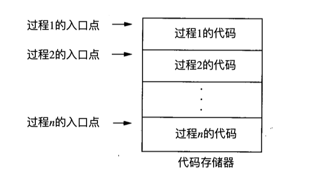

### The general organization of runtime storage

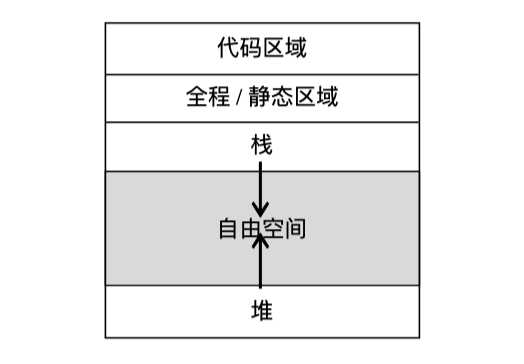

* 生成的目标代码的大小在编译时刻就已经固定下来了，因此编译器可以将可执行目标代码防在一个静态确定的区域: 代码区。 这个区通常位于存储的低端。(上面是低)
* 程序的某些数据对象的大小在编译时刻知道，他们可以被放置在另一个称为静态区的区域中，该区域可以被静态确定。防止在这个区域的数据对象包括全局变量和编译器产生的数据，比如用于支持垃圾回收的信息。
  * 之所以要将尽可能多的对象进行静态分配，是因为这些对象的地址可以被编译到目标代码中。
* stack和heap防在剩余空间的相对两端，是动态的。stack用来存放**活动记录**， 这些活动记录在函数调用的过程中生成。

#### 静态和动态存储分配

静态表示编译时刻，动态表示运行时刻。

* 如果编译器只需要观察程序文本就可以做出存储分配决定，不需要观察程序在运行时做了什么，我们就认为这个存储分配决定是静态的。
* 如果只有在程序运行时才能做出决定，那么这个决定是动态的

编译器基本使用以下两种策略的某种组合来进行动态存储分配：

1. 栈式存储：一个过程的局部名字在栈中分配空间。这种栈支持过程的call/return policy
2. 堆存储：有些数据的生命周期要比创造它的某次过程调用更长，这些数据通常被分配在一个可复用存储的堆中。堆事虚拟内存的一个区域，他允许对象或其他数据元素在创建时获得存储空间，并在数据变得无效时释放该存储空间。为了支持堆堆管理，需要垃圾回收机制来检测出无用的数据元素


# 2. Stack Allocation of Space


有些语言使用procedures, functions, or methods作为 user-defined actions的单元。几乎所有针对这些语言的编译器都把他们的run-time memory按照一个stack进行管理。

* 当一个过程(函数，过程，方法，子例程的总称)被调用时，用于存放该过程的局部变量被压栈。

* 当这个过程结束时，空间被弹出栈

## 2.1 活动树

栈式分配的一个前提是过程调用在时间上是嵌套的。不是嵌套的话，就不行了。

如果过程p的一个活动调用了过程q, 那么q的该次活动必定在p的活动结束之前结束。有是那种常见的情况

1. q的该次活动正常结束，那么控制流从p中调用q的点之后继续。
2. q的该次活动直接或间接的中止，那么q和p同时结束
3. q的该次活动因为q不能处理的某个异常结束。
   * 过程p可能会处理这个异常，此时q的活动结束而p的活动继续执行，p不一定从调用q的点开始。
   * 如果p不能处理这个异常，那么p和q的活动一起结束

我们可以用一棵树来表示在整个程序运行期间的所有过程的活动，这棵树称为活动树(activation tree)。树中每个节点对应一个活动，根节点是main过程的活动。

在表示过程p的某个活动的节点上，他的子节点对应于被p的这次活动调用的各个过程的活动。我们按照调用顺序，自左向右显示他们。

注意：一个子节点必须在其有兄弟节点的活动开始之前结束

<br>

我们来看一个quicksort的例子

```cpp
int a[11];
//将9个整数读入a[1],...,a[9]
void readArray() {
  int i;
  ...
}

int partition(int m, int n) {
  
}

void quicksort(int m, int n) {
  int i;
  if(n > m) {
    i = partition(m, n);
    quicksort(m, i - 1);
    quicksort(i + 1, n);
  }
}
int main() {
  readArray();
  a[0] = -9999;
  a[10] = 9999;
  quicksort(1, 9);
}
```

main中有三个任务

* 调用readArray
* 设定上下限
* 调用quicksort

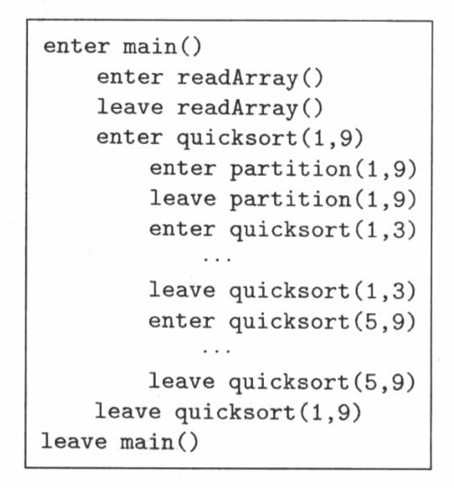

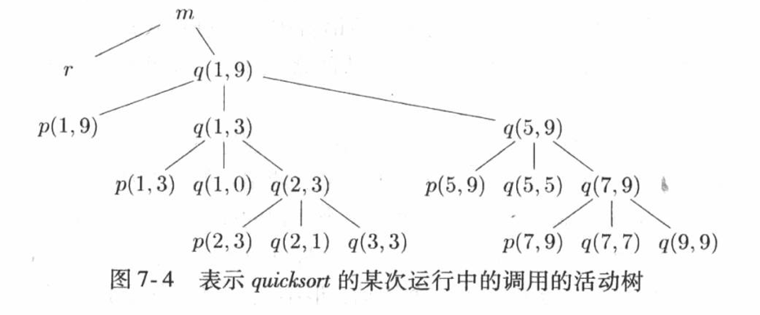

* 过程调用的序列和活动树的前序遍历对应
* 过程返回的序列和活动树的后序遍历对应


## 2.2 activation record

Procedure calls and returns通常由称为control stack的run-time  stack进行管理。

每个活跃的活动都有一个位于这个control stack的activation record。

活动树的根位于栈底，程序控制所在的活动记录位于栈顶。栈中全部活动记录的序列对应于在活动树中到大当前控制所在的活动节点的路径。


#### 活动记录中可能的内容有

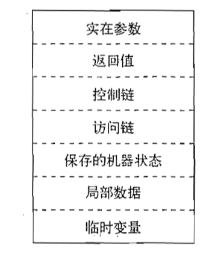

上面是栈底，下面是栈顶

* 临时值。比如点那个表达式求值过程中产生的中间结果无法存放在寄存器中时，就会生成这些临时值。
* 局部数据。对应于这个活动记录过程的局部变量
* 保存的机器状态。通常包含返回地址(PC的值)和寄存器的一些内容
* 访问链。当被调用过程需要另一个活动记录的数据时需要使用访问链进行定位。
* 控制链。指向**调用者**的活动记录

* 返回值。当被调用的函数有返回值时，要有一个用于存放这个返回值的空间。不是所有的调用过程都有返回值。即使有，我们也倾向于将返回值放到一个寄存器中提高效率
* 实在参数(actual parameter)。这些值通常尽可能放在寄存器中，而不是活动记录中。但是为了活动记录的通用性，我们仍然为他们预留了空间。


Example:

还是quicksort的例子。假设栈顶在下方


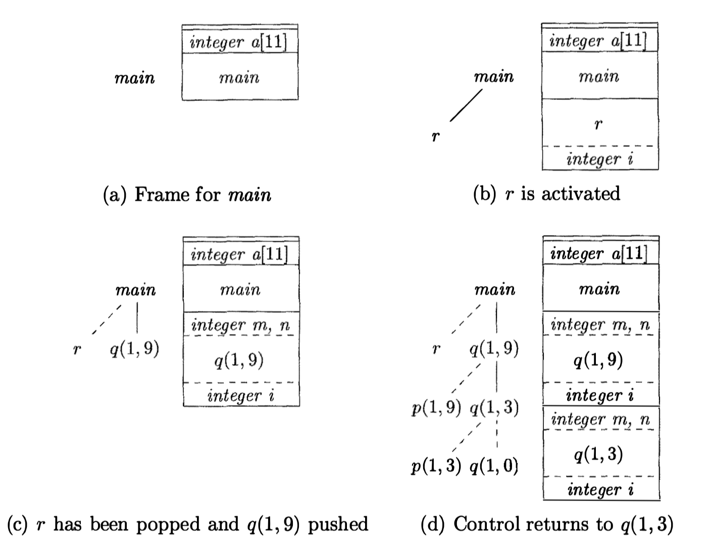


## 2.3 calling sequence

calling sequence时用来实现procedure call的代码段。他为一个活动记录在栈中分配空间，并在此记录的字段中填写信息

return sequence时一段类似的代码。他回复机器状态，使得调用过程能够在调用结束之后继续执行。

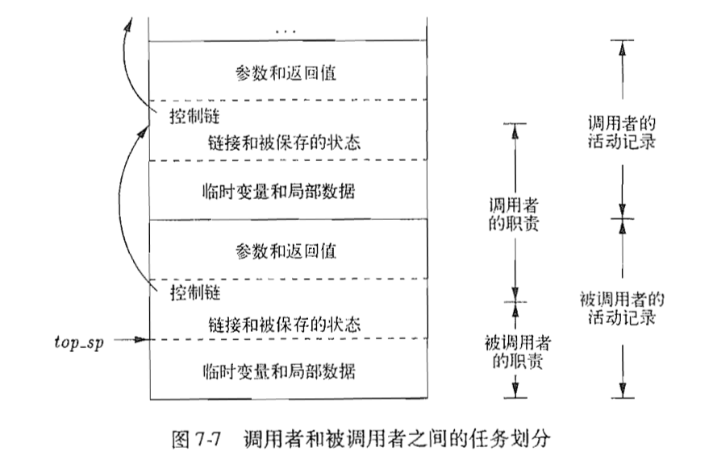

一个calling sequence中的代码通常被分割到调用者和被调用者中。如何分割？

如果一个过程在n个不同点上被调用，分配给调用者的那部分calling sequence会被生成n次，而分配给调用者的部分只被生成一次。因此期望把calling sequence尽可能多的放到被调用者中。


## 2.4 栈中的变长数据

过程p有三个局部数组，他们的大小无法在编译时刻确定。

这些数组的存储出现在栈中，但是他们不是p的活动记录的一部分。p的活动记录里只有指向各个数组开始位置的指针。

过程p还调用了构成q。q的活动记录从p的数组之后开始。

对栈中数组的访问通过指针`top`和`top_sp`完成。

* `top`: 标记了实际的栈顶位置，他指向下一个活动记录将开始的位置
* `top_sp`：用来找到顶层活动记录的局部的定长字段。假定`top_sp`指向机器状态字段的末端。

重置`top`和`top_sp`所指位置的代码可以在编译时刻生成。这些代码根据在运行时刻获知的记录大小来计算`top`和`top_sp`的新值。当q返回时，可以根据q的活动记录中的被保存的control link来恢复`top_sp`。 `top`的新值等于原来的`top_sp`的值减去q的活动记录中机器状态，control link, access link, 返回值，参数字段的总长度。这个总长度可以在编译时刻知道。

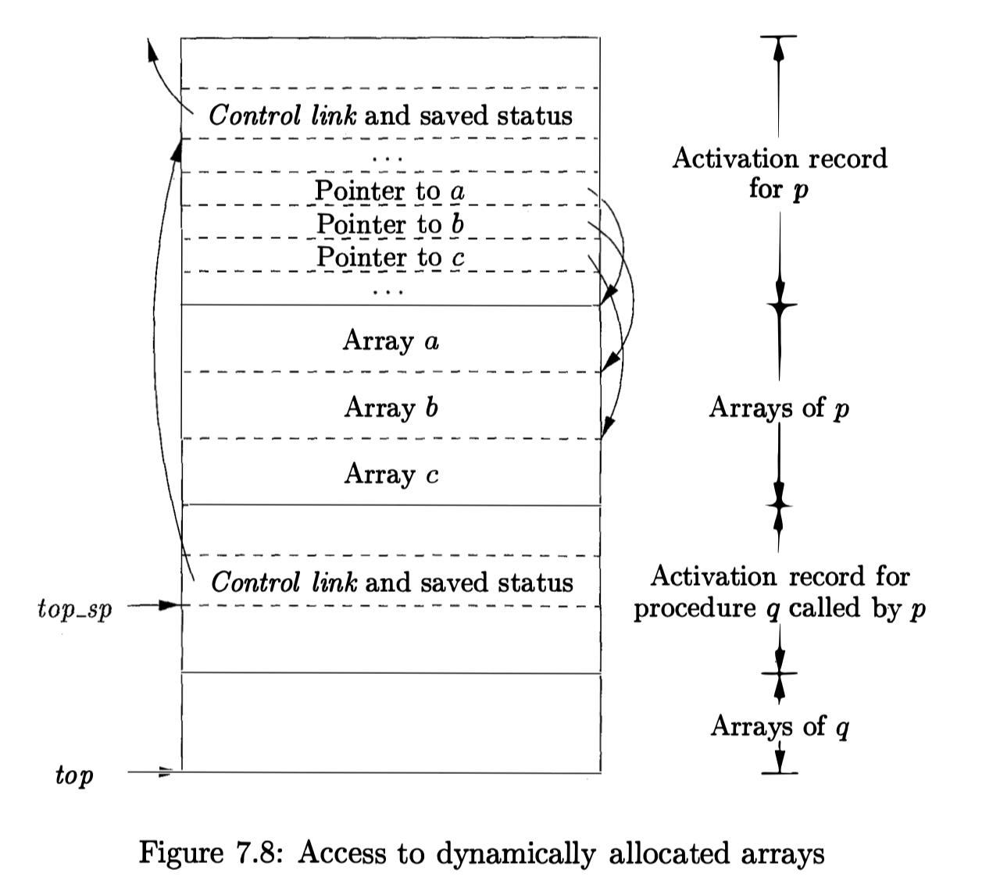


# 3. 栈中非局部数据的访问

## 3.1 没有嵌套过程的数据访问

C系列语言中，各个变量要么

* 在某个函数内定义
* 要么在所有函数之外(全局)定义。

对于不允许声明嵌套过程的语言，变量的存储分配和访问

* 全局变量被分配在静态区。这些变量的位置保持不变，编译时可知。
* 其他变量一定是栈顶活动的局部变量，可以通过运行时刻栈的`top_sp`来访问

<br>

An important benefit of static allocation for globals is that declared procedures may be passed as parameters or returned as results.


## 3.2 和嵌套过程相关的问题


如果有嵌套，一个过程能够访问能一个过程的变量，只要被访问变量所属的过程的声明包含了访问过程的声明即可。

`definition`{:.error}

嵌套深度：如果不内嵌在其他过程中的过程，其嵌套深度为1。一个在嵌套深度为i的过程中定义的过程p, p的嵌套深度为i+1

```lisp
fun sort(inputFile, outputFile) = 
	let
		val a = array(11, 0);
		fun readArray(inputFile) = ...
			... a ...;
		fun exchange(i, j) = 
			... a ...;
		fun quicksort(m, n) = 
			let 
				val v = ... ;
				fun partition(y, z) =
					... a ... v ... exchange ...
			in
				... a ... v ... partition ... quicksort
			end
	in
		... a ... readArray ... quicksort ...
end;
```

在sort中声明的函数有

* readArray(嵌套深度2)
* exchange(嵌套深度2)
* quicksort(嵌套深度2)
  * partition(嵌套深度3)

readArray和exchange都访问了数组a

在quicksort中定义了局部变量v(数组分割值), 并给出了partition的定义。

partition访问了数组a以及数组分割值v, 并且调用了函数exchange


## 3.3 access link

在每个AR中增加一个access link指针。如果过程p在源代码中直接嵌套在过程q中，那么p的任何活动access link都指向最近的q的活动。q的嵌套深度比p的嵌套深度恰好少1.

access link形成了一条链路，他从栈顶活动记录开始，经过嵌套深度逐步递减的活动的序列。沿着这条链路找到的活动就是其数据和对应过程可以被当前正在运行的过程访问的所有活动。

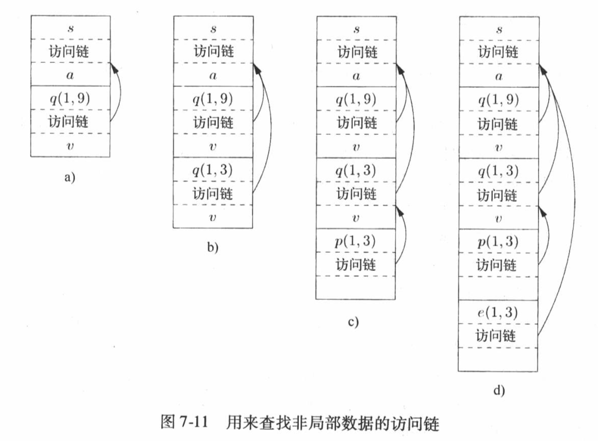

* (a) sort调用readArray()将输入加载到数组a上，结束后调用了quicksort(1, 9)对数组进行排序。
  * quicksort(1,9) 中的access link指向sort的AR, 因为sort是quicksort外围的离他最近的嵌套quicksort的函数。
* (b),(c) 对quicksort(1,3)的一次递归调用，然后调用partition, partition又调用exchange
  * quicksort(1,3)的access link指向sort, 这和quicksort(1,9)指向sort的理由相同
  * partition(1,3)的access link指向quicksort(1,3)。因为partition函数被嵌套在quicksort中，而quicksort(1,3)离partition(1,3)最近

* (d) partition(1,3)调用了exhange(1,3)
  * exchange(1,3)的access link指向sort(), 因为exchange直接嵌套在sort()中。这样很合理，因为exchange需要访问的外部元素只有数组a.


## 3.4 处理access link

两种情况

* 一个过程调用另一个过程，而被调用过程的名字在此次调用中明确给出
* 调用的对戏那个是一个过程型参数，要在运行时刻才能知道被调用的是那个过程

### 3.4.1 case 1: 过程q显式调用过程p

#### A. 过程p的嵌套深度>过程q的嵌套深度

可以确定：p一定是直接在q中定义的

否则，q是无法直接调用p的

因此

* p的嵌套深度=q的嵌套深度+1;
* p的access link一定指向q

所以，只需要在calling sequence中增加一个步骤，也就是在p的access link中放置一个指向q的AR的指针。

例子：sort调用quicksort, quicksort调用partition


#### B. 递归调用 p=q

新的AR的access link和他下面AR的access link是相同的。

例如quicksort(1,9)调用quicksort(1,3)


#### C. p的嵌套深度$n_p$<q的嵌套深度$n_q$

为了让q的调用处理p作用域的内容，过程q必定嵌套在r的某个过程中，而p是一个直接在r中定义的过程

所以，从q的活动记录开始，沿着access link经过$n_q-n_p+1$步就可以找到栈中最高的r的活动记录。p的access link必须指向r的这个活动记录

如上图(d)中partition(1,3)调用exchange(1,3)


### 3.4.2 case2 过程型参数

当一个过程p作为参数传递给了另一个过程q, 并且q随后调用了这个参数。

当过程被用作参数的时候，调用者除了传递过程参数的名字，同时害需要传递这个参数对应的正确的access link

使用3.4.1的case1来确定access link

```lisp
fun a(x) = 
	let 
		fun b(f) = 
			... f ...;
		fun c(y) = 
			let
				fun d(z) = ...
			in
				... b(d) ...
			end
	in
		... c(1) ...
	end;
```


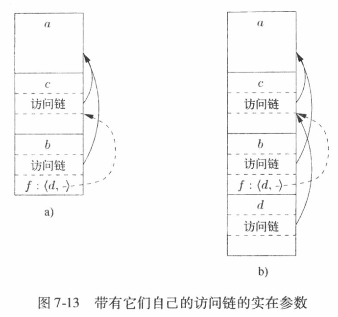


## 3.5 显示表(display)

使用access link, 如果嵌套深度变大，我们就必须沿着一段很长的访问链路才能找到需要的数据。

一个更高效的实现方式是使用一个称为显示表的辅助数组d, 他为每个嵌套深度保存了一个指针。

我们设法在任何时刻，指针d[i]都指向栈中最高的对应于某个嵌套深度为i的过程的活动记录。

如下图

* d[1]保存了一个指向sort的活动记录的指针，该活动记录是嵌套深度为1的函数中最高的活动记录(下边是栈底)

* d[2]保存了指向exchange的活动记录的指针，该记录是嵌套深度为2的最高活动记录
* d[3]指向partition, 是嵌套深度为3的最高活动记录

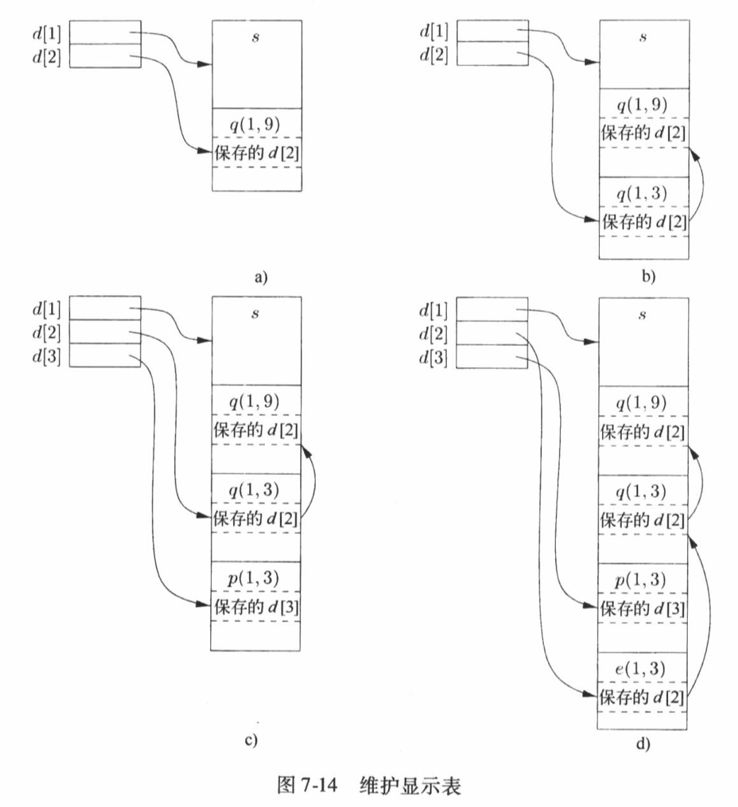

这样的优势在于，如果过程p正在运行，并且他需要某个嵌套深度为i的过程q的元素x, 那么只需要查看d[i]就可以了。我们沿着d[i]找到q的活动记录，根据偏移量就可以找到x


# 4. 堆管理

堆用来存储

* 生命周期不确定数据
* 生存到被程序显示删除位置的数据

## 4.1 存储管理器

存储管理器跟踪堆汇总的空闲空间，他的两个基本功能是：

* 分配：当程序为一个变量或者对象请求内存时，存储管理器产生一段连续的具有被请求大小的堆空间
  * 首先使用堆中的空闲空间来满足分配请求
  * 如果堆中没有被氢气大小的空间块可以分配，他试图从操作系统中获得连续的虚拟内存来增加堆区的存储空间
  * 如果空间已经用完，存储管理器将空间耗尽的信息传给应用程序
* 回收：存储管理器吧回收的空间反还到空闲空间的缓冲池，这样他可以复用该空间来满足其他的分配请求。存储管理器不会将内存反还给操作系统


## 4.2 碎片整理

程序开始执行是，堆区市一个连续的空闲空间单元。随着分配和回收过程的进行，空间被分割成若干空闲存储快和已用存储块。

空闲块不一定位于连续区域。我们将空闲存储块称为"窗口"(hole)

对于每个分配请求，存储管理器必须将请求的存储块放入一个足够大的hole中。除非hole的大小刚好，否则我们一定会切分某个hole, 结果创建更小的hole

对于每个分配请求，被释放的存储块被放回到空闲空间的缓冲池中。我们吧连续的hole接和(coalesce)成更大的窗口，否则窗口只会越变越小。

可以使用best-bit和next-fit来进行对象放置

