# 代码生成

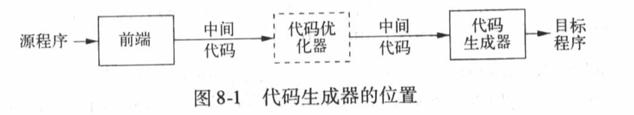

# 1. 中间代码和用于中间代码生成的数据结构

在翻译期间，intermediate representation(IR)代表了源程序的数据结构。

一般使用抽象语法树作为主要的IR

除了IR外，翻译期间的主要数据结构是符号表


## 1.1 Three-Address Code

```
x = y op z
```

之所以叫三地址吗，因为x,y,z通常代表了内存中的三个地址，但是x的地址的使用和y,z不同，因为y,z可以是常量或者没有运行时地址的字面常量

比如$2 * a + (b - 3)$

转换成三地址码：

```cpp
T1 = 2 * a;
T2 = b - 3;
T3 = T1 + T2;
```

其中T1, T2, T3是三个临时变量，这些临时变量对应于语法树的内部节点并且表示了他们的计算结果。他们有时候被保存在寄存器中，有时候保存在activation record中


Example:

```pascal
read x;
if 0 < x then
	fact := 1;
	repeat
		fact := fact * x;
		x := x - 1;
	until x = 0;
	write fact;
end
```

生成三地址码

```
read x
t1 = x > 0
if_false t1 goto L1
fact = 1

label L2
t2 = fact * x
fact = t2
t3 = x - 1
x = t3
t4 = x == 0
if_false t4 goto L2

write fact
label L1
halt
```

### 用于实现三地址码的数据结构

三地址码意味着每个表示需要4个域：**1个operation和3个地址**。

因此，一般用四元组(quadruple)的形式来实现

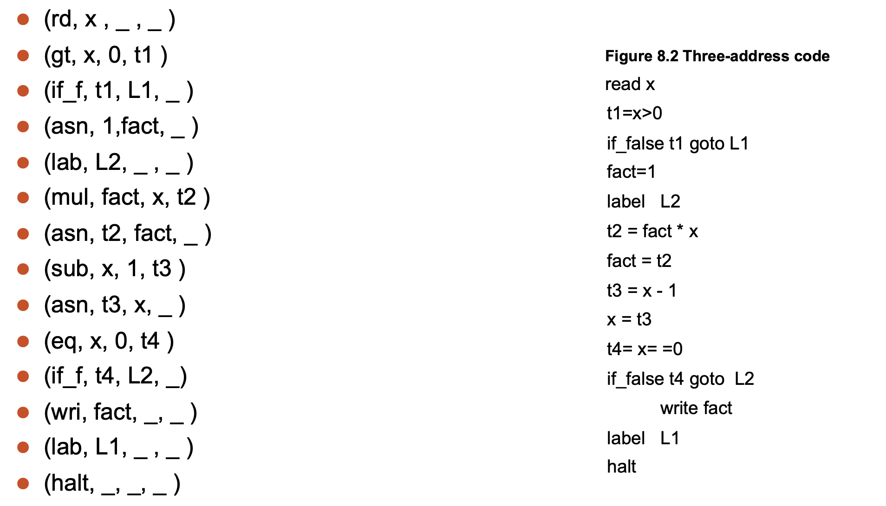

因为我们使用了变量，因此必须将其加入到符号表，以供进一步查询。

另一种替代方法是在四元式中使用指向符号表入口的指针， 避免额外的查询

三地址码使用自己的指令本身来代表临时变量，因此可以将四元组转变为三元组(triple)

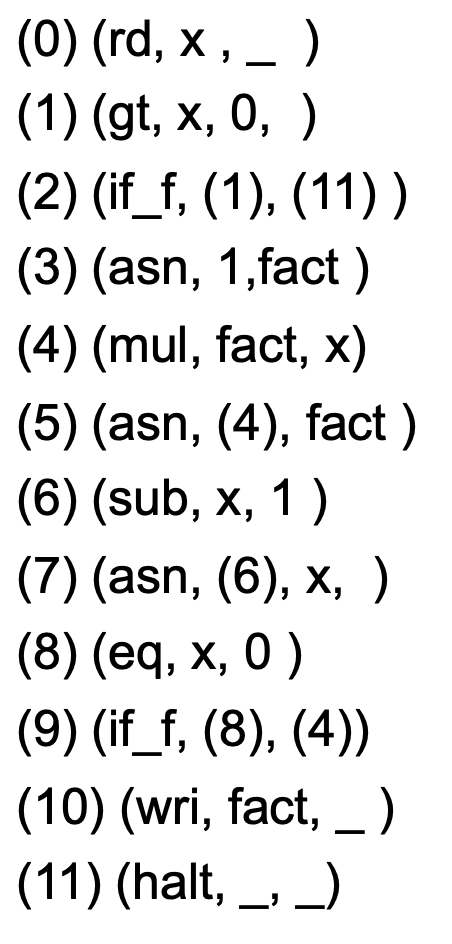

## 1.2 P-code

P-machine包含

* a code memory
* an unspecified data memory for name variables
* a stack for temporary data
* whatever registers are needed to maintain the stack and support execution


Example1:

$2*a+(b-3)$

```
ldc 2 ;   load constant 2    (pushes 2 onto the temporary)

lod a ;  load value of variable a (pushes a onto the temporary)

mpi;    integer multiplication  (pops these two values from the stack, multiplies them (in reverse order), and pushes the result onto the stack.)

lod b ;   load value of variable b

ldc 3 ;   load constant 3

sbi   ;  integer subtraction(subtracts the first from the second)

adi   ;   integer additiom
```

Example2:

$x:=y+1$

```
lda  x    ;load address of x
lod  y    ;load value of y
ldc  1    ;load constant 1
adi       ;add
sto       ;store top to address below top  &  pop both
```

这段代码首先计算x的地址，然后将表达式的值赋给 x，最后执行sto命令，这个命令需 要临时栈顶上的两个值：一个是要被存储的值，在它下面的那个是值所要存入的地址。 sto指 令也弹出两个值(在这例子中使栈变空)。

#### P-代码和三地址码的比较 

P-代码在许多方面比三地址码更接近于实际的机器码。 P-代码指令也需要较少地址；我们已见过的都是一地址或零地址指令，另一方面， P-代码在指令数量方面不如三地址码紧凑， P -代码不是自包含的，指令操作隐含地依赖于栈 (隐含的栈定位实际上就是“缺省的”地址 )， 栈的好处是在代码的每一处都包含了所需的所有临时值， 编译器 不用如三地址码中那样为它们再分配名字。


# 2. Basic Code Generation Techniques

## 2.1 Intermediate Code as a Synthesized Attribute

如果把中间代码看作是节点的一个字符串属性，那么中间代码生成就可以被看成是一个属性计算。这个中间代码属于合成属性(孩子指向父亲), 并且能在分析期间直接通过语法树的后序遍历生成。

Example:

$exp\rightarrow id=exp\vert aexp$

$aexp\rightarrow aexp+factor\vert factor$

$factor\rightarrow (exp)\vert num\vert id$

token num和id有一个预先计算过的strval属性

$(x=x+3)+4$

#### P-code

```
lda x
lod x
ldc3
adi
stn
ldc 4
adi
```

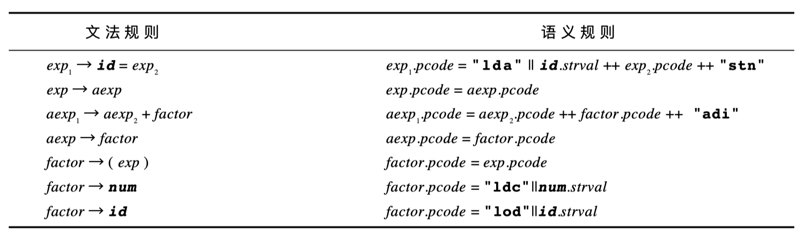

其中: $++$插入新行，$\vert\vert$ 插入空格， stn的结果仍然留在stack中而sto的结果会被踢出

#### Three-address-code

我们称代码属性为tacode

三地码要求为表达式的中间结果生成临时变量名，这就要求属性文法 在每个节点中都包括一个新名字属性。这个属性也是合成的，如果没有为一个内部节点分配一 个新产生的临时名， 就用newtemp()产生一个临时名字系列 $t_1、t_2、t_3,\cdots$( 每次调用 newtemp( )就返回一个新的)

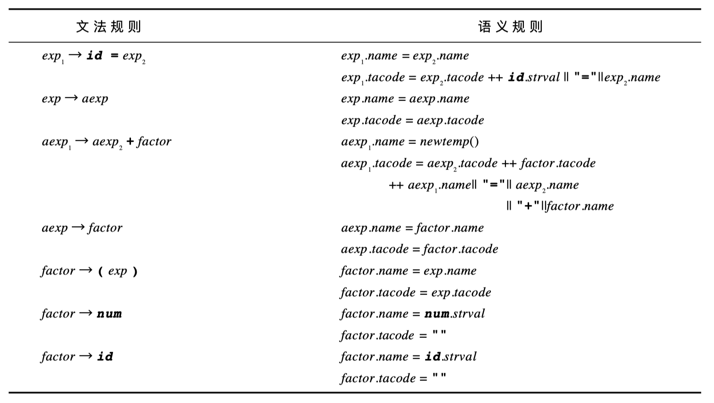

## 2.2 实际的代码生成

标准的代码生成或者涉及语法树后序遍历的修改

```pascal
procedure genCode(T:treenode);
begin
	if T is not nil then
		generate code to prepare for code of left child of T;
		genCode(left child of T);
		generate code to prepare for code of right child of T;
		genCode(right child of T);
		generate code to implement the action of T;
end;
```

注意，这个递归遍历不仅有一个后序部分(第7行: generate code to implement the action of T;)

还有一个前序部分(第4行: 为T的左子树产生准备代码)

还有一个中序部分(第6行: 为T的右子树产生准备代码)

<br>

假设我们的ast的定义如下

```cpp
typedefenum{Plus, Assign} optype;
typedefenum{OpKind, ConstKind, IdKind} NodeKind;
typedef struct streenode{ 
    NodeKindkind;
    Optypeop;  /* used with OpKind*/
    struct streenode* lchild, *rchild;
    int val; /* used with ConstKind*/
    char* strval;/* used for identifiers and numbers */
} STreenode;
typedef STreenode* syntaxtree;
```

表达式$(x=x+3)+4$的ast如下图所示

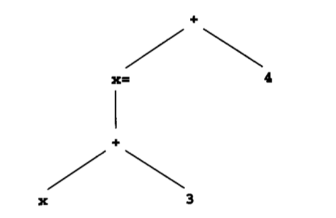

```cpp
%{
#define YYSTYPE char*
/* make Yacc use strings as values */
/* other inclusion code ... */
%}
%token NUM ID%
%exp       : ID { 
                 sprintf (codestr, "%s %s", "lda", $1);
                 emitCode ( codestr); 
            } 
			'=' exp { 
                emitCode ("stn"); 
            }
			| aexp
            ;
/*     */
aexp  : aexp  '+'  factor  { emitCode("adi");  } 
		| factor
        ;
factor: '(' exp  ')'
    	| num  {  
    		sprintf(codestr, "%s   %s",   "ldc", $1);
                    lemitCode(codestr);   
        }
        | ID   {  
            sprintf(codestr, "%s   %s",   "lod", $1);
            lemitCode(codestr);   
        }
        ;%%
```

## 2.3 Generation of Target Code from Intermediate Code

如果编译器或者直接从分析中或者从一棵语法树中产生了中间代码，那么下一步就是产生目标代码

最后的代码生成必须支持

* 变量和临时变量的实际定位
* 支持运行时环境所必需的代码
* 寄存器的合适定位和寄存器使用信息的维护(如哪个寄存器可用和哪个包含了已知值)


通常code generation from intermediate code有两种非常重要的技术

* macro expansion

  * 用一系列等效的目标代码指令代替每一条中间代码指令。(适用高级语言->低级语言)

* static simulation

  * 涉及到对中间代码效果的straight-line simulation, 并且生成匹配这些效果的目标代码。(适用低级语言->高级语言)

  

**接下来看一下用static simulation将P-code翻译到three-address-code的过程**

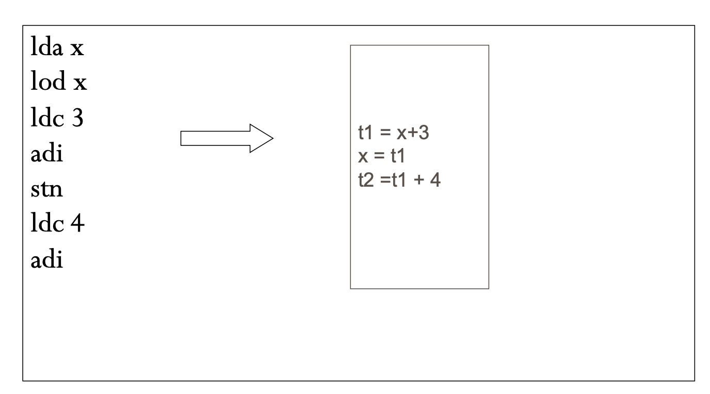

* 前三条指令执行后p-machine的状态如下，此时还没有三地址码产生

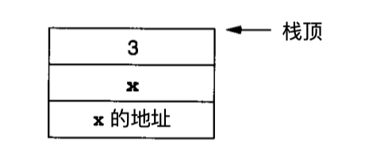

* 当处理`adi`时， 产生三地址码

```
t1 = x + 3
```

栈变成

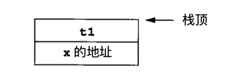

* 处理`stn`, 产生三地址码

```
x = t1
```

栈变成

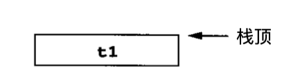

* `ldc 4`, 常量4入栈

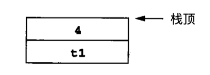

* 处理`adi`， 产生三地址码

```
t2 = t1 + 4
```

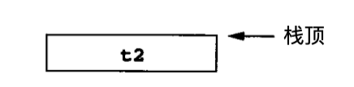

* 完成静态模拟和翻译


**接下来用macro expansion从three-address-code翻译到p-code**

如：一个三地址指令

```
a = b + c
```

可以被翻译成如下的p-code指令序列

```
lda a
lod b
lod c
adi
sto
```


# 3. Code Generation of Data Structure References

## 3.1 Address Calculations

#### A. Three-Address Code for Address Calculations

使用与C语言中意义一样的"&"和"*"来指示地址模式

```
t1 = &x + 10
*t1 = 2
```

上述代码意思是把常量 2存放 在变量x加上10个字节的地址处


#### B. P-code for Address Calculations

* `ind` indirect load指令

用一个整型偏移量作为参数，假设栈顶上有一个地址，就将这个地址 与偏移量相加得到新地址，再将***新地址中的值***压入栈以代替原来栈顶的地址。

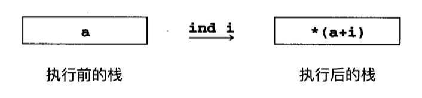

* `ixa` indexed address指令

用整型比例因子作为参数，假设一个偏移量已在栈顶并且在其下边有 一个基地址，则用比例因子与偏移量相乘，再加上基地址以得到新地址，再将偏移量和基地址从栈中弹出，压入***新地址***。

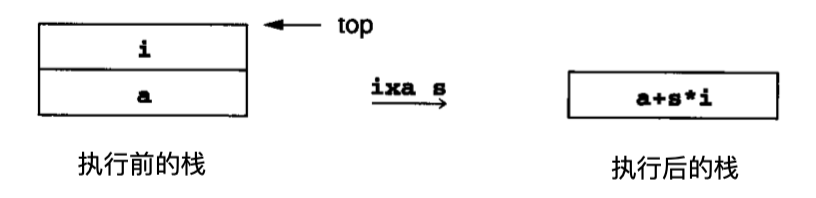

同样是这个例子

```
t1 = &x + 10
*t1 = 2
```

p-code可以写成

```
lda x
ldc 10
ixa 1
idc 2
sto
```


## 3.2 Array References

一般数组某元素地址的计算方式都是基址+偏移量

考虑C语言数组元素`a[i+1]`的地址是

```
a + (i + 1) * sizeof(int)
```

还要考虑，有些语言，数组的下标范围不是从0开始的。因此，任何语言中数组元素`a[t]`的地址为

```
base_address(a) + (t - lower_bound(a)) * element_size(a)
```

三地址码可以用`&a`获得`base_address(a)`

p-code可以用`lda a`将base_address(a)装入p-machine的stack中

`element_size(a)`在编译时就已经知道了，他会被替换为一个常量。


#### A. 数组引用的三地址码

三地址码引入了两个新的操作

* 一个是获取数组元素的值

```
t2 = a[t1]
```

* 还有一个是给数组元素赋值

```
a[t2] = t1
```

因此，源代码语句

```
a[i + 1] = a[j * 2] + 3
```

可以被翻译成如下三地址码

```
t1 = j * 2
t2 = a[t1]
t3 = t2 + 3
t4 = i + 1
a[t4] = t3
```

三地址码也有直接写出数组元素地址的计算

如:

```
t2 = a[t1]
```

可以被写成

```
t3 = t1 * elem_size(a)
t4 = &a + t3
t2 = *t4
```


#### B. 数组引用的p-code

使用指令`ixa`计算地址，`ind`用来装入已经计算地址里面的值

数组引用

```
t2 = a[t1]
```

翻译成p-code

```
lda t2
lda a
lod t1
ixa elem_size(a)
ind 0
sto
```

数组赋值

```
a[t2] = t1
```

翻译成p-code

```
lda a
lod t2
ixa elem_size(a)
lod t1
sto
```


#### C. 数组引用的代码生成过程

为了使用数组引用，更新文法如下

exp → subs = exp | aexp 

aexp → aexp + factor | factor

factor → ( exp ) | num | subs 

subs → id | id [ exp ]


... tbc


# 4. Code Generation of Control Statements and Logical Expressions

## 4.1 if和while语句的代码生成

if-stmt → if ( exp ) stmt | if ( exp ) stmt else stmt

while-stmt → while ( exp ) stmt

对这样语句的代码生成的主要问题是：将结构化的控制特性翻译成涉及转移的非结构化等价物， 它能被直接实现。这涉及到跳转

跳转可以被分成两类：unconditional jumps和jumps when the condition is false。 当condition为true的时候总是继续执行下面的指令，不需要jump

* unconditional jumps
  * `goto`(三地址码)
  * `ujp`(p-code)

* False jump:
  * `if_f, t1, L1,_`(三地址码)
  * `fjp L1` (P-code)

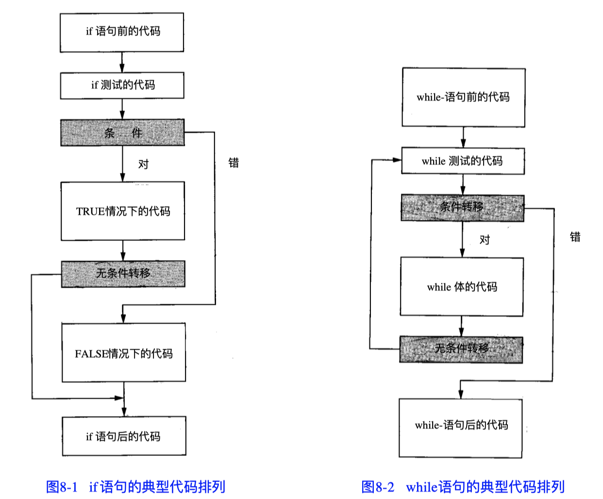


#### A. Three-Address Code for Control Statement

* if语句

```
if (E) S1 else S2
```

翻译成三地址码

```
<code to evaluate E to t1>
if_false t1 goto L1
<code for S1>
goto L2
label L1
<code for S2>
label L2
```

* while语句

```
while(E) S
```

翻译成三地址码

```
label L1
<code to evaluate E to t1>
if_false t1 goto L2
<code for S>
goto L1
label L2
```

#### B. P-code for control statement

* if语句

```
if(E) S1 else S2
```

翻译成p-code

```
<code to evaluate E>
fjp L1
<code for S1>
ujp L2
lab L1
<code for S2>
lab L2
```


* while语句

```
while(E) S
```

翻译成p-code

```
lab L1
<code to evaluate E>
fjp L2
<code for S>
ujp L1
lab L2
```

## 4.2 Generation of Labels and Backpatching

控制语句的代码生成有一个特点是:

jumps to a label must be generated prior to the definition of the label itself

因此，如果遇到forward jump(往还没有生成的代码跳转), 我们并不知道label到底在什么位置。

有一些方法来解决这个问题

* 在jump发生的代码处留下空位，或者产生一个dummy jump instruction to a fake location。当知道实际的转移位置后，这个位置用来回填(backpatch)缺少的代码

但是，这样依然会产生问题：

因为一般有两种jump, 一种short jump(含有128字节)，一种long jump(需要更多的空间)。

那code generator一般生成long jump占位，如果最后是short jump, 那么就插入nop指令来弥补这块多余的空间。


## 4.3 Code Generation of Logical Expressions

这里讨论`and`,` or` 操作，这两个操作存在短路现象

因此，可以将它们写成if语句

`a and b` $\equiv$ `if a then b else false`

`a or b` $\equiv$ `if a then true else b`

看一个例子:

```
(x != 0) && (y == x)
```

翻译成p-code

```
lod x
ldc 0
neq
fjp L1 {如果为false短路，跳转到L1}
lod y
lod x
equ
ujp L2
lab L1
lod FALSE {第一个条件就为false}
lab L2 
```


