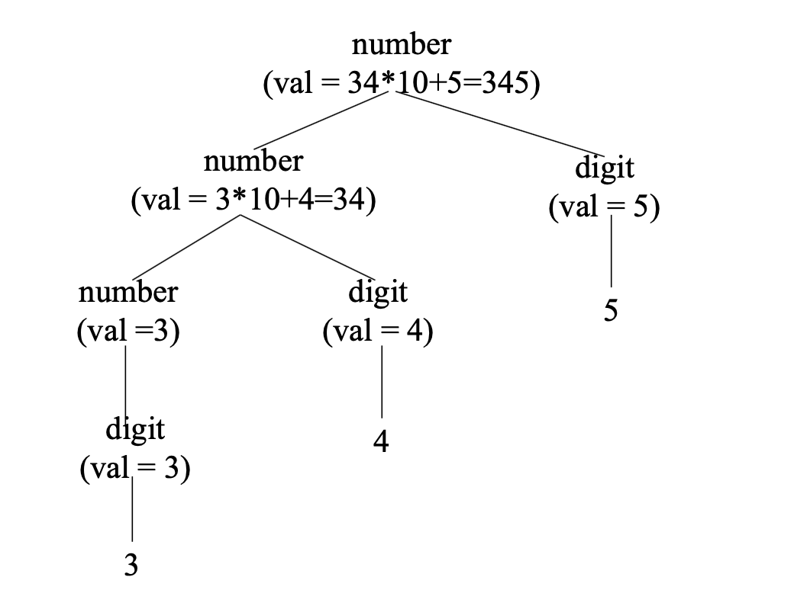
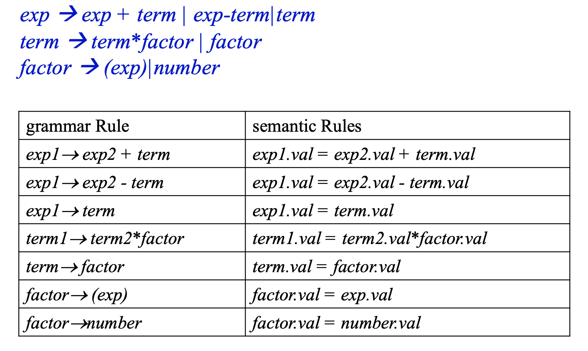
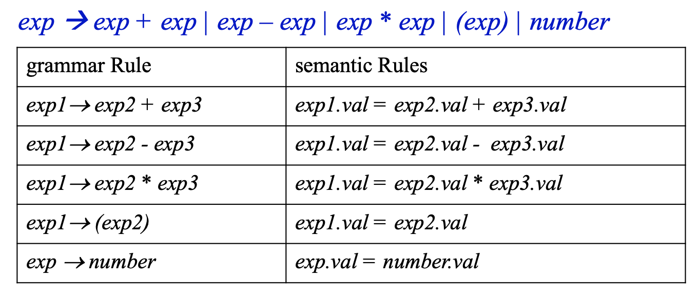
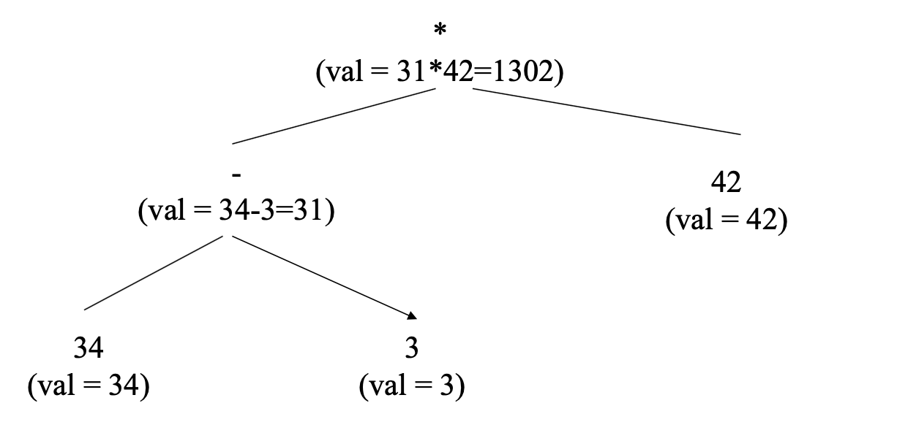
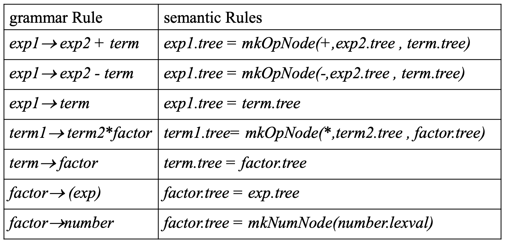
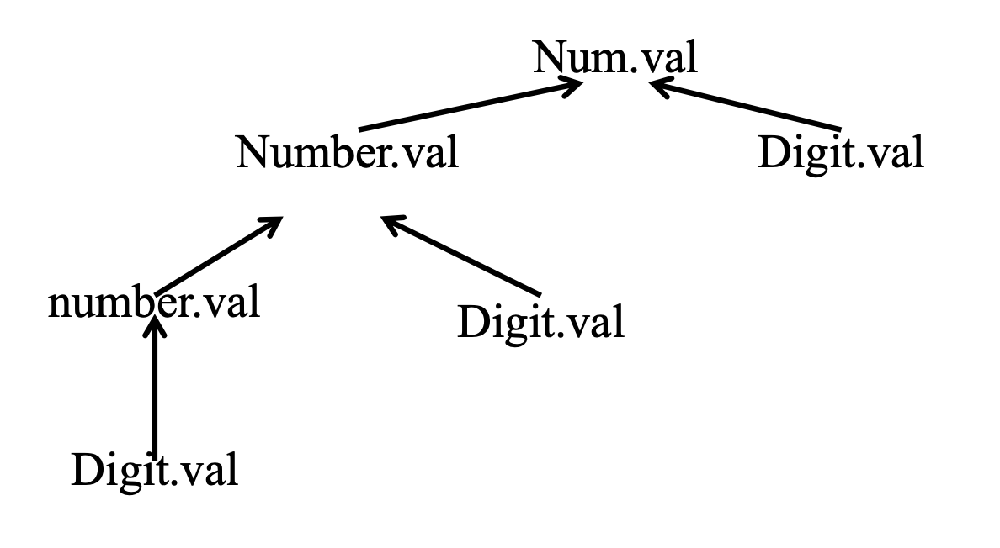
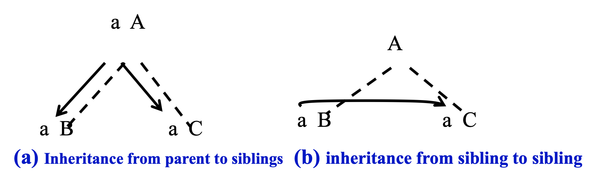

# 1. Attributes and attribute grammars

## 1.1 Some Conceptions

### A. Attributes

那些是属性？

* The ***data type*** of a variable
* The ***value*** of an expression
* The ***location*** of a variable in memory
* The ***object code*** of a procedure
* The ***numbers*** of significant digits in a number

属性可以在编译过程中确定也可以在程序执行过程中确定

### B. Binding

绑定是计算属性的值并且将属性值绑定到属性名

Binding Time:  绑定发生的时间 compilation/execution


根据绑定时间可以将属性分类

* ***static attributes***: be bound prior to execution
* ***dynamic attributes***: be bound during exectuion


### C. Type check

A type checker的工作

* computes the data type attribute of all language entities for which data types are defined(给一个变量a绑定了整数类型，我们判断给a的值是否是整数类型)
* verifies that these types conform to the ***type rule***s of the language. (比如int和double的数值运算全部转化为double计算)

<br>

{:.warning}

Type checking=set of rules that ensure the type consistency of different constructs in the program

<br>

一些rule的例子：

* The type of a variable must match the type from its  declaration

* The operands of arithmetic expressions (+, *, -,/)must have integer types; the result has integer type

* The operands of comparison expressions (==, !=)  must have integer or string types; the result has boolean type


## 1.2 Attribute grammars

### A. 定义

`X.a`: the value of a associated to `X`

`X`是语法符号,`a`是`X`绑定的一个属性

<br>

所谓***Syntax-directed semantics***: 属性直接和语法符号关联绑定

给定属性$a_1,a_2,\cdots$, 对于一个语法规则$X_0\rightarrow X_1X_2\cdots X_n$($X_0$是非终结符)，$X_i.a_j$和其他符号的属性相关

因为这种相关，我们可以写出数学表达式

$X_i.a_j=f_{ij}(X_0.a_1,\cdots,X_0.a_k,X_1.a_1,\cdots,X_1.a_k,\cdots,X_n.a_1,\cdots,X_n.a_k)$

我们称这样的语法规则为为attribute grammar

<br>

### B. 形式

| Grammar Rule | Semantics Rules                |
| ------------ | ------------------------------ |
| Rule 1       | Associated attribute equations |
| ...          | ...                            |
| Rule n       | Associated attribute equations |

Example1：

Given grammar rules

$number\rightarrow number\;digit\vert digit$

$digit\rightarrow 0\vert 1\vert 2\vert 3\vert 4\vert 5\vert 6\vert 7\vert 8\vert 9$

| Grammar Rule                        | Semantics Rules                            |
| ----------------------------------- | ------------------------------------------ |
| $number1\rightarrow number2\;digit$ | number1.val = number2.val * 10 + digit.val |
| $number\rightarrow digit$           | number.val = digit.val                     |
| $digit\rightarrow 0$                | digit.val=0                                |
| $digit\rightarrow 1$                | digit.val=1                                |
| $digit\rightarrow 2$                | digit.val=2                                |
| $digit\rightarrow 3$                | digit.val=3                                |
| $digit\rightarrow 4$                | digit.val=4                                |
| $digit\rightarrow 5$                | digit.val=5                                |
| $digit\rightarrow 6$                | digit.val=6                                |
| $digit\rightarrow 7$                | digit.val=7                                |
| $digit\rightarrow 8$                | digit.val=8                                |
| $digit\rightarrow 9$                | digit.val=9                                |

**注意第一行$number1\rightarrow number2\;digit$, 因为左右两边number有重复，因此改写为number1, number2来做一个区分**

give number 345




## 1.3 Simplifications and Extensions to Attribute Grammars

### A. 一些概念

* attribute grammar的***Metalanguage***(元语言): the collection of expressions allowable in an attribute equation

  * 限制算术型，逻辑型表达式
  * if-then-else表达式，switch-case表达式

* ***Functions***可以被加入到元语言中，他的定义可以在另外的地方

  $digit\rightarrow D$

  用numval函数digit.val=numval(D)


### B. 简化的方法

1. 使用歧义文法(所有歧义都在parser阶段处理了)



使用歧义文法后转化成



2. 用抽象语法树来代替语法树






# 2. Algorithms for attribute computation

## 2.1 Dependency Graphs and Evaluation Order

### A. dependency graph


$X_i.a_j=f_{ij}(\cdots,X_m.a_k,\cdots)$

An edge from each node $X_m.a_k$ to $X_i.a_j$ expressing the dependency of $X_i.a_j$ on $X_m.a_k$




Example:


### B. Directed acyclic graphs(DAG)

算法必须计算出dependency graph中每个node的属性值后才能计算后续属性

可以用拓扑排序来计算一下顺序，拓扑排序要求图无环


### C. find attribute values at roots

* Parse tree method:  construction of the dependency graph is based on the specific parse tree at compile time, add complexity and need circularity detective.
* Rule based method: fix an order for attribute evaluation at compiler construction time. It depends on an analysis of the attribute equations, or semantics rules.


### D. classification of the attributes

* #### ***synthesized attributes***

在parse tree中从孩子指向父亲的属性是synthesized attributes

给定语法规则$A\rightarrow X_1X_2\cdots X_n$, the only associated attribute equation with an `a` on the left-hand side is of the form

$A.a=f(X_a.a_1,\cdots,X_1.a_k,\cdots,X_n.a_1,\cdots,X_n.a_k)$

我们称一个文法为S-attributed grammar, 如果所有属性都是synthesized attributes

***计算***：

可以通过bottom-up, post-order遍历的方式计算

```pascal
procedure postEval(T:treenode);
begin
	for each child C of T do
	postEval(C);
	compute all synthesized attributes of T;
end
```

* ***inherited attributes***

不是synthesized attributes就是inherited attributes



***计算***：

可以通过preorder, combined preorder/inorder 遍历的方式计算

```pascal
procedure preEval(T:treenode)
begin
	for each child C of T do
		computed all inherited attributes of C
	preEval(C)
end
```

Remark:

* The order in which the inherited attributes of the children are computed is important.

* It must adhere to any requirements of the dependencies

