# Fully static Runtime Env

所有数据都是静态的， 且执行程序期间在存储器中保持固定。 

这样的环境可用来实现

* 没有指针或动态分配
* 过程不可递归调用

的语言。

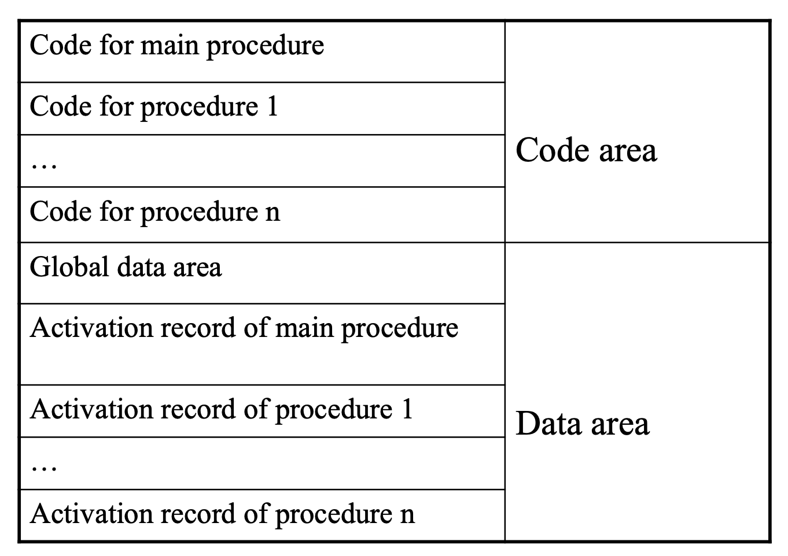

特点：

* 不仅全局变量，所有的变量都是静态分配
* 每个过程只有一个 在执行之前被静态分配的活动记录
* 可通过固定的地址直接访问所有的变量
* No extra information about the environment needs to be kept in an activation record.

Calling sequence: 参数，返回地址保存-->跳转-->执行完跳回

* Each argument is computed and stored into its appropriate parameter location in the activation of the procedure being called.

* The return address in the code of the caller is saved
* A jump is made to the begining of the code of the called procedure
* On return, a simple jump is made to the return address.


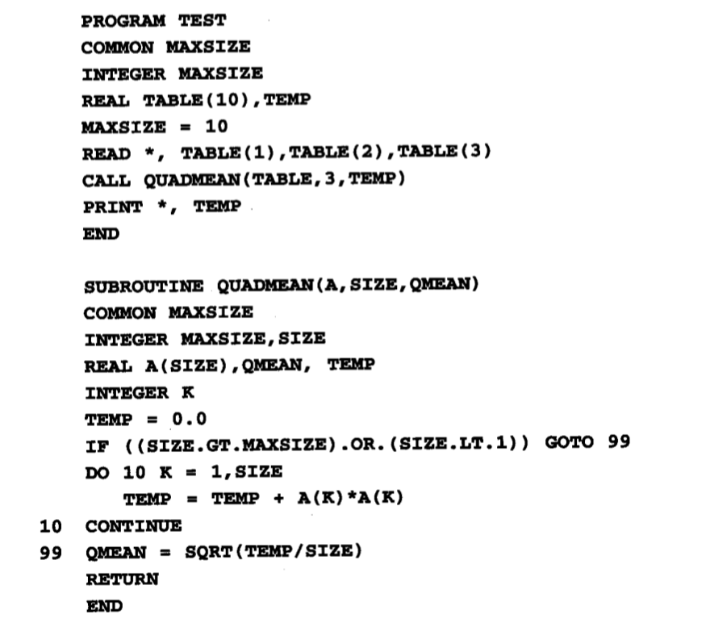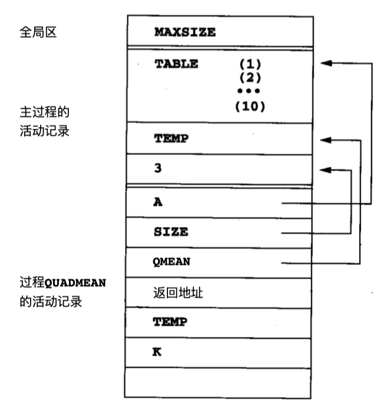

我们用箭头表示从主过程中调用时，过程`QUADMEAN`的参数A、 SIZE和QMEAN的值。

在FORTRAN77中，参数值是隐含的存储引用，所以

```fortran
CALL QUADMEAN(TABLE, 3, TEMP)
```

的参数(TABLE, 3, TEMP)的参数地址就被复制到QUADMEAN的参数地址中。

它有几个后果：

1. 需要一个额外的复引用来访问参数值。 
2. 数组参数无需再重新设置和复制(因此， 只给在`QUADMEAN`中的数组参数A分配一个空间， 在调用时指出TABLE的基地址)。
3. 像在调用中的值3的常量参数必须被放在一个存储器地址中而且在调用时要使用这个地址

4. `QUADMEAN`的AR结尾分配的未命名的地址，是在算术表达式计算中用来存储临时变量


# Stack-based runtime env

在**允许递归调用**以及每一个调用中都重新分配局部变量的语言中，不能静态地分配活动记录。必须以一个基于栈的风格来分配活动记录

* 当进行一个新的过程调用 (活动记录的push)时，每个新的活动记录都分配在栈的顶部
* 当调用退出时则再次解除分配 (活动记录的弹出(pop))。

活动记录的栈(stack of activation record)(也指运行时栈(runtime stack) 或调用栈(call stack))就随着程序执行时发生的调用链生长或缩小。每个过程每次在调用栈上可 以有若干个不同的活动记录，每个都代表了一个不同的调用


## Stack-based environments without local procedures

In a language where all procedures are global(比如C语言)， the stack-based environment requires two things

* Frame pointer (`fp`)
  * A pointer to the current activation record to allow access to local variable. 
* Stack pointer(`sp`) --> top of stack pointer
  * A pointer to the **last** location allocated on the call stack

<br>

Example:

```cpp
#include <stdio.h>
int x, y;
int gcd(int u, int v) {
    if(v == 0) return u;
    else return gcd(v, u % v);
}

int main() {
    scanf("%d%d", &x, &y);
    printf("%d\n", gcd(x, y));
    return 0;
}
```

假设输入为15, 10

* main初始化调用`gcd(15, 10)`
* 递归调用`gcd(10, 5)`
* 递归调用`gcd(5, 0)`

在第三个调用中，runtime env如下图所示

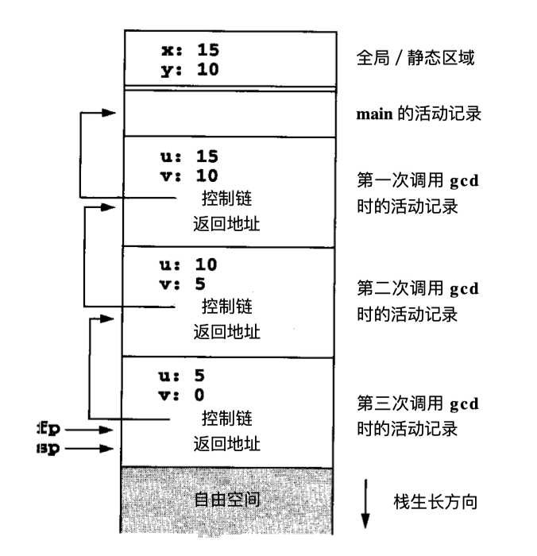

在每个AR中，control link指向先前AR的control link

fp指向当前AR的control link


```cpp
int x = 2;
void g(int);

void f(int n) {
    static int x = 1;
    g(n);
    x--;
}

void g(int m) {
    int y = m - 1;
    if(y > 0) {
        f(y);
        x--;
        g(y);
    }
}

int main() {
    g(x);
    return 0;
}
```

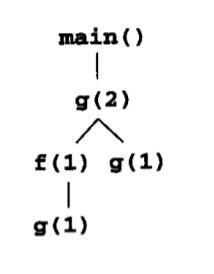

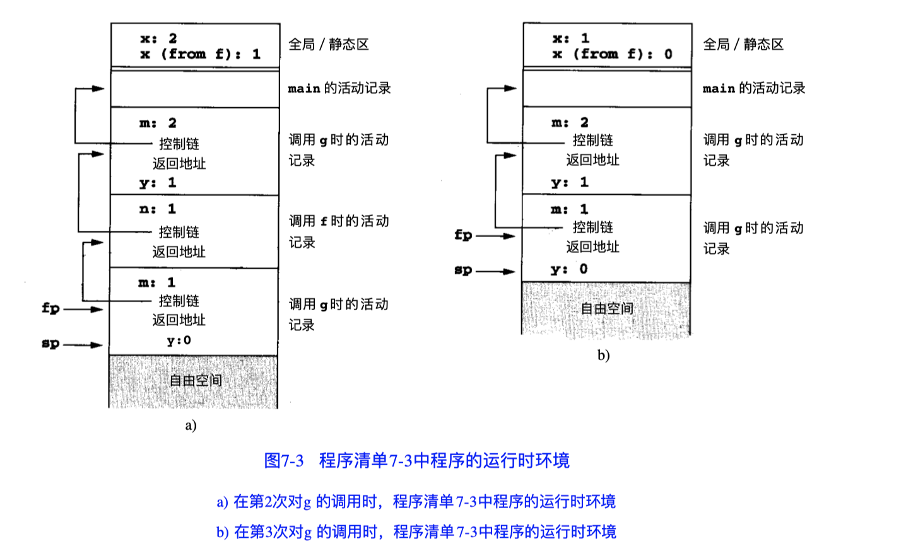

#### access to names

通过`fp`以及相对`fp`的offset来找到parameters and local vairable的位置

(在大多数语言中，offset可以被编译器statically computed)

Example:

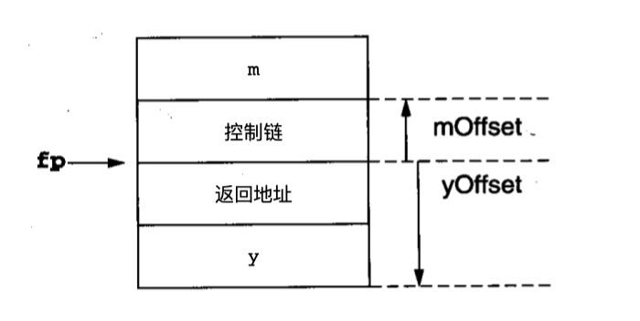

`m`和`y`都可以根据他们相对`fp`的offset进行访问。

具体地假设运行时栈从存储器地址的高端向低端生长，整型变量的存储要求两个字节，地址要求 4个字节。则有`mOffset = +4`和`yOffset = -6`，且对m和y的引用写成机器代码为`4(fp)`和`-6(fp)`。

Example:

```cpp
void f(int x, char c) {
    int a[10];
    double y;
    ...
}
```

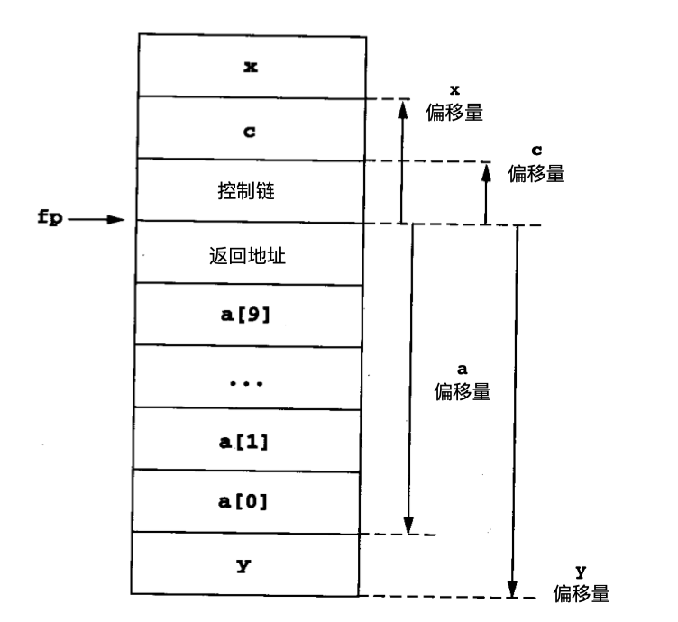

访问`a[i]`就计算地址`(-24 + 2 * i)(fp)`


#### The calling sequence

当调用一个procedure时，步骤如下

1. 计算arguments并且将其存放在new AR的适当位置
2. 将fp作为contol link保存到new AR
3. 改变fp使其指向新的AR的开始(这个位置是当前栈顶，也是control link的位置)
4. 将return address保存在新的活动记录中(如果需要)
5. 完成到被调用的procedure的代码的一个转移

当procedure exit时

1. copy the `fp` to `sp`
2. Load the control link into the `fp`
3. Perform a jump to the return address
4. Change the `sp` to pop the arguments

<br>

Example:

考虑在前面对g的最后一个调用的情况：

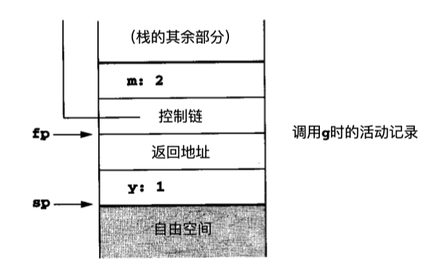

当进行对g新的调用时，首先将参数m的值压入到运行时栈中：

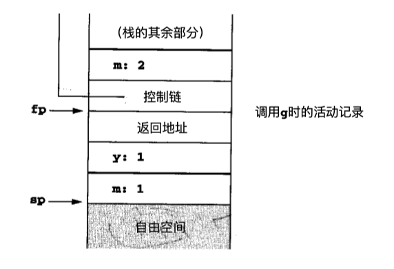

接着将fp压入到栈中：

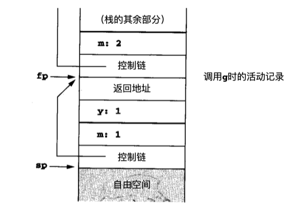

现在将sp复制到fp中，并将返回的地址压入到栈中，就得出了到 g的新的调用了：

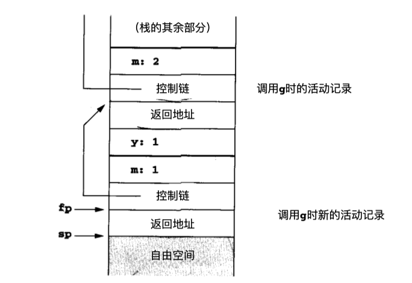

最后， g在栈上分配和初始化新的y以完成对新的活动记录的构造：

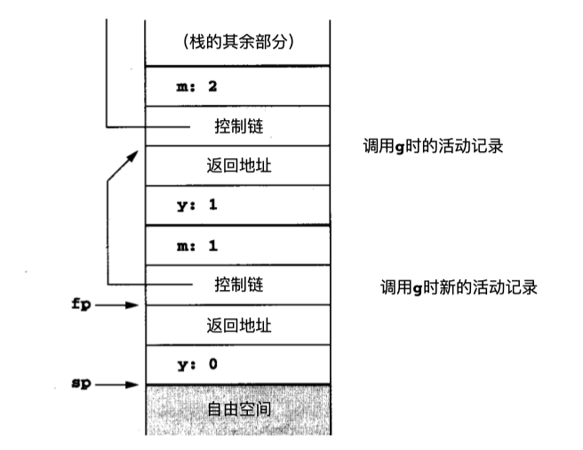

#### Dealing with variable-length data

所有的数据，无论是局部的还是全局的，都可在一个固定的地方，或由编译程序计算出的到fp的offset找到。有时compiler必须处理数据变化的可能性，表现在数据对象的数量和每个对象的大小上。发生在支持基于 栈的环境的语言中的两个示例如下：① 调用中的自变量的数量可根据调用的不同而不同。 ② 数组参数或局部数组变量的大小可根据调用的不同而不同。

比如C语言中的`printf`函数

<br>

在处理上

* C语言: pushing the arguments to a call in **reverse order** onto the runtime stack. 那么第一个参数和fp的offset始终是fixed
* 另外可以使用ap(argument pointer)


#### Local Temporaries and Nested Declarations

过程调用时必须保存的计算是导致局部临时变量的部分原因

考虑

```cpp
x[i] = (i + j) * ( i / k + f(j))
```

在从左到右的求值计算中，在对f的调用过程中需要保存中间结果

* x[i]的地址
* 计算i+j的和
* i/k的商

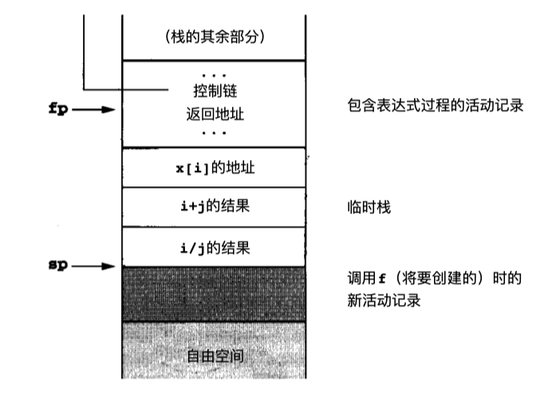

嵌套declarations

```cpp
void p(int x, double y) {
    char a;
    int i;
    ...;
    A: {
        double x;
        int j;
        ...;
    }
    B: {
        char* a;
        int k;
        ...;
    }
    ...;
}
```

在过程 p的主体中嵌套着两个分别标作 A和B的块。 

在块进入之前无需对这些块的局部声明进行分配，而且块 A和块B也无需同时进行分配。

* compiler 能够像对待过程一样处理块， 并且在每次进入块时创建新的活动记录， 并在退出时抛弃它。 然而， 由于这样的块比过程简单得多， 所以它的效率并不高：这样的块没有参数且无返回地 址，而且总是立即被执行而不是从其他地方调用。 
* 一个更简单的方法是按照与临时表达式相类似的办法在嵌套的块中处理声明， 并在进入块时在栈中分配它们而在退出时重新分配。 例如，在上面所给出的简

C代码中进入块A之后，运行时栈应如下所示：

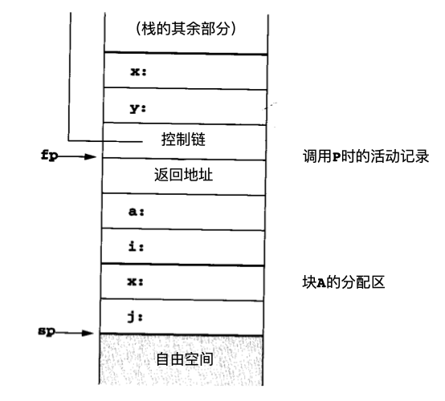

当进入块B后，则如下所示：

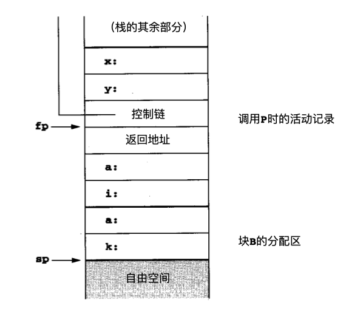

## 2. Stack-Based Environment with local procedures

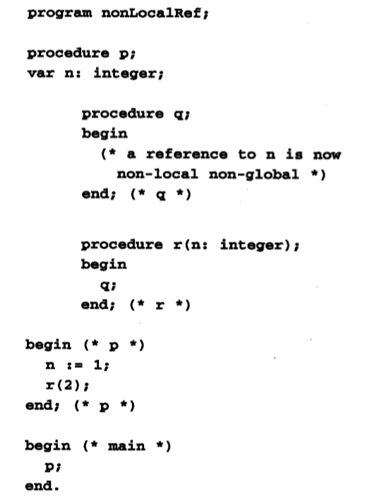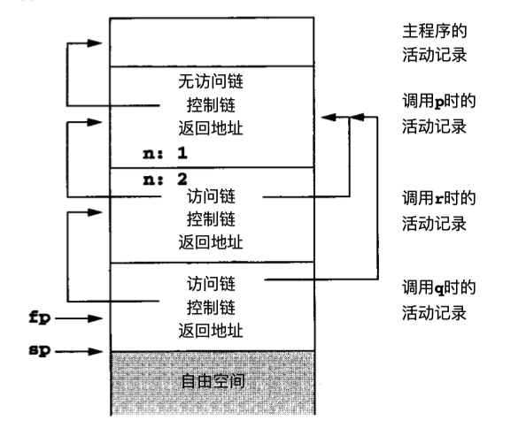

access lnk represents the defining environment of the procedure; access link is sometimes also called the static link

r和q 的活动记录的访问链都指向 p的活动记录， 这是 r 和q都在 p中声明的缘故.


Example:

```pascal
program chain;

procedure p;
var x: integer;
	procedure q;
		procedure r;
		begin
			x := 2;
			...;
			if ... then p;
		end; (* r *)
    begin
    	r;
    end; (* q *)
begin
	q;
end;(* p *)

begin 
	p;
end. (* main *)
```

过程p中declare了过程q, 过程q中declare了过程r,

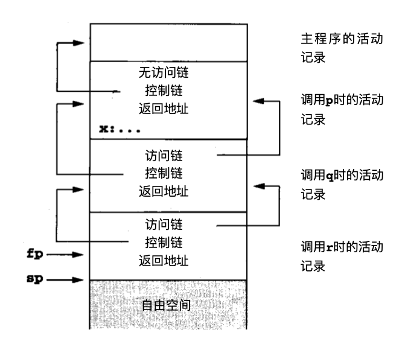

* The calling sequence
  * The access link must be pushed onto the runtime stack just before the fp during the call
  * The sp must be adjusted by an extra amount to remove the access link after an exit
* How to find the access link of a procedure during a call
  * Using the compile-time nesting level information attached to the declaration of the procedure
  * Generate an access chian as if to access a vairable at the smae nesting level.


## 3. Stack-Based Env with Procedure Parameters

过程可以作为参数传递 。当过程国伟参数时，必须预先计算出过程的access link并与过程代码的指针一同传递。他是一个指针对，包含

* 一个代码指针
* 一个访问链

他们通称为闭包，表示为`<ip, ep>` (ip表示代码指针或入口点，ep表示环境指针或access link)

```pascal
program closureEx(output);

procedure p(procedure a);
begin 
	a;
end;

procedure q;
var x : integer;
	procedure r;
	begin
		writeln(x);
	end;
begin
	x := 2;
	p(r);
end; (* q *)
begin(* main *)
	q;
end.
```

有一个过程 p，带有一个也是过程的参数 a。 在q中对p调用之后， q的过程r传递到p，p中的对a的调用实际上调用的是r，而且这个调用仍 必须在q的活动中寻找非局部变量 x。当调用p时，将a构造为闭包<ip, ep>，其中ip是指向r的 代码的指针，而ep是在调用点fp的拷贝 (也就是它指向调用q的环境，其中定义了r)。a的ep的值由虚线指明，表示在 q中的调用p之后的环境。接着当在 p内调用a时，就将a的ep用作其活动记录的静态链

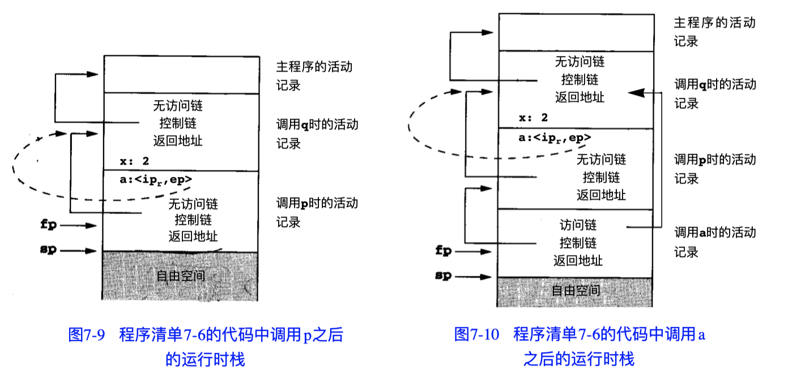

# Dynamic memory

stack-based 环境会出现dangling reference的问题

比如:

```cpp
int* dangle(void) {
    int x;
    return &x;
}

addr = dangle();
```

这会导致addr指向activation stack中一个不安全的位置


## Fully Dynamic Runtime Env

It can deallocate activation records only when all references to them have disappeared


#### heap management

* allocate
* free

