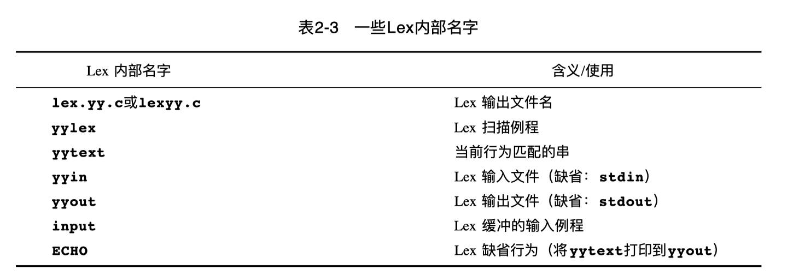

Lex输入文件由3个部分组成：definition, rules, auxiliary routine

```lex
{definition}
%%
{rules}
%%
{auxiliary routines}
```





YACC基于LSLR(1)

### How YACC Works


其中y.output用来做诊断: 文字版的自动机模型，看会不会出现冲突


```y
%{
//这里面的内容不会做处理
#include<stdio.h>
%}
%token NAME NUMBER //指名非终结符， %type针对非终结符
%% 
statement: NAME '=' expression
| expression { printf("%d\n", $1);}
;
expression: expression '+' NUMBER { $$ = $1 + $3; }
| expression '-' NUMBER 					{ $$ = $1 - $3; }
| NUMBER 													{ $$ = $1; }
;
%%

int yyerror(char* s) {
	fprintf("stderr", "%s\n", s);
	return 0;
}
int main() {
	yyparse();
	return 0;
}
```

$$表示左边符号对应的值，$1表示冒号右边第一个符号, $3表示冒号右边第三个符号


recognize tokens的两种方法

* 被''引起来的字符会被认为是他本身
* %token declare的符号

Action code is placed at the end of each grammar rule choice, although it is also possible to write embedded actions within a choice.

```
expression '+' NUMBER { $$ = $1 + $3; }
```

也就是后面{}里的内容