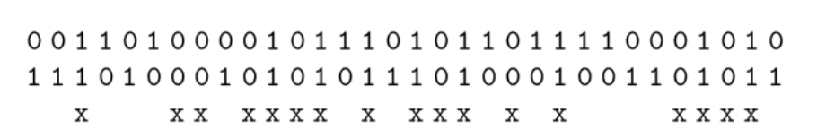

# 1. Confusion and Diffusion

* 混淆(Confusion): 使密钥与密文之间的关系尽可能模糊的加密操作。常用substitution来实现混淆
* 扩散(Diffusion): 为了隐藏明文的统计属性而将一个明文符号的影响扩散到多个密文符号的加密操作。常用permutation来实现扩散

可以将若干加密操作串联起来，得到更strong的密码。这样的密码叫做product cipher。目前所有的block cipher都是product cipher, 因为他们都是由对数据重复操作的轮组成的

现代block cipher具有良好的扩散属性。这意味着修改明文中的一位将会导致平均一半的输出位发生改变。也就是说，第二位密文看上去和第一位密文完全没有关系。如下图的例子

# 2. DES算法概述

<table>
  <tr>
    <td>
   
  
     
  
  
   
  
     
    
       
      <h4>DES</h4>     
    
     
    
是一种使用56位密钥对64位长分组进行加密的密码
  
  

</td>
  </tr>
</table>

DES属于**对称密码**， 即加密和解密使用相同的密钥

DES也是一种***迭代算法***。对明文中每个分组的加密过程都包含结构完全相同的16轮。每轮用不同的子密钥，子密钥$k_i$是由主密钥$k$推导得到的

DES内部是一种Feistel网络。这种网络密码学强度高并且加密过程和解密过程完全相同，只需要一个逆向的密钥编排

* 64位的明文x进行初始permutation得到IP(x)
* 明文被分成$L_0,R_0$两部分,将32位的左右两部分输入Feistel网络，网络包含16轮操作
  * $L_i=R_{i-1}\quad R_i=L_{i-1}\oplus f(R_{i-1},k_i)$
* 16轮后，$L_{16}$与$R_{16}$交换
* 最后，逆初始permutation, $IP^{-1}$

 

我们可以看到Feistel每轮只加密输入的左半部分，右半部分直接进入下一轮。$f$函数可以看作是由两个参数$R_{i-1}$和$k_i$的伪随机数产生器。扩散和混淆都是在$f$函数内实现的

Feistel结构都讲一个64位的输入分组双映射到一个64位的输出分组。在DES中，$f$是一个满射

 

# 3. DES内部结构

## 3.1 初始置换与逆初始置换

初始置换与逆初始置换都是按位置换。这在硬件上很容易实现，也就是线的交叉连接

## 3.2 f函数

f函数首先将32位的输入分成8个4bits的分组，然后通过E-box将32位扩展成48位。

接着将48位结构与round key $k_i$进行XOR操作，然后将8个6位长的分组送入8个不同的S-box。S-box通过查找表实现，他将6位数速入映射为4位输出

最后32位的输出进行按位置换

<table>
  <tr>
    <td>
   
  
     
  
  
   
  
     
    
       
      <h4>E-box</h4> 
      

        32个输入位中有16个输入位对应两个输出位。任意一个输入位不会在同一个6位的分组中出现两次。E-box增加了DES的扩散行为，因为某些输入位会影响两个不同的输出位置。
      

  

</td>
  </tr>
</table>

## 3.3 key schedule

key schedule从原始的56位密码中得到16个round key $k_i$, 其中每个$k_i$都是48位。

56位密钥分为$C_0,D_0$两部分。长度均为28位的左右两部分周期性地向左移动一位或两位(即循环移位)，移动的具体位数取决于轮数i

* 在$i=1,2,9,16$轮，左右两部分向左⬅️移动一位
* 在$i\not= 1,2,9,16$轮，左右两部分向左移动两位

移动位置的总数为$4\cdot 1+12\cdot 2=28$, 这会使$C_0=C_{16},D_0=D_{16}$

为了得到48位的round key $k_i$, 左右两部分需要根据PC-2(置换选择2)进行按位置换，PC-2 忽略其中的8位

## 3.4 解密

解密与加密本质上完全相同。解密过程很自由密钥编排逆转了，即第一轮需要round key 16, 第二轮需要round key 15

### A. 逆向密钥编排

# 1. Bulge function

下图是两个32位的二进制串

这两个二进制串有17个位置的取值相同(已经用x在下方标出),成为aggrements，剩下15个位置的取值不同，称为disaggrements。

我们可以用aggrements-disaggrements来表示index of coincidence.

在统计上，衡量两个二进制串的关系的方法称为correlation, 在统计学上，称为bulge

在上面的case中，有17个aggrements和15个disaggrements, 那么这两个序列的bulge是17-15=2

