# Dynamic Programming

# 1. Divide and Conquer

1. Divide the problem into smaller problems (subproblems)

2. Solve the subproblems (recursively)

3. Combine solutions of the subproblems to give solution of the original problem

Examples: 

* Mergesort

* Integer/matrix multiplication

* Finding maximum and minimum

Time complexity $T(n) = aT(n/b) + cn$

where $a =$ number of subproblems and $n/b=$ size of subproblems

### Multistage graph-shortest path

Multistage graph有K个stages, 每个stage有L个nodes 

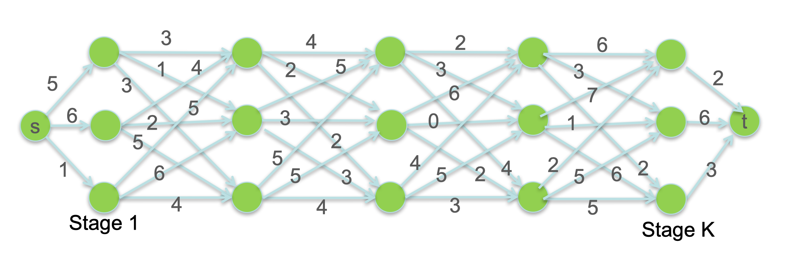

Problem: 找到从source(s)到sink(t)到cost最少到路径

Approaches:

* Exhaustive Search:

一共K个stages, 每个stage有L中选择，那么一共有$L^K$ 条路径

* 递归，reduce成L个K-1 stages到subproblems

$$T(K)=L\cdot T(K-1)$$

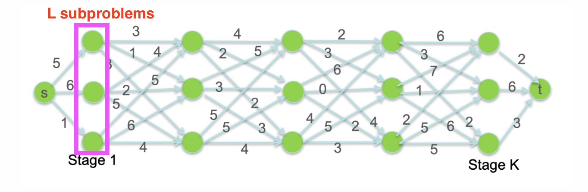

* Divide and Conquer

从中间stage将问题一分为二

左边有L个subproblem(考虑从中间stage的L个nodes出发到s结束)，右边有L个subproblem

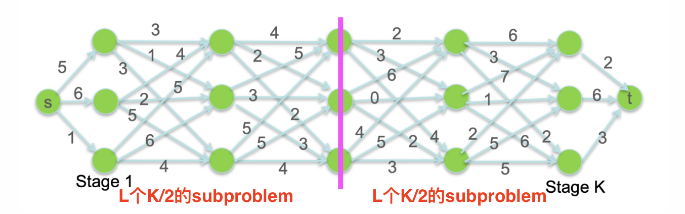

### Dynamic Programming

从stage K开始到stage 1计算每个node到t到最短路径

* $C_{kij}$=node $(k,i)$和 node $(k+1,j)$之间的距离

* $M_{ki}$=node $(k,i)$到t的最短路径的长度=$min_j(C_{kij}+M_{k+1,j})$，其中$j=1,\cdots,L$

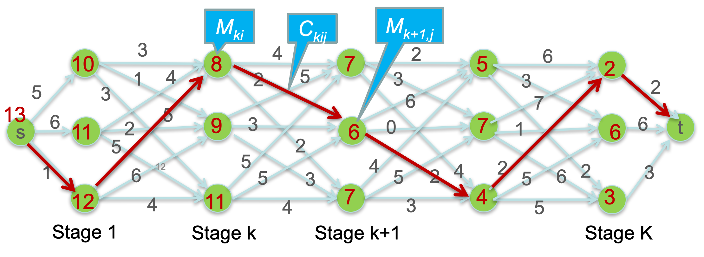

Time:

一共有KL个elements:$M_{ki}$, 每个要通过L次计算，因此总共是$O(KL^2)$时间

这个答案是Optimal的吗？是的，因为一共有$KL^2$条边

 

### Principle of Optimality

一个optimal solution具有的性质是：

> whatever the initial conditions and choices, the decision chosen over the remaining period must be an (optimal) solution for the remaining problem.

即：全局最优的也是局部最优的

Examples:

* Each $M_{k,i} $is optimal by itself

* Shortest path – from any node to sink

### Integer Decomposition

> Given n, find the number $D(n)$ of different ways to write n as the sum of 1, 3, 4 

Example: $n=5, D(n)=6$

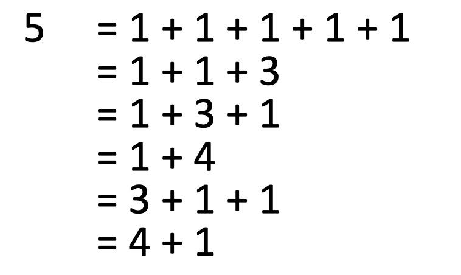

$$D(n)=\begin{aligned}&D(n-1)+D(n-3)+D(n-4)& n>0\\&1&n=0\\&0&n<0\end{aligned}$$

$D(1)=1,D(2)=1,D(3)=2,D(4)=4,D(5)=6$

### Number of Tilings

Find $D_n$, the number of ways to tile a $2 \times n$ board with $2\times 1$ tiles

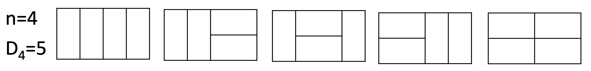

Recursion formula:

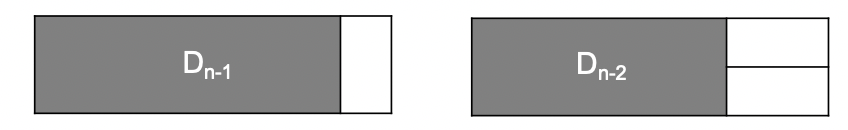

$$D_n=\begin{aligned}&D_{n-1}+D_{n-2}&n>2\\&2&n=2\\&1&n=1\end{aligned}$$

### How to solve problems by DP

* A method for solving complex problems by breaking them down into simpler ***"overlapping" subproblems***. 

* Solve a large problem by solutions of smaller problems

* Principle of Optimality(要有最优子结构)

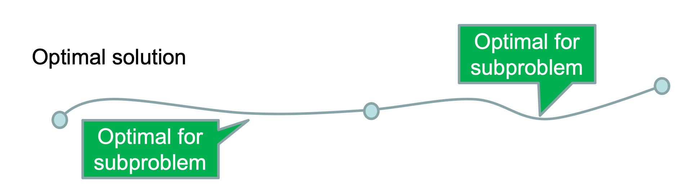

三步走：

1. Defining subproblems (follow the principle of optimality)

2. Finding recursions 

3. Solving the base cases (similar to mathematical induction)

 

### Palindrome Problem

 Examples of palindrome (same reading reverse)

* abcdcba

* eye, ANNA, level, madam, racecar, civic, noon

* Able was I ere I saw Elba

给定一个string $X=x_1\cdots x_n$,找到最少数量的插入字母来使得这个字符串变成palindrome

e.g.

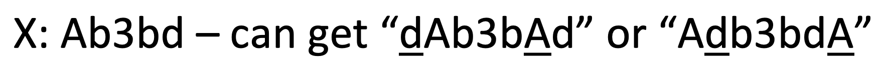

子问题是什么呢？

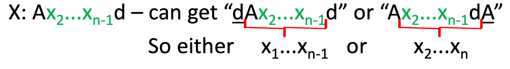

#### DP Solutions:

Subproblems:

* $D_{ij}$=使$x_i\cdots x_j$成为palindrome需要插入的最少数量的字母
* Solution: $D_{1n}$

Recursion formula:

$$D_{ij}=\begin{aligned}&1+min\{D_{i+1,j},D_{i,j-1}\}&x_i\not=x_j\\&D_{i+1,j-1}&x_i=x_j\\&0&i\geq j\end{aligned}$$

时间复杂度:

subproblems的数量为$O(n^2)$ (i有n种取值，j有n种取值)

### Longest Increasing Subsequence(LIS)

给定一个序列 $X=x_1,\cdots,x_n$, 找到最长的升序序列

e.g.

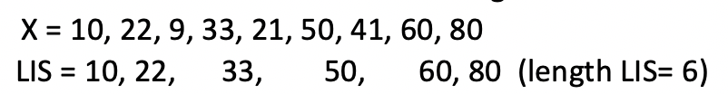

 

Subproblem:

* $L(i)$=length of the LIS for $x_1,\cdots,x_i$ end with $x_i$

Recursion formula

L(i)=1+max(L(j)) 其中$x_j<x_i$且$0<j<i$

L(i)=1. 如果这样的i不存在

