# Computational Geometry

# Convex Hull

`definition`{:.warning}

A set of points S is convex if $p,q\in S$, segment pq is in $S$


二维点集Q的凸包(convex hull)为

* intersection of all convex sets that contain Q

* intersection of all halfspaces that contains Q

* the smallest convex polygon P that contains Q(这个比较好理解)

* union of all the triangles determined by points in Q


## Convex Hull Problem

给定 $Q=\{p_1,p_2,\cdots,p_n\}$,  从Q中找到属于Q的convex hull的顶点 $CH(Q)$

* Input: $Q=\{p_1,p_2,\cdots,p_n\}$
* Output: $CH(Q)=\{p_8,p_5,p_4,p_9,p_2\}$

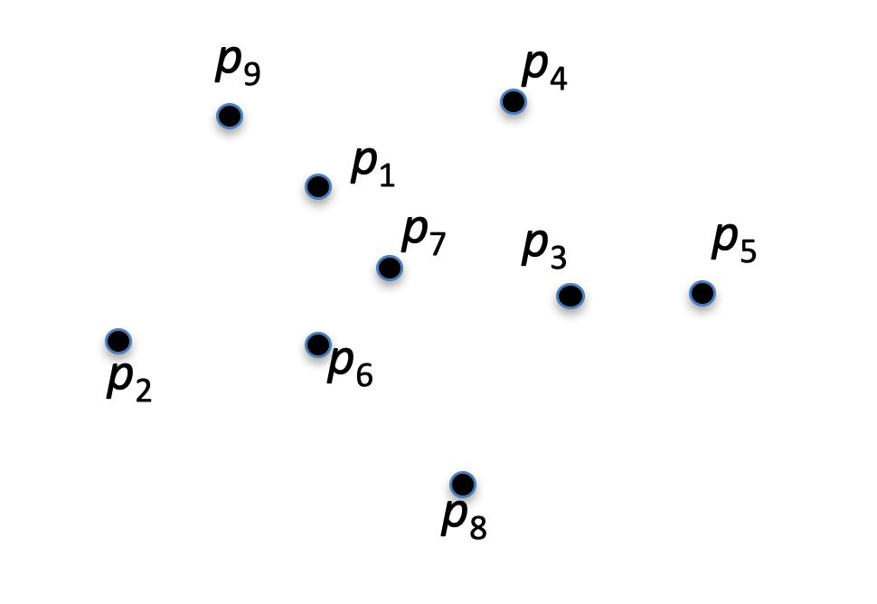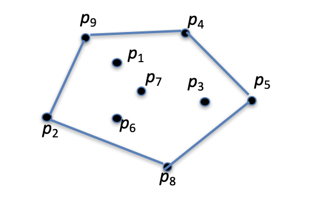

接下来我们通过problem reduction来推导Lower Bound


## Lower Bound for CH Problem

计算n个二维点的凸包需要$\Omega(nlogn)$

事实上有: Distinct Integer Soring$\propto$ Convex Hull Problem

给定n个数$a_1,\cdots,a_n$, 可以生成n个点$(a_i,a_i^2)$

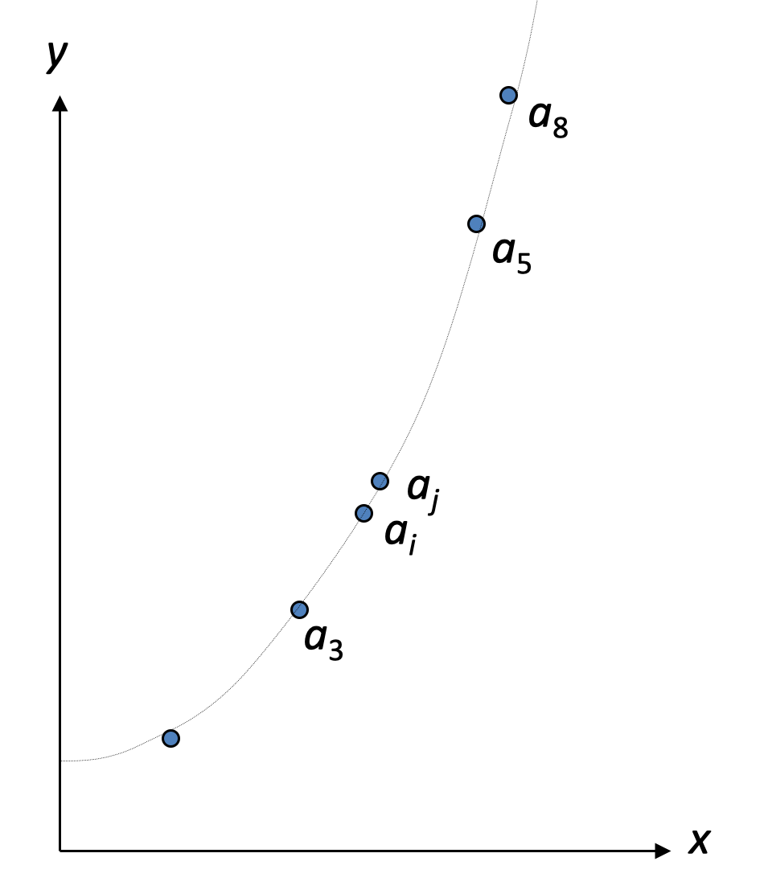

Basic geometric fact:

{:.success}

All these points appear on their convex hull in sorted order by x coordinate.

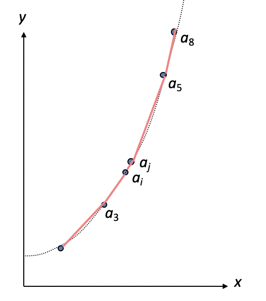

步骤

1. Compute the new points $(a_i,a_i^2)$
2. Compute the convex hull of the n points in $T(n)$ time
3. Find the left-most point in the convex hull
4. List the points in anti-clockwise order

步骤1，3，4需要$O(n)$时间，因此总时间要$T(n)+O(n)$

因为sorting需要$\Omega(nlogn)$, 因此$T(n)$必须也为$\Omega(nlogn)$


## Divide and Conquer

给定n个点$p_1,p_2,\cdots,p_n$

$ConvexHull(p_1,p_2,\cdots,p_n)$

Find the midian of $\{p_1,p_2,\cdots,p_n\}$ based on x-coordinates

Divide the  $\{p_1,p_2,\cdots,p_n\}$ into 2 equal size sets, $\{p_1,p_2,\cdots,p_{n/2}\}$, $\{p_{n/2+1},p_{n/2+2},\cdots,p_n\}$

1. Find ConvexHull$(p_1,p_2,\cdots,p_{n/2})$
2. Find ConvexHull($p_{n/2+1},p_{n/2+2},\cdots,p_n)$
3. Combine to get the overall hull.

怎么combine呢

给定两个凸多边形P和Q, P完全在Q左侧

在$O(n)$时间找到$P\cup Q$的convex hull, 其中n是P,Q的corner数量


### Merge in $O(n)$ time

Find upper and lower tangents in O(*n*) time (to be proved later)

Compute the convex hull of $A\cup B$: 

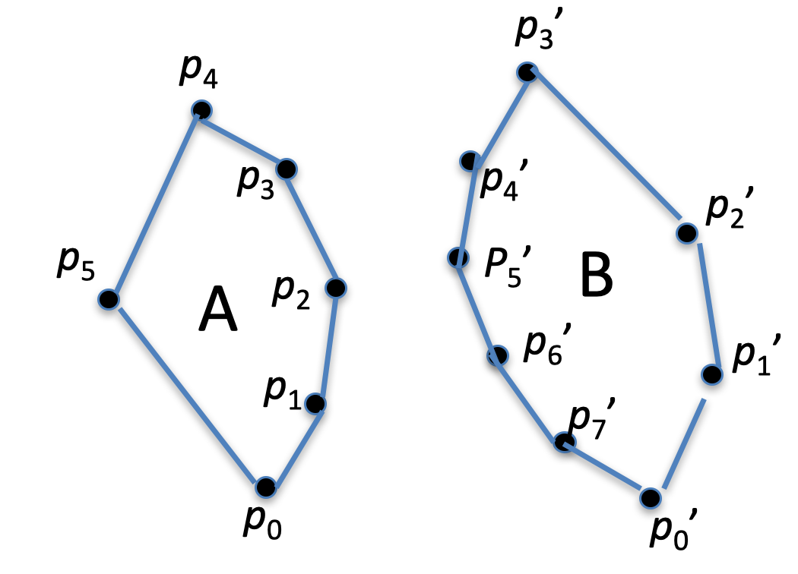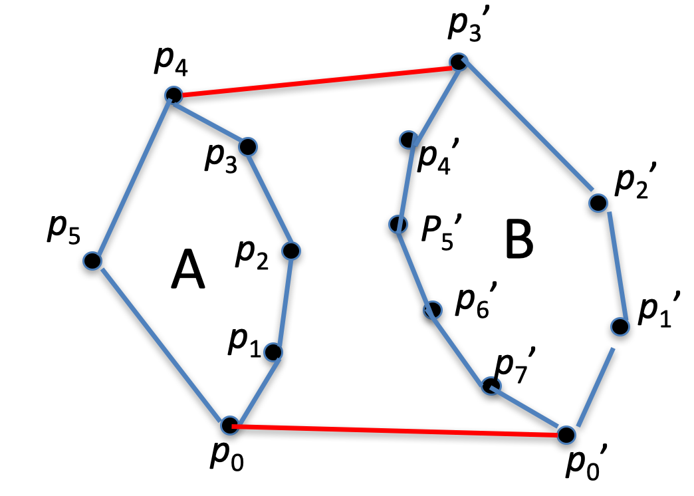

* Starting with right endpoint of  lower tangent, walk anti-clockwise around the convex hull of B

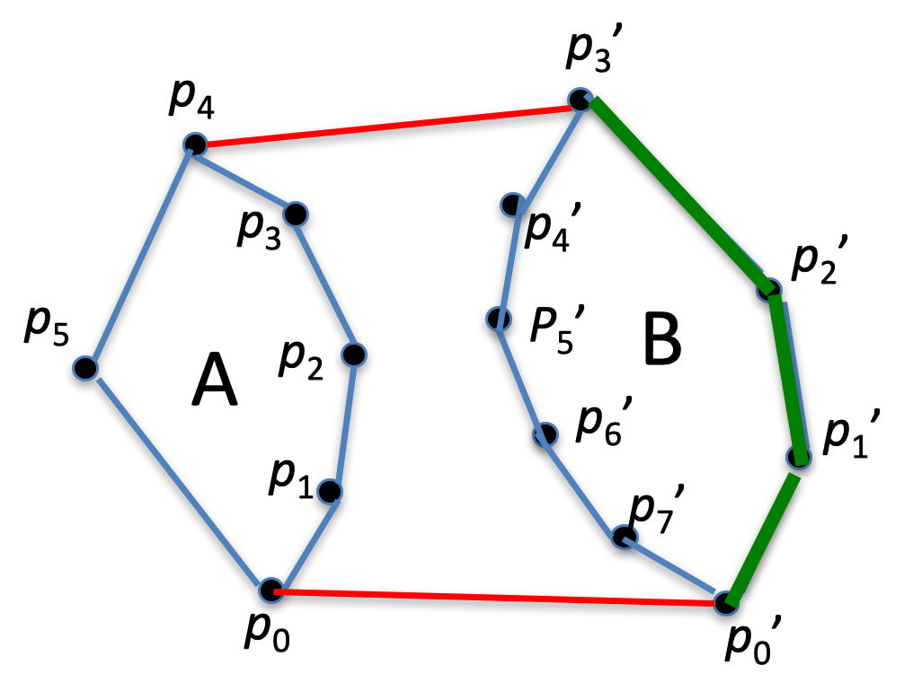

* When hitting the right endpoint of the upper tangent, cross over to the convex hull of B 

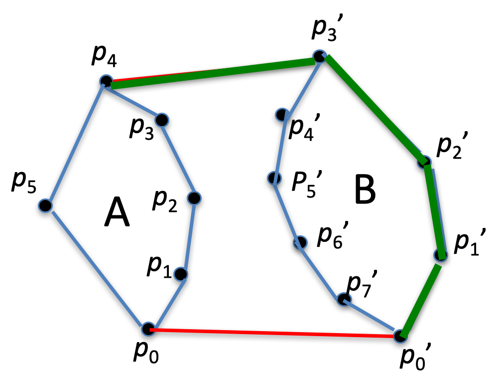


* Walk anti-clockwise around the convex hull of A

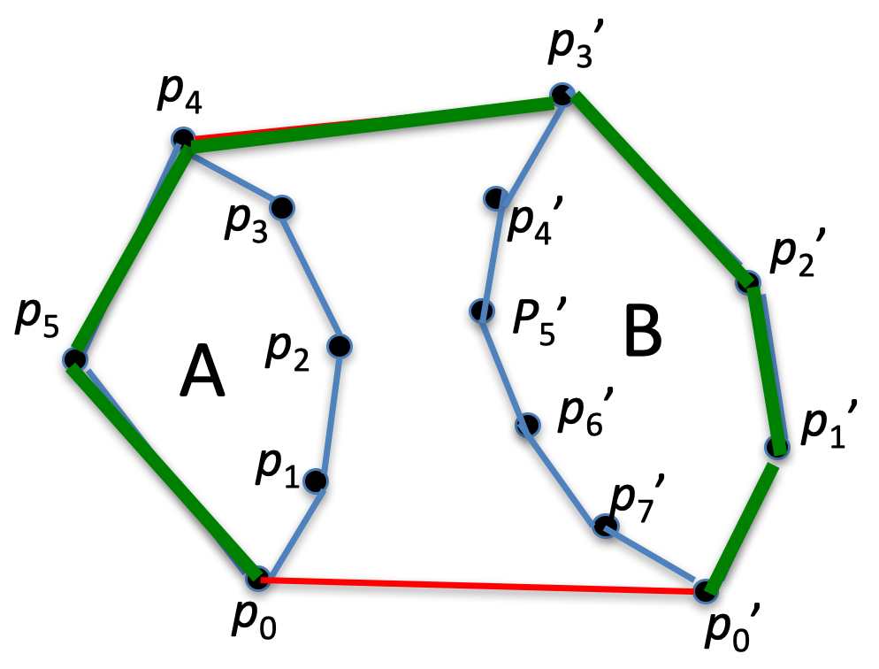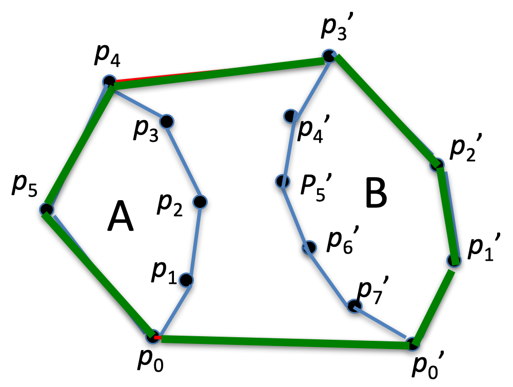

* When hitting left endpoint of the lower tangent, 
   follow the lower tangent to its left endpoint

This takes O(*n*) time


那么问题又来了，怎么找到lower tangent呢？

### Finding the lower tangent

Q: When is line $l$ tangent to a polygon?

A: Assume $l$ is tangent at point $p_i$, then slope($l$) must be in-between of slope $(p_{i-1},p_i)$ and slope$(p_i,p_{i+1})$

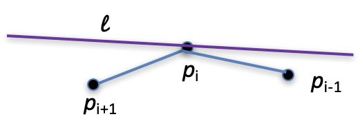

Lower common tangent of A and B

* a - rightmost point of A
* b - leftmost point of B
* Let $T=(a,b)$

```pascal
while T not lower tangent do {
    while T not lower tangent to B
    	do { b = b + 1}
    while T not lower tangent to A
    	do {a = a - 1}
}
```

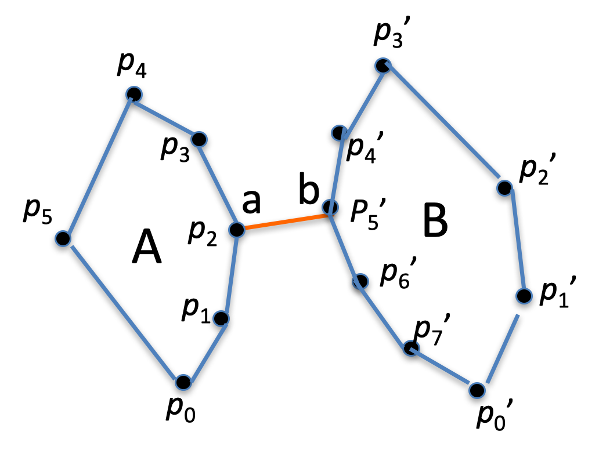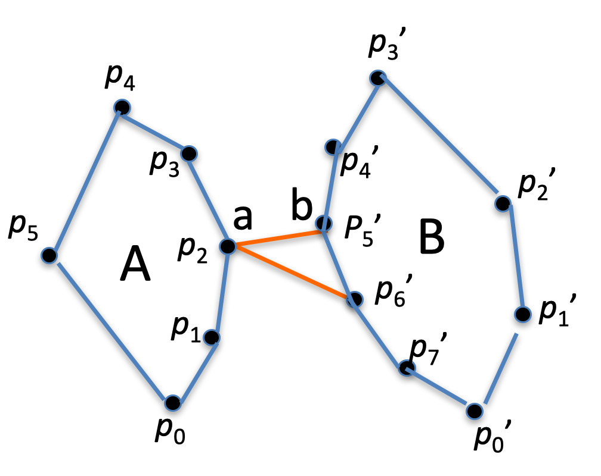

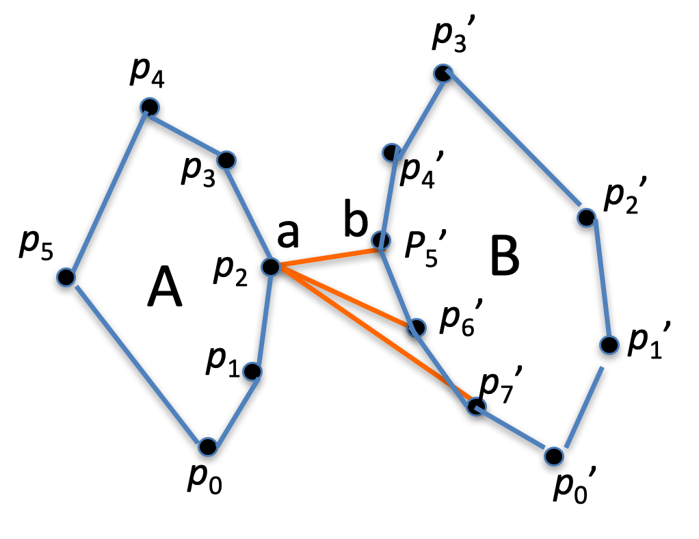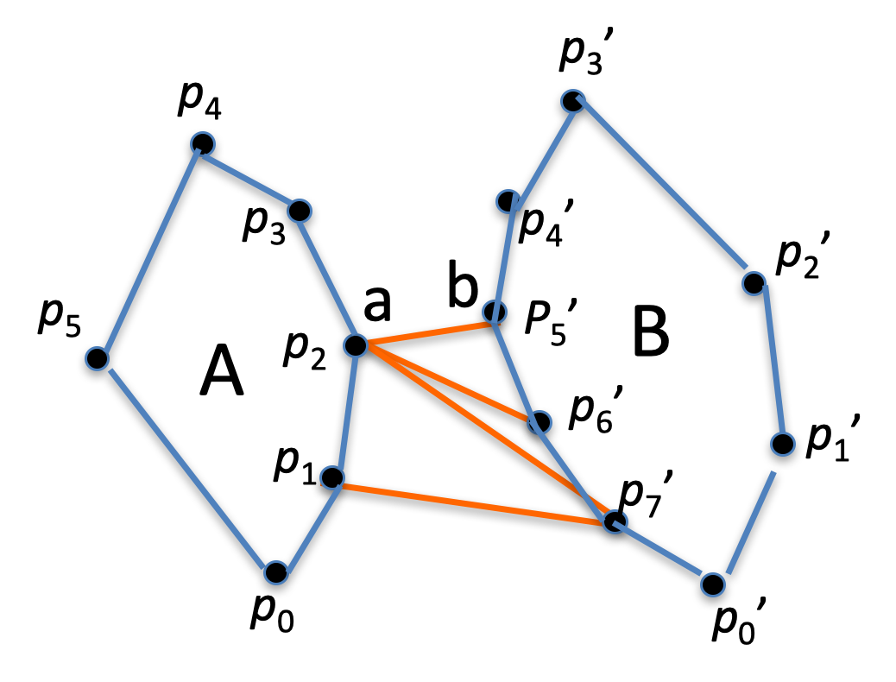

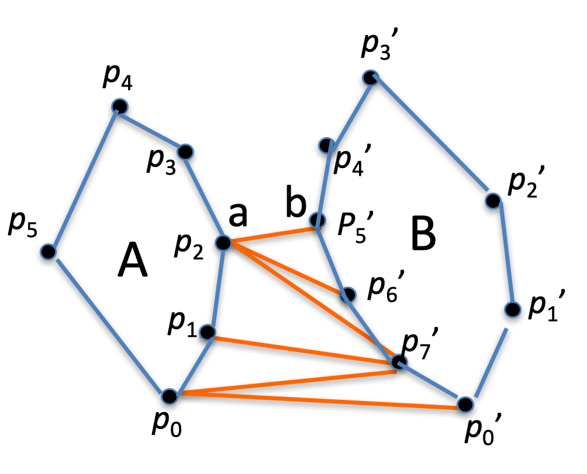

