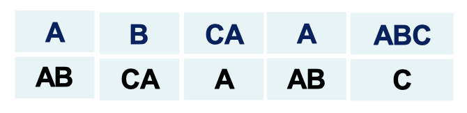
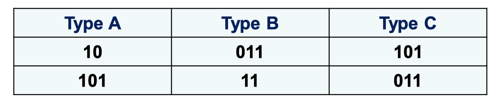

# Is Procedure P an algorithm?

P is an algorithm if P takes any input, always stops and outputs "Yes" or "No".

P用二进制码表示

## Undecidable Problems

An undecidable problem is a decision problem for which. it is proved to be impossible to construct an algorithm that always leads to a correct yes-or-no answer

### Post Correspondence Problem

Given: a collection of dominoes 

如

目标：找到一个有限的domino序列(允许复选)，使得上面字母形成的字母序列和下面字母形成的字母序列相同。

比如：根据上面的dominoes, 我们可以得到一下的合法序列

ABCAAABC

#### Another PCP example

给定3种dominoes

是否存在解？

 

事实上:

{:.warning}

There does not exist an algorithm which can solve this PCP problem, because PCP can simulate the compuatation of a Turing Machine. PCP problem is undecidable.

`Theorem`{:.error}

The post correspondence problem is undecidable, provided that the alphabet $\Sigma$ has at least two symbols

那么如果$\Sigma$只有一个symbol是怎么样的情况呢？答案是decidable

Suppose we have n tiles

| Type $A_1$ | Type $A_2$ | $\cdots$ | Type $A_n$ |      |
| ---------- | ---------- | -------- | ---------- | ---- |
| $a_1$ 0s   | $a_2$ 0s   | $\cdots$ | $a_n$ 0s   |      |
| $b_1$ 0s   | $b_2$ 0s   | $\cdots$ | $b_n$ 0s   |      |

We choose $x_1$ $A_1$, $x_2$ $A_2$, $\cdots$ , $x_n$ $A_n$

$x_1a_1+x_2a_2+\cdots+x_na_n=x_1b_1+x_2b_2+\cdots+x_nb_n$

$x_1(a_1-b_1)+x_2(a_2-b_2)+\cdots +x_n(a_n-b_n)=0$

* if $\exist i, s.t.\; a_i-b_i=0$ , then choose $x_i=1,2,\cdots, $

* find i that max$(a_i-b_i)$, j that min$(a_j-b_j)$

  * if $(a_i-b_i)(a_j-b_j)>0$ , there is no solution

  * else 

    * find LCM$(a_i-b_i, a_j-b_j)=m$ (最小公倍数), choose $x_i=m/(a_i-b_i), x_j=m/(a_j-b_j), others=0$

# 