# Maximum Flow

# 1. Maximum Flow and Minimum Cut

Applications:

* Data mining
* Open-pit mining
* Project selection
* Airline scheduling
* ...


### A. Flow Network(Weighted Directed Graph)

* $G=(V,E)$是一个有向图，没有parallel edges

* 给定两个不同的节点： $s=source, t=sink$

* Weighted network, $c(e)$=capacity of edge $e$


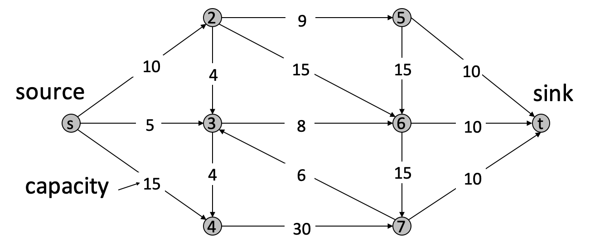


### B. Cuts

`Definition`{:.warning}

An s-t cut is a partition $(A,B)$ of $V$ with $s\in A$ and $t\in B$

<br>

`Definition`{:.warning}

The capacity of a cut $(A,B)$ is:

$cap(A,B)=\sum_{e\;out\;of\;A}c(e)$

也就是说从集合A出发指向集合B的边的capacity的总和

同理

$cap(B,A)=\sum_{e\;out\;of\;B}c(e)$

<br>

Example:

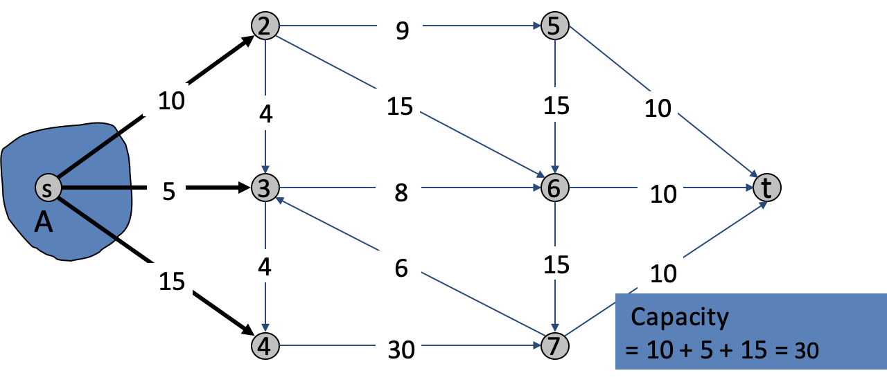

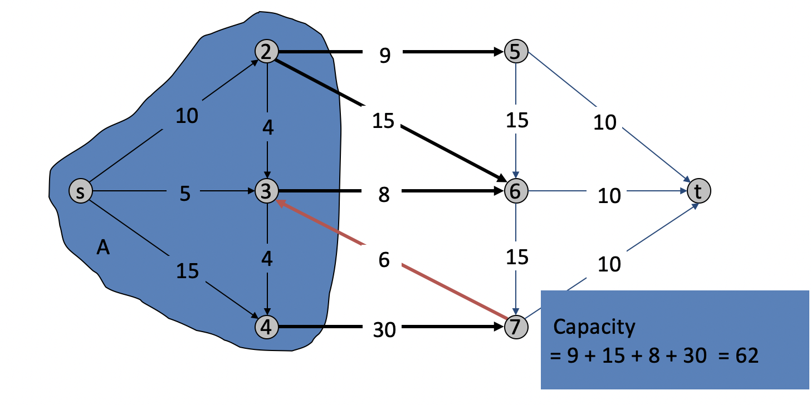


`Definition`{:.warning}

Min s-t cut problem. Find an s-t cut of ***minimum capacity***.

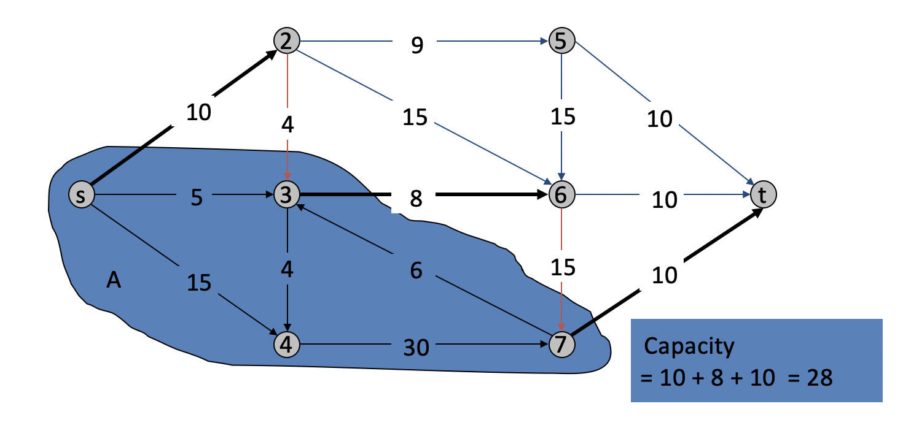

### C. Flows

`Definition`{:.warning}

An s-t flow is a function that satisfies:

* (capacity) For each $e\in E$: $0\leq f(e)\leq c(e)$ (也就是说流量不能超过管道限制)

* (conservation) For each $v\in V-\{s,t\}$: $\sum_{e\;in\;to\;v}f(e)=\sum_{e\; out\; of\;v}f(e)$ (也就是说进入v的流量和从v出去的流量相等)

<br>

`Definition`{:.warning}

The value of a flow $f$ is : 

$$v(f)=\sum_{e\;out\;of\;s}f(e)$$

<br>

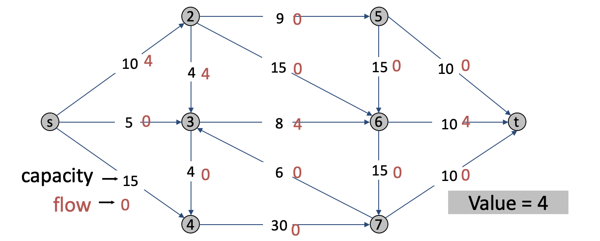

<br>

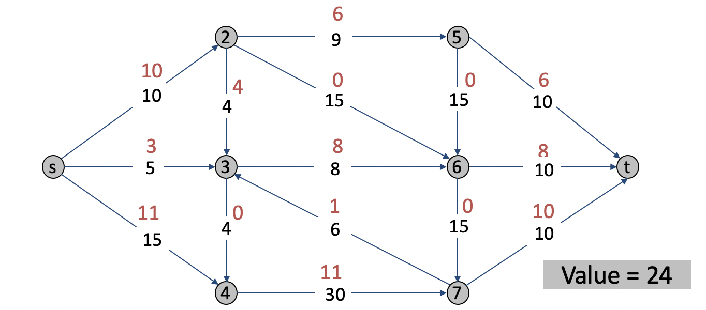

`Definition`{:.}

Find s-t flow of maximum value.


### Flows and Cuts

`Flow value lemma`{:.success}

Net flow $f$ across cut$(A,B)$= the amount leaving $s$.

$$\sum_{e\;out\;of\;A} f(e)-\sum_{e\;in\;to\;A}f(e)=v(f)$$

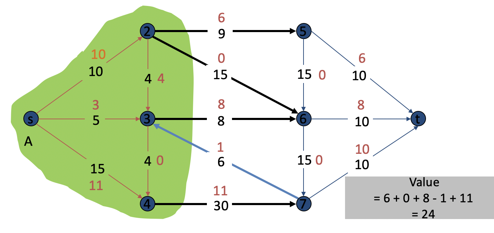


### Certificate of Optimality

我们可以想象整个图为管道系统，minimum cut是管道系统中最tight 的一部分的管道容量。flow不能超过管道容量。max flow是流体能通过管道的最大体量。要求max flow就是求minimum cut.

`Theorem`{:.error}

Let $f$ be any flow and $(A,B)$ be any cut. If $v(f)=cap(A,B)$, then $f$ is a max flow and $(A,B)$ is a min cut.

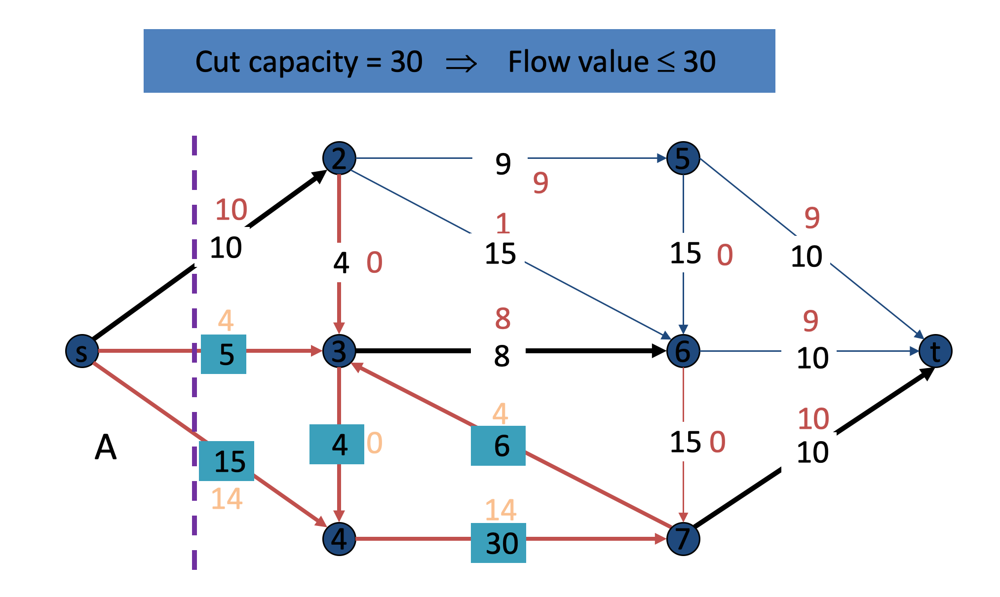

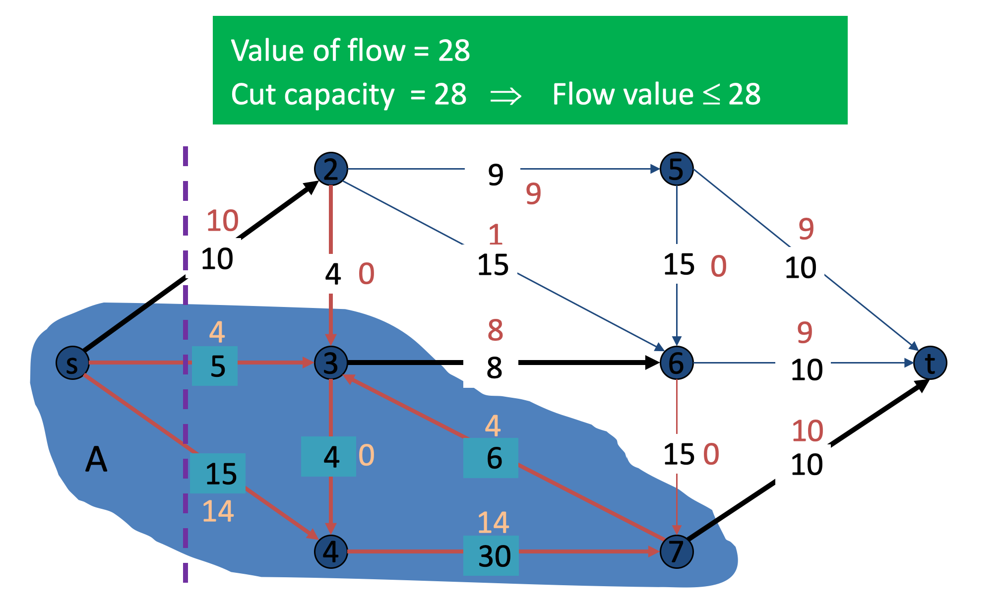


### Residual Graph

Original edge

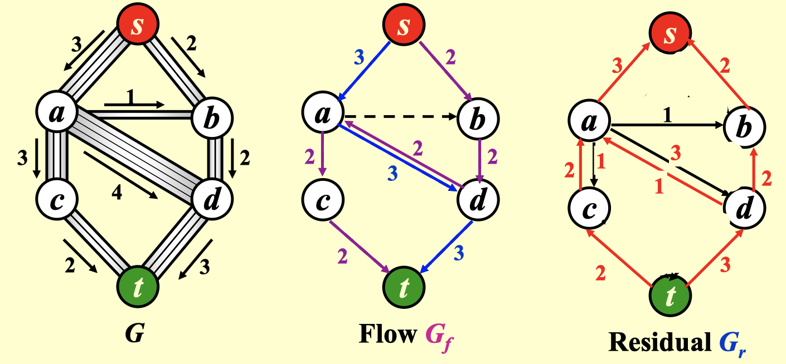


从图G开始并且构造一个流图$G_f$。

* $G_f$表示在算法的任意阶段已经达到的流。开始时$G_f$的边没有流，我们希望算法终止时$G_f$包含最大流
* $G_r$为残余图，表示对于每条边还能再添加上多少流。可以通过容量减去当前的流而计算出残余的流。$G_r$的边叫做残余边(residual edge)

augmenting path：图$G_r$中一条从s到t的路径。这条路径上的最小值边就是可以添加到路径每一条边上的流量。


```pseudocode
Ford-Fulkerson-Method(G, s, t)
	initialize flow f to 0
	while there exists an augmenting path p
		do augment flow f along p
return f
```


```cpp
int n, G[MAXV][MAXV];
int rG[MAXV][MAXV];
bool inq[MAXV] = {false};
int parent[MAXV];
bool BFS(int s, int t) {
    for(int i = 0; i < MAXV; i++) {
        inq[i] = false;
        parent[i] = -1;
    }
    queue<int> q;
    inq[s] = true;
    q.push(s);
    parent[s] = -1;
    while(q.size()) {
        int u = q.front(); q.pop();
        for(int v = 0; v < n; v++) {
            if(!inq[v] && rG[u][v] > 0) {
                q.push(v);
                parent[v] = u;
                inq[v] = true;
            }
        }
    }
    return inq[t] == true; //是否还存在augment path
}

int fordFulkerson(int s, int t) {
    for(int u = 0; u < n; u++) {
        for(int v = 0; v < n; v++) {
            rG[u][v] = G[u][v];
        }
    }
    int maxFlow = 0;
    while(BFS(s, t)) {
        int pathFlow = 0x3fffffff;
        for(int v = t; v != s; v = parent[v]) {
            int u = parent[v];
            pathFlow = min(pathFlow, rG[u][v]);
        }
        for(int v = t; v != s; v = parent[v]) {
            int u = parent[v];
            rG[u][v] -= pathFlow;
            rG[v][u] += pathFlow;
        }
        maxFlow += pathFlow;
    }
    return maxFlow;
}
```


### Ford-Fulkerson never terminate

`Theorem`{:.error}

There exists a flow network with real capacities such that Ford-Fulkerson does not terminate. Furthermore, the values of the flows found may converge to some value arbitrarily far from the max flow.

证明：

给出下图，其中$X$可以任意大，$\phi=\frac{\sqrt{5}-1}{2}$是$\phi=1-\phi^2$的一个解

可以发现下图的max flow是$2X+1$, 但是Ford-Fulkerson可以找到一个augmenting path的sequence，其flow value分别为$1,\phi,\phi,\phi^2,\phi^2,\cdots$

$$1+2\sum_{i=1}^\infty \phi^2=1+\frac{2}{1-\phi}=4+\sqrt{5}<6\ll 2X+1$$

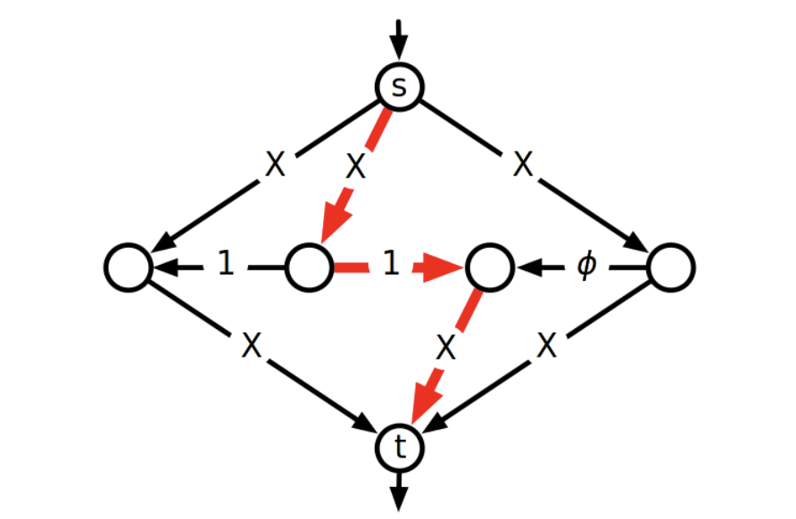


第一步，走如下红色经过center的路径，考虑中间水平的三条边，他们的residual capacities从$(1,1,\phi)$ 变成$(1,0,\phi)$

 现在我们的结果为$(\phi^0,0,\phi^1)$

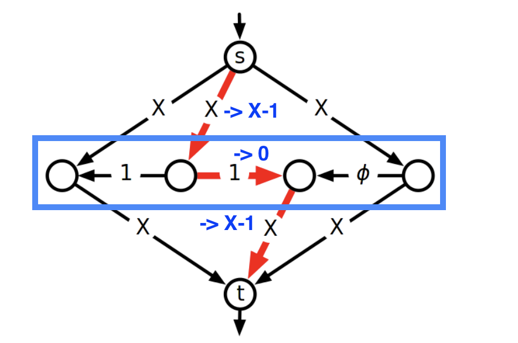

归纳法证明，如果当前三条边为$(\phi^{k-1},0,\phi^k)$, 那么通过寻找4条augmenting path, 我们就可以将这三条边转化为$(\phi^{k+1},0,\phi^{k+2})$

下图表示了三种paths

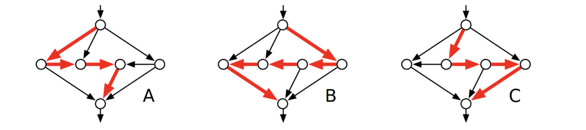

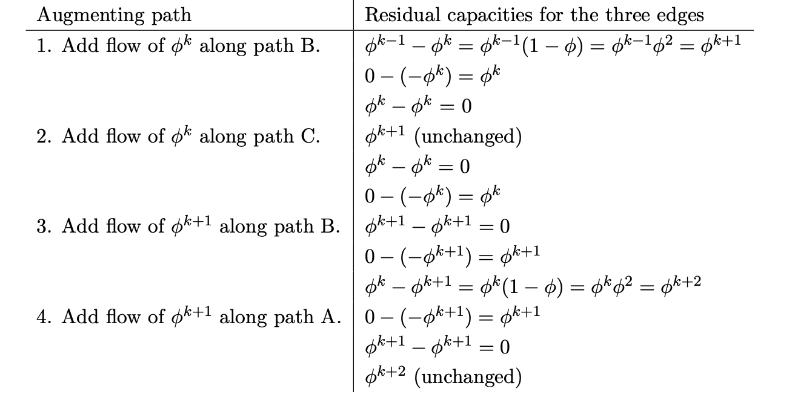


## Edmonds-Karp: pick shortest augmenting path

`Claim`{:.success}

Length of the augmenting path will be non-decreasing!

证明：

在一条augmenting path上，总是存在critical edge $(u,v)$, 他是augmenting path中capacity最小，限制了整条augmenting path的flow，即$f(u,v)=c(u,v)$=flow of the augmenting path

这个critical edge会在下一次augmentation反向。

因此，如果在下次augmentation选择了不含有这条critical edge的新augmenting path, 那么他一定不会比原来的augmenting path短，否则在上一次我们就会选择这条短的augmenting path.

如果在下次augmentation选择了含有这条critical edge的新augmenting path, 因为critical edge的反向，新augmenting path不仅不会比原来的augmenting path短，而且至少比原augmenting path长两个单位。

<br>

有了以上的claim后，我们有可以得出如下结论

{:.success}

Each edge can become critical(and reverse) at most $\vert V\vert$ times。

因为一条路径最长的长度为$\vert V\vert$ (所有顶点串联)

一条边被选到成为critical edge后, 那么再选到他为critical edge就会使path的长度至少增加1(其实是2啦)，因此，每条edge最多成为$\vert V\vert$次critical edge.

所以totoal number of augmentations:

$$O(\vert V\vert \vert E\vert)$$

每次augmentation, 用BFS去找shortest augmenting path. BFS的复杂度是$O(\vert V\vert +\vert E\vert)$的, 因为每条边和每个顶点只会被遍历到一次。

因此Total time complexity:

$$O(\vert V\vert \vert E\vert^2)$$


## $O(\vert V\vert^3)$ max-flow algorithm

`definition`{:.warning}

throughtout(v) = sum of input capacities or sum of output capacities, whichever is smaller.

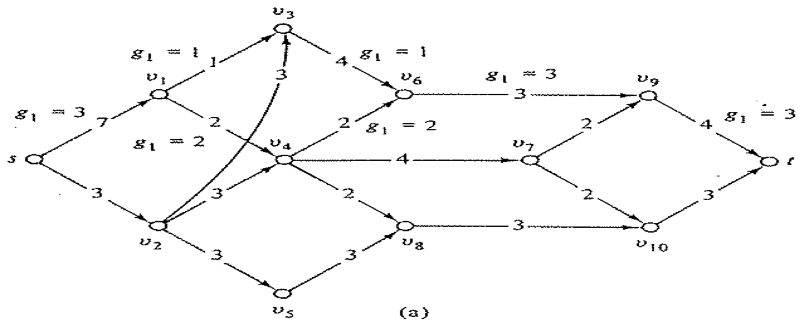


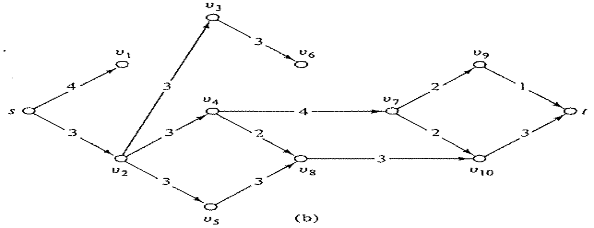


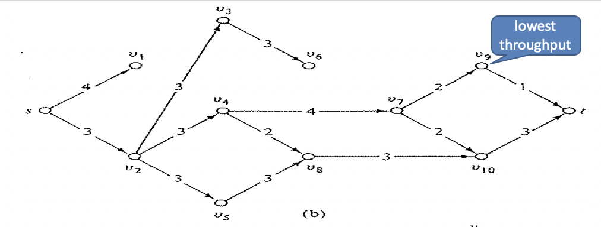

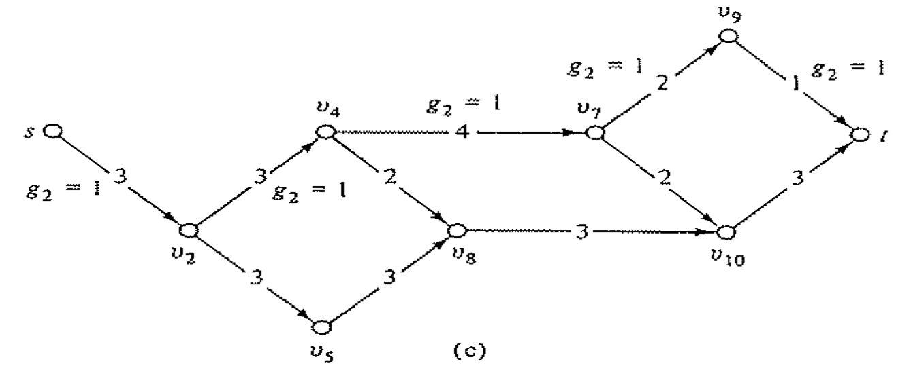


References:

[1]http://www.cs.cmu.edu/afs/cs/academic/class/15750-s17/ScribeNotes/lecture19.pdf

