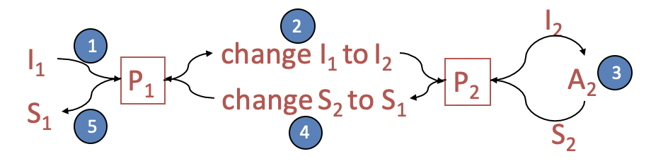

# 1. What is problem reduction

Reducing $P_1$ to $P_2$ ($P_2$)

我们想要解决问题 $P_1$， 手上有解决问题$P_2$的算法$A_2$。将问题$P_1$的实例$I_1$变换成问题$P_2$的实例$I_2$。用算法$A_2$解决$I_2$, 得到解$S_2$。再将$S_2$变换成$I_1$的解$S_1$.

这个合成的算法就是问题$P_1$的算法$A_1$

Algorithm *A*1:

* 对于问题$P_1$的实例$I_1$, 生成问题$P_2$的实例$I_2$
* 用算法$A_2$解决问题$P_2$的实例$I_2$
* 得到解$S_2$
* 将$S_2$转换成$I_1$的解$S_1$

合成算法$A_1$可能比较慢(不会比$A_2$快)， $time(A_1)\geq time(A_2)$

Upper bound for $P_1$: $time(A_1)\leq conversion\;time(input\;and \;output) +time(A_2)$

 

# 2. limits: If $P_1$ is hard, then so is $P_2$

$P_1,P_2$是一个难度级别的。

如果可以很容易的解决$P_2$, 那么我们也可以很容易的解决$P_1$

同样，如果解决$P_1$很难，那么解决$P_2$也很难。

做reduction的目的就在于说明$P_2$ hard, 并不是真的要用它去解决问题

## 2.1 Examples

### A. Distinct Integers Sorting

`Theorem`{:.error}

Any algorithm for sorting distinct integers has worst case runtime $\Omega(nlogn)$

Proof:

假设算法$A_{SDI}$可以在$T(n)$时间sort distinct integers($P_2$)

我们可以说明general sorting($P_1$)的算法A时$O(T(n))$的。因为A是$\Omega(nlogn)$的，那么$A_{SDI}$也必须是$\Omega(nlogn)$的

 

给定算法$A_{SDI}$

我们想要sort $\{a_1,a_2,\cdots,a_n\}$, 这些数不一定distinct(也就是General Sorting)

对每个$a_i$, 令$b_i=a_in+i$

&emsp;注意到，如果有$a_i<a_j$, 就有$b_i<b_j$

所有的$b_i$都distinct

用$A_{SDI}$来对$b$做sorting

> Claim: if $b_i <b_j$, then $a_i\leq a_j$
>
> Proof:
>
> 如果$b_i<b_j$, 也就是$a_in+i<a_jn+j$
>
> 那么对于$1\leq i,j\leq n$, 有
>
> * $a_i=a_j$ and $i<j$
> * $a_i<a_j$
>
> 这两种情况下都说明$a_i\leq a_j$

所以对$b_i$对排序等价于对$a_i$的排序

 

总结一下：

sorting distinct integers这个问题事先不知道他的复杂度。然后我们证明了如果我们可以解决这个问题，我们就可以解决sorting in general的问题, 即

$$General\; Sorting\propto Distinct\; Integer\; Sorting$$

那么我们就知道了sorting distinct integer和sorting in general是一个难度级别的

 

### B. Integer Distinctness Problem

判断给定一组整数$\{x_1,x_2,\cdots,x_n\}$, 这些整数是否不同

接下来我们要分析这个问题的复杂度。

如果comparison只有"equal"和"not equal"两个答案，那么复杂度: 

Lower bound $=\Omega(n^2)$ By Adversary

因为任何两个数之间都要比较一下，否则adversary就可以更改结果

如果comparison有$<,=,>$的答案，那么复杂度是多少呢？

我们接下来证明

$$Integer\; distinctness\;problem\propto sorting$$

 

给定$\{x_1,x_2,\cdots,x_n\}$

1. Sort N items. 假设$x_i$各不相同，对$x_i$进行排序

$$x_1<x_2<\cdots<x_i<x_{i+1}<\cdots<x_n$$

2. Check adjacent pairs for equality. 接下来要比较所有$x_i,x_{i+1}$。否则的话，假设$x_k,x_{k+1}$没有进行比较，那么在改动$x_k=x_{k+1}$后，该算法仍然会给出distinct的结果

这些比较可以在线性时间完成。

所以最终integer distinctness problem需要$N log N + N$

 

### C. Closest Pair Problem

给定n个数$\{x_1,x_2,\cdots,x_n\}$. 找到一对数，他们之间的差距最小

这个问题的复杂度$T(n)=O(nlogn)$

因为$Integer\; distinctness\;problem\propto Closest\;pair\;problem$

稍加思索可知，这个reduction是对的。如果closest pair problem得到最小的difference是0， 那么integer distinctness problem给出的答案就是"no", 如果closest pair problem得到最小的difference不是0， 那么integer distinctness problem给出的答案就是"yes"

## 2.2 Refining Reduction

The general "reducing" algorithm, $P_1\propto P_2$

1. 对于问题$P_1$的实例$I_1$, 生成问题$P_2$的实例$I_2$

2. 用算法$A_2$解决问题$P_2$的实例$I_2$, 得到解$S_2$

3. 将$S_2$转换成$I_1$的解$S_1$

step 1 and 3 need to be dominated by step 2's runtime. 这个时候我们才可以说$P_1, P_2$是一样难的

# 3. Time Complexity on Reductions

* Linear reductions ($P_1\propto_l P_2$)

Step 1: $O(\vert I_1\vert$)time to pepare $I_2$ for $P_2$

Step 3: $O(\vert I_1\vert) $ time to change $S_2$ into $S_1$ to $I_1$

* Polynomial reductions ($P_1\propto_p P_2$)

Step 1: $O(f(\vert I_1\vert))$ time to pepare $I_2$ for $P_2$

Step 3: $O(f(\vert I_1\vert)) $ time to change $S_2$ into $S_1$ to $I_1$

A reduction from problem $P_1$ to $P_2$ in $O(f (n))$ time and an $O(g(n))$ time algorithm for $P_2$ gives an $O(f(n)+g(n))$ algorithm for $P_1$. 

 

# 4. More Problems

### 4.1 TSP and HC

Traveling Salesman Problem (TSP): (optimization problem)

> A salesman aims to visit each of the *n* cities at least once and return to his starting point

Given: A weighted complete graph G

Goal: A minimum TSP tour in G.

Hamiltonian Cycle: (decision problem)

> Given an unweighted graph G=(V,E), does the graph have a tour which visits every vertex exactly once?

