# Selection Problem

这里我们会讨论几个问题，这几个问题都可以归类到selection。除了找到解法外，我们还会讨论lower bounds。

## 1.1 Adversary Arguments

假设有一个算法，我们认为是有效的。想象有一个对手想证明他不是有效的。在每一个算法做判定的点，对手告诉我们判定的结果。对手选择他的回答使得算法更难找到结果，也就是说对手迫使算法做更多的判定。可以认为对手逐渐构造一个算法的坏的输入。对手的唯一限制是必须保持前后一致

## 1.2 tournament

使用tournament来描述比较的结果，比较中大的称为winner, 小的称为loser

# 2. 查找max和min

稍加思索，我们发现这个任务可以通过用n-1次比较来找到max,再通过n-2次比较找到min来完成，一共是$(n-1)+(n-2)$次比较。但是我们会有更好的方法

用分治进行分析

```pascal
Procedure MAXMIN(S):/*two outputs (max, min)*/
case S={a}: return (a, a)
case S={a, b}: return (MAX(a, b), MIN(a, b))
Else begin
	divide S into S1 and S2 /*equal-size subsets*/
	(max1, min1)<-MAXMIN(S1);
	(max1, min2)<-MAXMIN(S2);
```

接下来我们分析这个算法的复杂度

令$T(n)$为计算MAXMIN(S)所需要的比较次数, $\vert S\vert =n=2^m$

$$T(n)=\begin{aligned}&2T(n/2)+2&n>2\\&1&n=2\\&0&n=1\end{aligned}$$

$\begin{aligned}T(n)=&2T(n/2)+2\\=&2(2T(n/4)+2)+2\\&\vdots\\=&2^{m-1}T(2)+2^{m-1}+2^{m-2}+\cdots+2^2+2\\=&2^{m-1}+2^m-2\\=&\frac{3n}{2}-2 \end{aligned}$

接下来我们说明这个下界是紧的

`theorem`{:.warning}

在n个元素中通过comparison查找max和min的任意算法在最坏情况下都必须做至少$\frac{3n}{2}-2$次比较

Proof:

为了建立lower bound, 不妨假设这些元素各不相同。为了确定一个key $x$是max, 一个key $y$是min, 算法必须知道其他的所有元素都直接或者间接败于$x$, 其他元素都直接简介胜于$y$。如果我们计胜和败为一个unit的信息，则算法必须知道至少2n-2个unit的信息(n-1个元素输给了x, n-1个元素赢了y)。adversary希望每次给出的结果都使获得的信息量尽可能小。

我们设置如下状态

| Key Status | 含义                     |
| ---------- | ------------------------ |
| W          | 至少胜过一次并且从未败过 |
| L          | 至少败过一次并且从未胜过 |
| WL         | 至少胜过一次败过一次     |
| N          | 还没有被比较过           |

每一个W或L是一个unit的信息，WL有2个unit的信息，N不携带信息。

下表给出Adversary策略, adversary希望每次回答给出的信息越少越好。因此在遇到W,L时，adversary回答$x>y$, 这样增加的信息就为0，反之如果回答$x<y$, 状态就会变为WL, WL, 增加了2个单位的信息

| 算法比较的x,y所处状态 | adversary回答 | 新的状态  | units of new information |
| --------------------- | ------------- | --------- | ------------------------ |
| N,N                   | x>y           | W,L       | 2                        |
| L,N                   | x<y           | L,W       | 1                        |
| W,W                   | x>y           | W,WL      | 1                        |
| L,L                   | x>y           | WL,L      | 1                        |
| W,N或WL,N             | x>y           | W,L或WL,L | 1                        |
| W,L或WL,L或W, WL      | x>y           | 没有改变  | 0                        |
| WL,WL                 | 与赋值一致    | 没有改变  | 0                        |

我们希望每次增加的信息越多越好

step 1: $\frac{n}{2}$ comparisons N,N 获得n个unit的信息

step 2: 剩下n-2个unit的信息可以通过做n-2次比较得到

因此，最少需要$\frac{n}{2}+n-2=\frac{3}{2}n-2$次比较


# 4. The selection Problem

## 4.1 分治

我们将集合拆成两个子集合$S_1,S_2$, 并且$S_1$中的元素比$S_2$中的元素都要小。那么median位于含有较多元素的那个子集中。

比如一个含有$n=255$元素的集合, 我们想找他的median( rank k=128). 假设拆分后$S_1$有96个元素，$S_2$有159个元素。那么median就在$S_2$中，并且在$S_2$中rank 32位。

这个例子也向我们说明了，找median和找第k大大元素本质上是一样就大。因此我们去求解general selection problem.

## 4.2 A Linear-Time Selection Algorithm

algorithm

***Input：***

​	 **S**， a set of keys；

​	 **k**， an integer such that $1\leq k\leq n$

***Output:*** The kth smallest key in **S**


Element selection(SetOfElements S, int k) 

0. if($\vert S\vert \leq 5$)

&emsp;return direct solution for *k*th element of **S**

1. 将keys分成组，每组5个元素，找到每个组的median(最后一个组可能少于5个元素，但是我们也称其为一个5元集合)。令每个集合的median为M。令$n_M=\vert M\vert =\lceil n/5\rceil$.  我们可以得到下图。每个5元组中，2个较大的出现在median上面，2个较小的出现在median下方

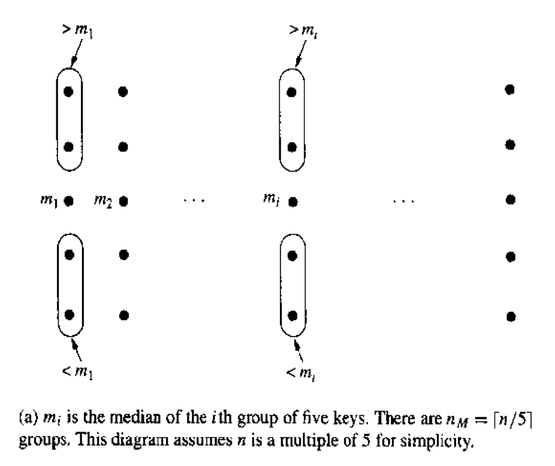

2. $m^*=select(M,\lceil\frac{\vert M\vert}{2}\rceil)$

($m^*$ 是M的median)

加下来，我们将这些5元组重新排列，median大于$m^*$的放在他右边，median小于$m^*$放在他左边。排列后我们将这些数分区，B区都是$>m^*$, C区都是$<m^*$

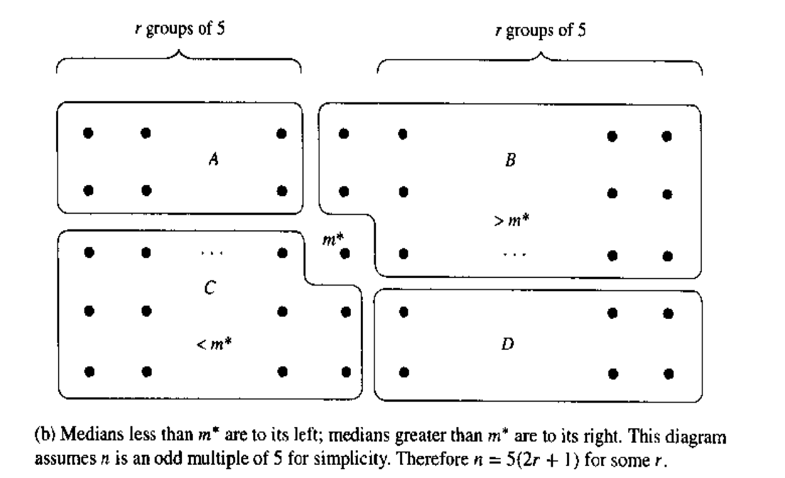

3. 将A区，D区元素和$m^*$进行比较, 结合B区和C区后，得到如下两个集合

$S_1=C\cup\{$ keys from $A\cup D$ that are smaller than $m^*\}$ 

$S_2=B\cup\{$ keys from $A\cup D$ that are larger than $m^*\}$ 

4. Divide and Conquer

if ($k=\vert S_1\vert +1$)

&emsp; $m^*$ is the kth-smallest key

&emsp; return $m^*$

else if ($k\leq\vert S_1\vert$)

&emsp;the kth-smallest key is in $S_1$

&emsp;return select($S_1$, k)

else 

&emsp;the kth-smallest key is in $S_2$

&emsp;return select($S_2,k-\vert S_1\vert -1$)

## 4.3 Analysis

令$W(n)$为输入规模为n时需要的比较次数

假设$n=5(2r+1),r$是一个非负整数

<br>

1. 找到每个5元组的median: 每组需要6次比较，一共需要$6(n/5)$次比较
2. 递归去找median of medians, 找到$m^*$: $W(n/5)$
3. 将A和D区的元素与$m^*$比较: 一共需要$4r$次比较

4. 递归select， 在最坏的情况下，A和D的4r个元素都比$m^*$大或者都比$m^*$小，B和C各有$3r+2$个元素，所以select的最大规模为$7r+2$: $W(7r+2)$

$W(n)\leq 1.2n+W(0.2n)+0.4n+W(0.7n)=1.6n+W(0.2n)+W(0.7n)$

画出recursive tree

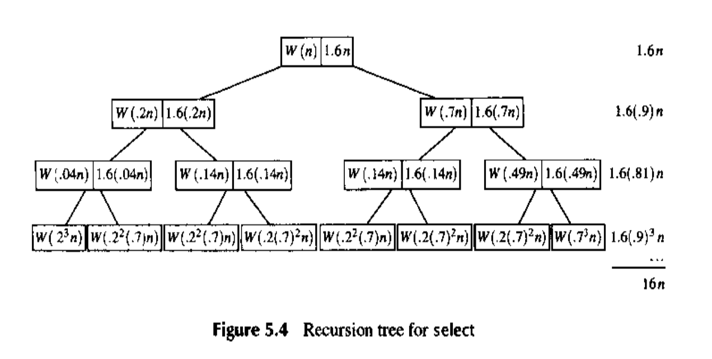

<br>

## 4.4 A Lower Bound for Finding the Median

为了找到中位数，我们必须知道每一个数与中位数的关系。也就是说，对任意一个数$x$, 我们必须知道$x>median$或者$x<median$。这样我们就可以建立如下的这样一棵树。每个节点代表一个key, 每条边代表一次比较，比较高的节点代表比较大的数值。

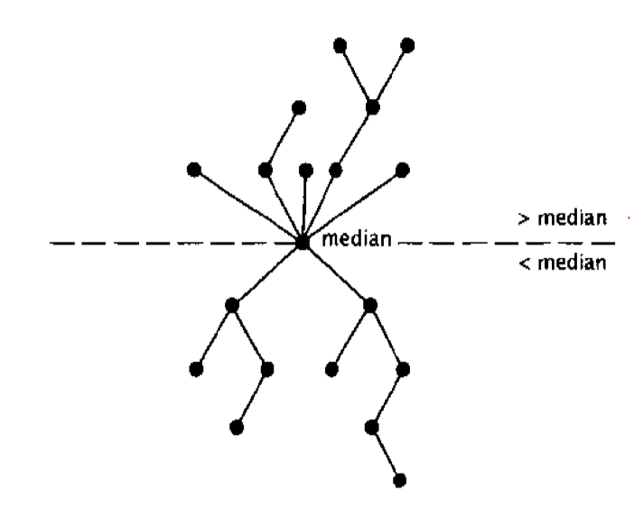

如果有一些未知的key, 比如y, adversary可以改变y的值，从而改变median的值

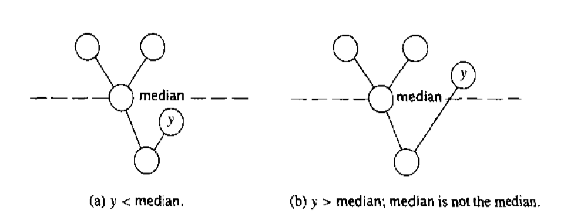


图中有n个顶点，n-1条边，因此至少要做n-1次比较，但是adversary可以迫使你做一些useless的比较


### A. Crucial comparison

`definition`{:.warning}

A comparison involving a key $x$ is a crucial comparison for $x$ if it is the first comparison where $x>y$, for some $y\geq median$, or $x<y$ for some $y\leq median$.

Comparisons of x and y where $x>median$ and $y<median$ are noncrucial

我们可以看到, crucial comparison可以建立$x$与$median$的关系。另一点需要注意，这个定义并不要求$x$的crucial comparison时已经知道$y$和$median$的关系

<br>

下面我们会说明adversary如何迫使算法去做noncrucial comparisons. 

首先adversary选择一个数(not a particular key)为median.

在比较的过程中，adversary会给在comparison中的new key赋值。在这个过程中要保证, 大于$median$的key不会超过$\frac{n-1}{2}$个，小于$median$的key也不会超过$\frac{n-1}{2}$个

我们设置以下状态

| L     | Has been assigned a value Larger than median      |
| ----- | ------------------------------------------------- |
| **S** | **Has been assigned a value Smaller than median** |
| **N** | **Has not yet been in a comparison**              |


| Comparands   | Adversary's action                                        |
| ------------ | --------------------------------------------------------- |
| N, N         | (S, L) Make one key larger than median ,the other smaller |
| L, N or N, L | (L, S) Assign a value smaller than median to N            |
| S, N or N, S | (L, S) Assign a value larger than median to N             |
|              |                                                           |

adversary采取的策略如上表格所示

如果已经有$\frac{n-1}{2}$个key处于S状态或者L状态，adversary就会忽略上述表格中的规则，开始将剩下N赋值为L (resp. S), 直到只剩下一个N没有赋值，这个值就是median

我们可以看到在表格中的这些比较全都是noncrucial comparisons. Adversary可以迫使算法做至少$\frac{n-1}{2}$次noncrucial comparisons.(算法可以每次都比较N,N keys来达到$\frac{n-1}{2}$这个最小值, adversary并不能保证算法做比$\frac{n-1}{2}$次更多的noncrucial comparisons)

因此总共需要的比较次数为$n-1$(crucial comparisons)$+(\frac{n-1}{2})$(noncrucial comparisons)

<br>

Example: 

Find the median of 5 elements

如果用sorting的方式，可以用7次比较将5个元素排序，然后就可以知道median了

但其实采取上述方式，他的lower bound$=\frac{3(n-1)}{2}=6$

Step 1: sort two pairs($a<b, c<d$)

Step 2: order their larger elements ($b<d$) $\Rightarrow d >median$

Step 3: compare c and e ($c<e$)

Step 4: order the larger elements of $(c,e)$ and $(a,b)$ , ($b<e$)

Step 5: compare c and b, greater one is the median


# Find X in a sorted matrix

什么是sorted matrix?

给定一个矩阵M，每一行每一列都是升序的

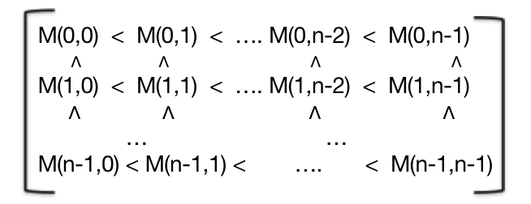

我们的问题是：Find whether x is in sorted matrix M

<br>

### A. a solution

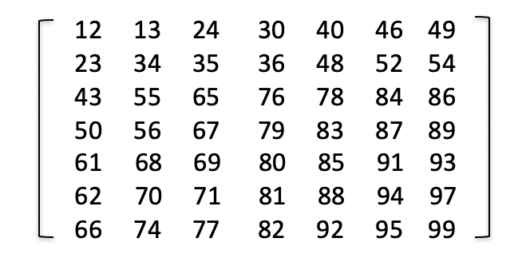

algorithm: Find(x)

1. start with top right element, say $e$
2. Loop: compare $e$ with $x$
   * if $e==x$ then return "found"
   * if $e<x$ then remove down (if out of bound then return "false")
   * if $e>x$ then remove left (if out of bound then return "false")
3. repreat 1,2,3 till you find $x$ or return "false"

Complexity: 2n-1次比较

Example: Find(84)

1. e=49, 比较49和84

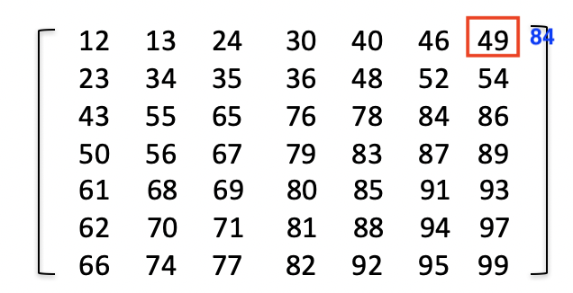

2. 84>49, move down

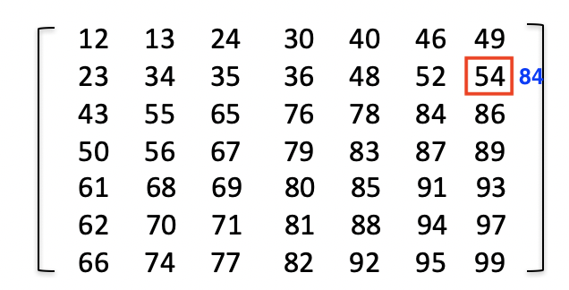

3. 84>54, move down

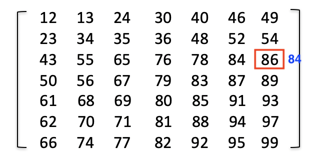

4. 84<86, move left

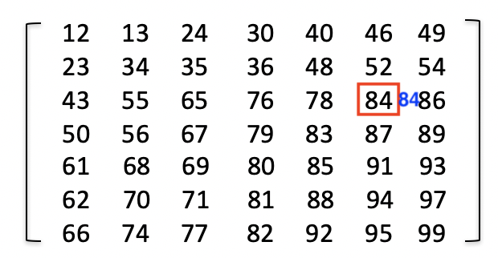

5. 84=84, found!

### B. Lower Bound

Adversary的目标是: eliminate as less elements as possible

考虑如下例子

我们可以发现每个6或者8的位置都可以被7代替。你可以不断去访问这些位置，在最后一次访问，adversary回答7在这个位置

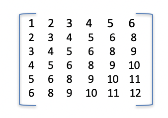

因此至少需要2n-1次比较


# Merge Sorted Lists

Problem: 合并两个有序列表$X_1<X_2<\cdots X_n$和$Y_1<Y_2<\cdots Y_n$到一个有序列表

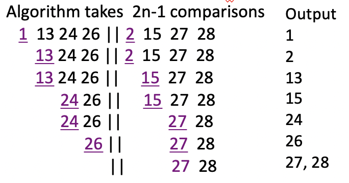

复杂度为$2n-O(n)$

Adversary: 2n-1 comparison

接下来我们来证明更紧更精确的界

<br>

### Adversary Proof of 2n-1 comparisons

假设算法可以只用2n-2次比较就合并两个规模为n的有序列表X,Y

Adversary采取的策略：

* query $Y_i<X_j(i<j)$: yes

* query $Y_i<X_j(i\geq j)$: no

令$X_i=2i-1, Y_i=2i$

那么最后形成的有序列表为$X_1Y_1X_2Y_2\cdots X_iY_i\cdots X_nY_n$

如果只用2n-2次比较，那么至少有一个$X_i$没有和$Y_i,Y_{i+1}$中的一个数做比较(note: $X_1$只需要和$Y_1$比较)

不失一般性，假设$X_i$没有和$Y_i$做比较

令$X_i=2i,Y_i=2i-1$

X列表和Y列表保持顺序不变，但是最后形成的合并列表的顺序就发生了改变

因此2n-2次比较是不够的，至少需要2n-1次

<br>

# Graph Connectivity

给定一个无向图$G=(V,E)$的邻接矩阵A, A是$n\times n$的, $A[i,j]=1\;or\;0$, query $Q(i,j)=1$ iff $A[i,j]=1$

<br>

Q: 是否需要query邻接矩阵A中的所有元素才能判断图的连通性呢？

A: 是

Adversary策略：

* 维护两个图, Y和M ('yes'和'maybe')
* Y包含了已知在G中的边，$A[i,j]=1$
* M包含了所有在Y中的边以及没有被测试的边
* 一开始，Y是空的，M是满的
* $Q(i,j)$ return 0 如果在删掉了边$e(i,j)$后M仍然是连通的； 否则return 1并且加入Y

我们需要考虑A中所有的entry

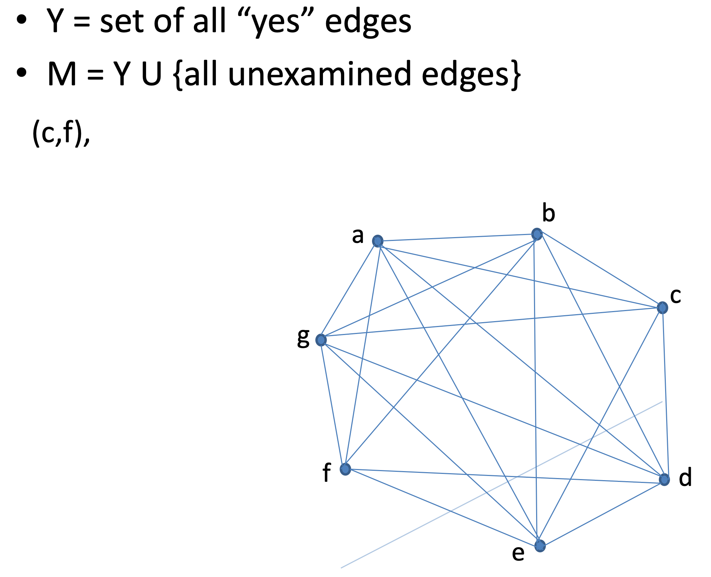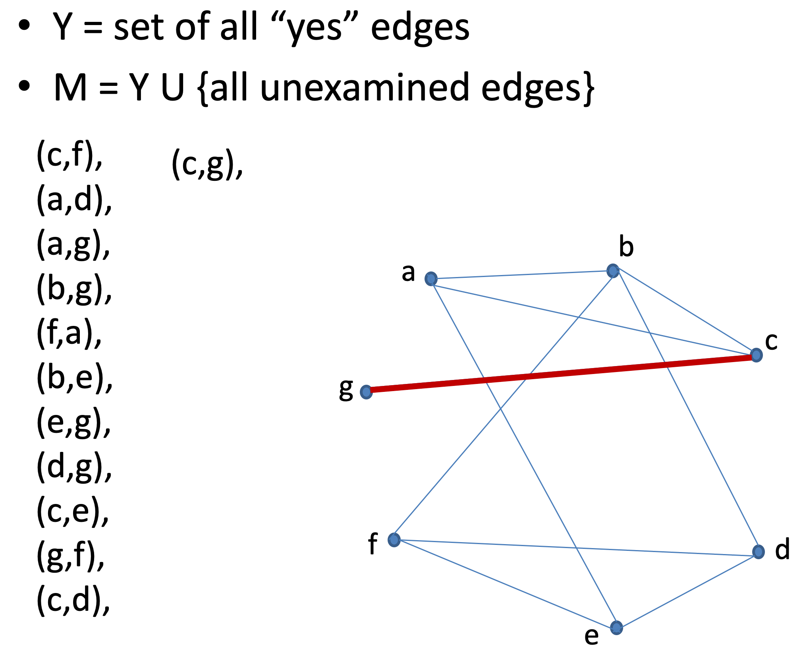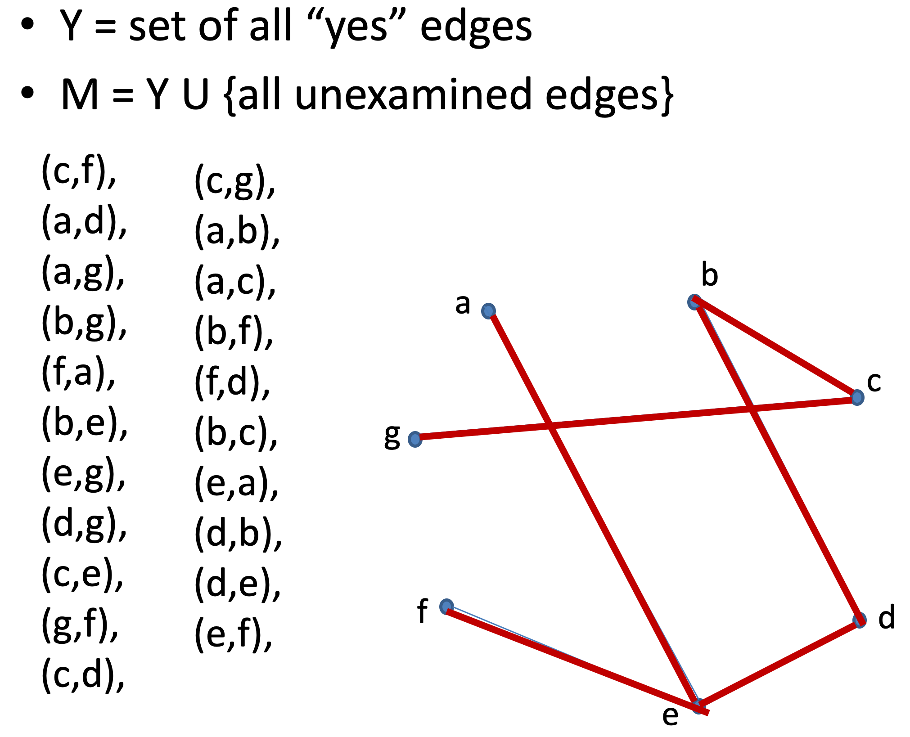


# Finding Patterns in Bit Strings

Does an n-bits string B contain the substring 01?

### A. Finding 01 Patterns in Odd-Length

 如果n是奇数

我们去研究$B(2),B(4),\cdots, B(2i), \cdots,B(n-1)$

* 如果$B(2i)=0$ 并且有$B(2j)=1,j>i$, 那么答案是"yes" (必然有一个01边界)
* 如果所有$B(2i)=0$，就不需要考虑$B(1)$
* 如果所有$B(2i)=1$，就不需要考虑$B(n)$

* 如果$B(2i)=1,i<k$ 且$B(2j)=0,j\geq k$, 就不需要考虑$B(2k-1)$


### B. Finding 01 Patterns in Even-Length

假设$n=6$

