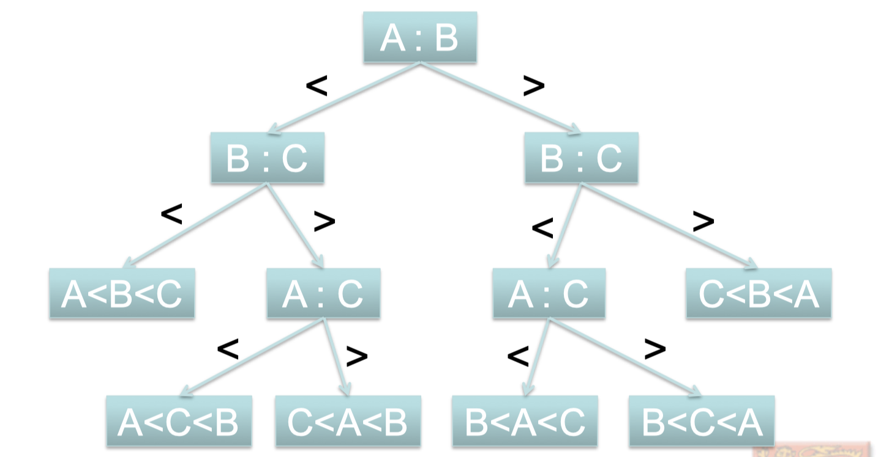
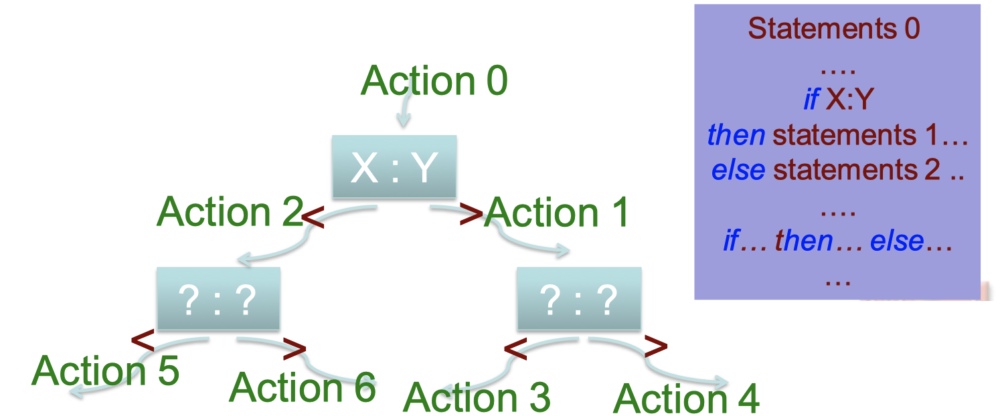
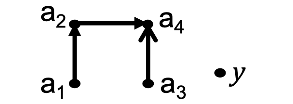
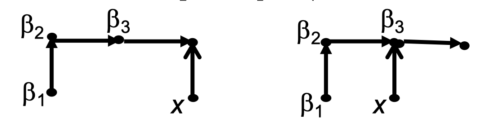
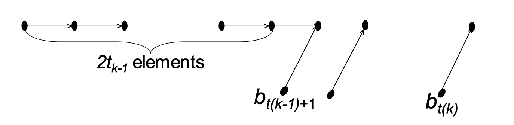

# Is Procedure P an algorithm?

P is an algorithm if P takes any input, always stops and outputs "Yes" or "No".

P用二进制码表示

## Undecidable Problems

An undecidable problem is a decision problem for which. it is proved to be impossible to construct an algorithm that always leads to a correct yes-or-no answer

### Post Correspondence Problem

Given: a collection of dominoes 

如

目标：找到一个有限的domino序列(允许复选)，使得上面字母形成的字母序列和下面字母形成的字母序列相同。

比如：根据上面的dominoes, 我们可以得到一下的合法序列

ABCAAABC

#### Another PCP example

给定3种dominoes

是否存在解？

 

事实上:

{:.warning}

There does not exist an algorithm which can solve this PCP problem, because PCP can simulate the compuatation of a Turing Machine. PCP problem is undecidable.

`Theorem`{:.error}

The post correspondence problem is undecidable, provided that the alphabet $\Sigma$ has at least two symbols

那么如果$\Sigma$只有一个symbol是怎么样的情况呢？答案是decidable

Suppose we have n tiles

| Type $A_1$ | Type $A_2$ | $\cdots$ | Type $A_n$ |      |
| ---------- | ---------- | -------- | ---------- | ---- |
| $a_1$ 0s   | $a_2$ 0s   | $\cdots$ | $a_n$ 0s   |      |
| $b_1$ 0s   | $b_2$ 0s   | $\cdots$ | $b_n$ 0s   |      |

We choose $x_1$ $A_1$, $x_2$ $A_2$, $\cdots$ , $x_n$ $A_n$

$x_1a_1+x_2a_2+\cdots+x_na_n=x_1b_1+x_2b_2+\cdots+x_nb_n$

$x_1(a_1-b_1)+x_2(a_2-b_2)+\cdots +x_n(a_n-b_n)=0$

* if $\exist i, s.t.\; a_i-b_i=0$ , then choose $x_i=1,2,\cdots, $

* find i that max$(a_i-b_i)$, j that min$(a_j-b_j)$

  * if $(a_i-b_i)(a_j-b_j)>0$ , there is no solution

  * else 

    * find LCM$(a_i-b_i, a_j-b_j)=m$ (最小公倍数), choose $x_i=m/(a_i-b_i), x_j=m/(a_j-b_j), others=0$

# Sorting

## Sorting 3 elements (A, B, C)

对元素两两比较

可以看到sort tree的高度是3

因此number of operations(key comparisons) = 3

#### Is it optimal?

可以看到做两次comparison生成的sort tree的叶子结点有4个，说明只能分辨4个permutations

对n个元素进行排序

permutations的数量$=n!$

因此，sort tree的高度至少为$\lceil log_2n!\rceil$

| n                      | 2    | 3    | 4    | 5    | 6    | 7     | 8     | 9      |
| ---------------------- | ---- | ---- | ---- | ---- | ---- | ----- | ----- | ------ |
| $n!$                   | 2    | 6    | 24   | 120  | 720  | 5040  | 40320 | 362880 |
| $log 2 (n!)$           | 1    | 2.58 | 4.58 | 6.91 | 9.49 | 12.30 | 15.30 | 18.47  |
| $\lceil log_2n!\rceil$ | 1    | 3    | 5    | 7    | 10   | 13    | 16    | 19     |

例子：sort 5 elements in 7 comparisons

## Binary Comparison Sort

也是一种insertion sort -- 将第$k$个元素插入$k-1$个已排序元素中

二分插入第k个元素需要的比较次数为$\lceil log_2(k-1+1)\rceil$，因为一棵有n个节点完全二叉树的高度为$\lceil log(n+1)\rceil$

他需要的总比较次数为

$$B(n)=\sum_{k=1}^n\lceil log_2k\rceil$$

| n                      | 1    | 2    | 3    | 4    | 5    | 6    | 7    | 8     | 9      |
| ---------------------- | ---- | ---- | ---- | ---- | ---- | ---- | ---- | ----- | ------ |
| $n!$                   | 0    | 2    | 6    | 24   | 120  | 720  | 5040 | 40320 | 362880 |
| $\lceil log_2n!\rceil$ | 0    | 1    | 3    | 5    | 7    | 10   | 13   | 16    | 19     |
| $B(n)$                 | 0    | 1    | 3    | 5    | 8    | 11   | 14   | 17    | 21     |

因为事实上

$\lceil log_2n!\rceil=\lceil \sum_{k=1}^n log_2k\rceil \leq \sum_{k=1}^n\lceil log_2k\rceil$

可以看到在n=5度时候，这种算法需要8次比较，事实上有只需要7次的比较方式

## Merge Insertion Sort

#### Sorting 5 elements in 7 comparisons

* 首先做两两比较，不妨$a_1,a_2$做比较并且$a_2>a_1$, $a_3,a_4$做比较并且$a_4>a_3$
* 将max$(a_1,a_2)$和max($a_3,a_4)$做比较， 不妨$a_4>a_2$

* 将y合并到这个chain中，先和$a_2$比, 再是$a_1$或者$a_4$

* 将x合并到这个chain中, 先和$\beta_2$比，再和$\beta_1$或者$\beta_3$比较

一共是7次比较

Show how to sort 11 elements with mergeinsertion sorting (5 elements is known to be sorted in 7 comparisons).

1. Make pairwise compasions： 5 comparisons

1. Sort the larger key by merge insertion

Merge Insertion(5)=7

3. insert b3 and b2(2 comparisons each)

4. insert b4 and b5(3 comparisons each)

4. insert b6(4 comparisons)

Total: $5+7+2*2+3*2+4=26= \lceil log_221!\rceil$ comparisons

这一部分参考了<a href="https://jiangshibiao.github.io/2020/04/26/Algorithm-Designs-and-Analysis/#Flow-and-Match">jsbdl的blog</a>

总之，对于N个数

* 先将数字分成$\lceil N/2\rceil$ 个组两两比较。如果是奇数那就多出一个数字。设比较完的序列是 $b_i<a_i(i\in1..N)$ ，以及可能存在单个 $b_{N/2+1}$
* 对于$a_i$这 $N/2 $个数调用 Merge-Insertion-Sort 使其有序
* 依次把 $b_i$ 序列插入到主链上。具体地，首先分别花 2 步把 $b_3,b_2$ （通过二分）插入到 $(b_1,a_1,a_2)$ 的链上；然后花 3 步把 $b_5,b_4$ 插入到链上；然后花 4 步把 $b_{11}∼b_6$ 插入到链上……

怎么判断$b_i$要怎么插呢？

本质上$b_i$是通过二分插入来确定位置的，因此, 如果$b_i$前面有$2^{k-1}+1$~$2^k$个元素插入只需要k次

Insert each $b_{t(k)},b_{t(k)-1},\cdots,b_{t(k-1)+1}$ in k comparisons,

也就是说需要树高为k, 树高为k的完全二叉树的节点个数在$2^{k-1}$和$2^k-1$之间

因此，$b_{t(k)}$需要和前面$2t_{k-1}$个元素以及$a_{t_{k-1}+1}$～$a_{t_k-1}$比较大小

因此条件为

$2t_{k-1}+(t_k-t_{k-1}-1)\leq 2^k-1\Rightarrow t_{k-1}+t_k=2^k$

接下来推导$t_k$的表达式

$$\begin{aligned} t_k&=2^k-t_{k-1}\\&=2^k-2^{k-1}+t_{k-2} \\&=2^k-2^{k-1}+\cdots + (-1)^k2^0\\&=\frac{2^{k+1}+(-1)^k}{3} \end{aligned}$$

这样我们可以得到t的一个序列

$(t_0,t_1,t_2,t_3,t_4,t_5,t_6,\cdots)=(1,1,3,5,11,21,43,85,\cdots)$

现在我们来分析一下 Merge-Insertion-Sort 的具体步数。

设$ F(N) $是 $N$ 个数的比较次数，可知$ F(N)=\lceil N/2\rceil+F(\lceil N/2\rceil)+G(\lceil N/2\rceil)$，其中 $G(N)$ 表示将 N 个数按上述顺序插入链中的方案数。

下面我们来计算一下 $G(N)$。

如果$t_{k-1}\leq m\leq t_k$

$G(m)=(t_1-t_0)+2(t_2-t_1)+3(t_3-t_2)+\cdots +k(m-t_{k-1})$

$\quad= km-(t_0+t_1+t_2+\cdots+t_{k-1})$

令$W_k=t_0+t_1+t_2+\cdots+t_{k-1}$

因为$t_k=\frac{2^{k+1}+(-1)^k}{3}$, 因此

$W_k=\frac{(2+2^2+2^3+\cdots+2^k+(-1)^k)}{3}=\lfloor\frac{2^{k+1}}{3}\rfloor$

最后我们可以得到

$$F(n)=\sum_{k=1}^N \lceil log_2(\frac{3k}{4})\rceil$$

