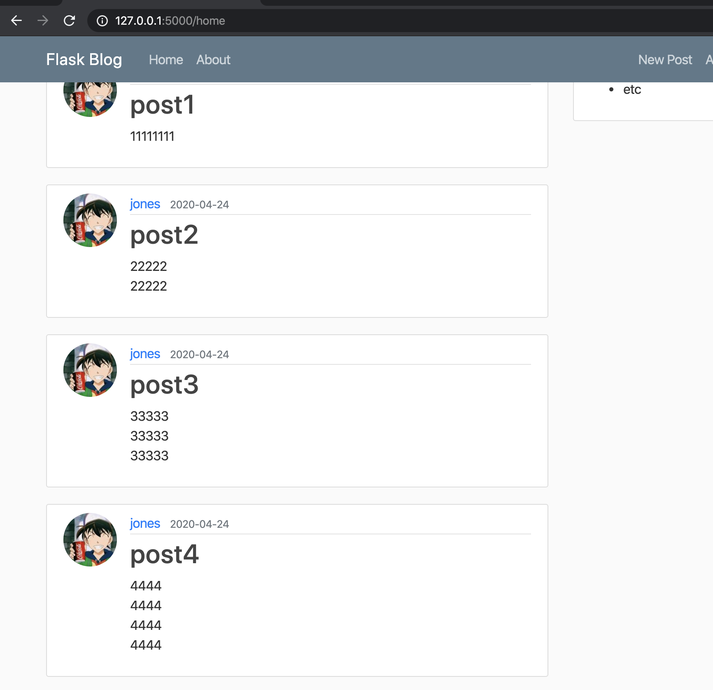
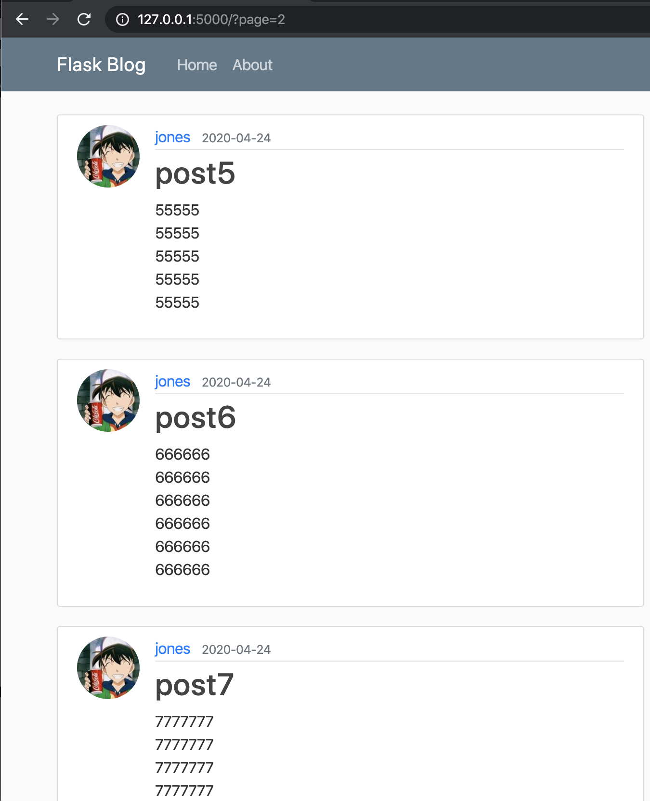
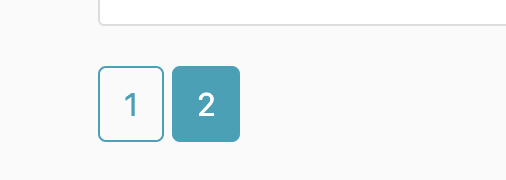
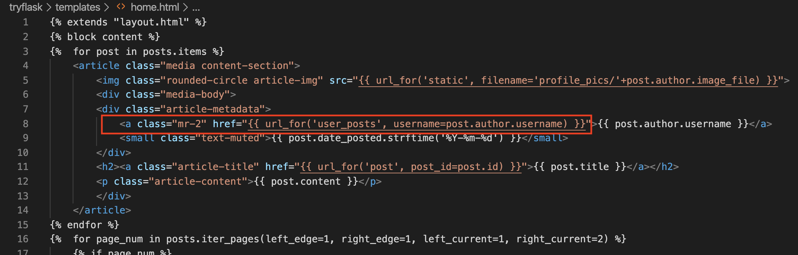
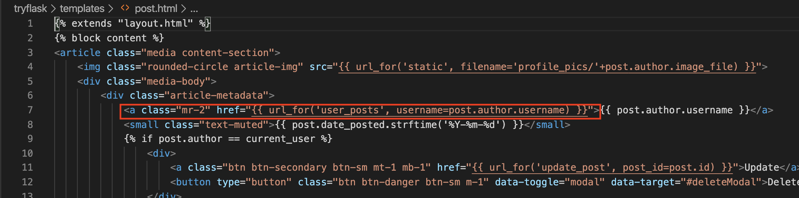
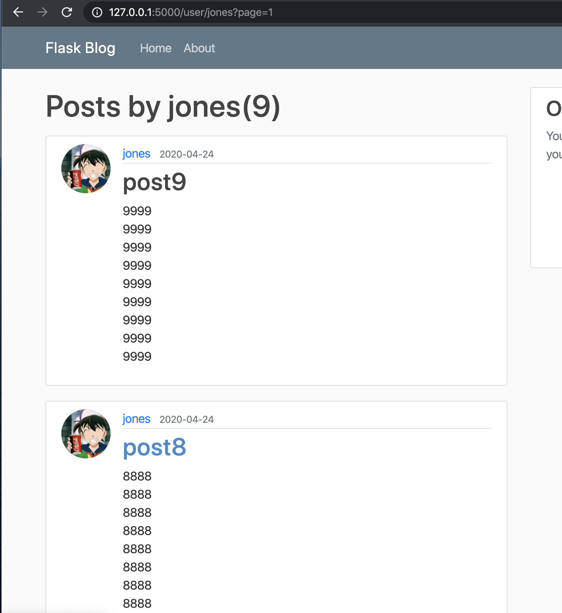

```python
>>> from tryflask.models import Post
^[[A/Users/jones/anaconda3/lib/python3.7/site-packages/flask_sqlalchemy/__init__.py:835: FSADeprecationWarning: SQLALCHEMY_TRACK_MODIFICATIONS adds significant overhead and will be disabled by default in the future.  Set it to True or False to suppress this warning.
  'SQLALCHEMY_TRACK_MODIFICATIONS adds significant overhead and '
>>> posts = Post.query.all()
>>> for post in posts:
...     print(post)
... 
Post('A second post'. '2020-04-23 15:43:23.836704')
Post('post1'. '2020-04-24 02:32:35.743385')
Post('post2'. '2020-04-24 02:32:43.299598')
Post('post3'. '2020-04-24 02:32:52.074475')
Post('post4'. '2020-04-24 02:33:01.014768')
Post('post5'. '2020-04-24 02:33:11.870076')
Post('post6'. '2020-04-24 02:33:25.473892')
Post('post7'. '2020-04-24 02:33:37.084284')
Post('post8'. '2020-04-24 02:33:47.784083')
Post('post9'. '2020-04-24 02:34:01.283884')
```

per_page控制每个page的数量

```python
>>> posts = Post.query.paginate(per_page=5)
>>> posts.page
1
>>> for post in posts.items:
...     print(post)
... 
Post('A second post'. '2020-04-23 15:43:23.836704')
Post('post1'. '2020-04-24 02:32:35.743385')
Post('post2'. '2020-04-24 02:32:43.299598')
Post('post3'. '2020-04-24 02:32:52.074475')
Post('post4'. '2020-04-24 02:33:01.014768')
```

page控制当前显示第几页

```python
>>> posts = Post.query.paginate(per_page=5, page=2)
>>> posts.page
2
>>> for post in posts.items:
...     print(post)
... 
Post('post5'. '2020-04-24 02:33:11.870076')
Post('post6'. '2020-04-24 02:33:25.473892')
Post('post7'. '2020-04-24 02:33:37.084284')
Post('post8'. '2020-04-24 02:33:47.784083')
Post('post9'. '2020-04-24 02:34:01.283884')
```


现在一页只展示5个posts





<br>

home.html

```html



    <article class="media content-section">
        
        <div class="media-body">
        <div class="article-metadata">
            <a class="mr-2" href="#">{{ post.author.username }}</a>
            <small class="text-muted">{{ post.date_posted.strftime('%Y-%m-%d') }}</small>
        </div>
        <h2><a class="article-title" href="{{ url_for('post', post_id=post.id) }}">{{ post.title }}</a></h2>
        <p class="article-content">{{ post.content }}</p>
        </div>
    </article>


    
        
            <a class="btn btn-info mb-4" href="{{ url_for('home', page=page_num) }}">{{ page_num }}</a>
        
            <a class="btn btn-outline-info mb-4" href="{{ url_for('home', page=page_num) }}">{{ page_num }}</a>
        
    
        ...
    



```



接下来，我们想让新发布的post排在前面

```python
@app.route("/")
@app.route("/home")
def home():
    page = request.args.get('page', 1, type=int)
    posts = Post.query.order_by(Post.date_posted.desc()).paginate(per_page=5, page=page)
    return render_template('home.html', posts=posts)
```

我们想点击用户名可以跳转到该用户发布过的post界面

routes.py

```python
@app.route("/user/<string:username>")
def user_posts(username):
    page = request.args.get('page', 1, type=int)
    user = User.query.filter_by(username=username).first_or_404()
    posts = Post.query.filter_by(author=user)\
        .order_by(Post.date_posted.desc())\
        .paginate(per_page=5, page=page)
    return render_template('user_posts.html', posts=posts, user=user)
```


新建user_posts.html

```html


<h1 class="mb-3">Posts by {{ user.username }}({{ posts.total }})</h1>

    <article class="media content-section">
        
        <div class="media-body">
        <div class="article-metadata">
            <a class="mr-2" href="{{ url_for('user_posts', username=post.author.username) }}">{{ post.author.username }}</a>
            <small class="text-muted">{{ post.date_posted.strftime('%Y-%m-%d') }}</small>
        </div>
        <h2><a class="article-title" href="{{ url_for('post', post_id=post.id) }}">{{ post.title }}</a></h2>
        <p class="article-content">{{ post.content }}</p>
        </div>
    </article>


    
        
            <a class="btn btn-info mb-4" href="{{ url_for('user_posts', username=user.username, page=page_num) }}">{{ page_num }}</a>
        
            <a class="btn btn-outline-info mb-4" href="{{ url_for('user_posts', username=user.username, page=page_num) }}">{{ page_num }}</a>
        
    
        ...
    



```










3 3 2

* 3=3
  * consider left 2 coins
    * 从3=3中拿出一个硬币和这2个中的一个比较
* 3$\not=$3(3H+3L+2G)
  * 2H+1L 比较 1L+2G
    * 2H+1L >1L+2G 
      * 2H较重
      * 右边1L较轻
        * 1H+1G比较1H+1G
    * 2H+1L<1L+2G
      * 左边1L较轻
    * 2H+1L=1L+2G
      * 剩下1H,1L的问题 