forms.py

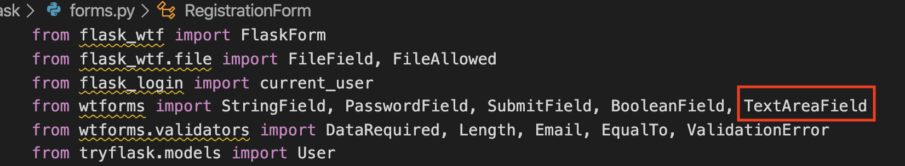

```python
class PostForm(FlaskForm):
    title = StringField('Title', validators=[DataRequired()])
    content = TextAreaField('Content', validators=[DataRequired()])
    submit = SubmitField('Post')
```

routes.py

```python
@app.route("/post/new", methods=['GET', 'POST'])
@login_required
def new_post():
    form = PostForm()
    if form.validate_on_submit():
        flash('Your post has been created!', 'success')
        return redirect(url_for('home'))
    return render_template('create_post.html', title="New Post", form=form)
```


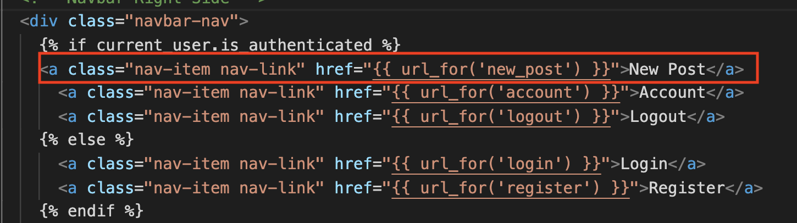

在template中创建一个新文件create_post.html

```html


<div class="content-section">
    <form method="post" action="">
        {{ form.hidden_tag() }}
        <fieldset class="form-group">
            <legend class="border-bottom mb-4">New Post</legend>
            <div class="form-group">
                {{ form.title.label(class="form-control-label") }}
                
                    {{ form.title(class="form-control form-control-lg is-invalid") }}
                    <div class="invalid-feedback">
                        
                            <span>{{ error }} </span>
                        
                    </div>
                
                    {{ form.title(class="form-control form-control-lg") }}
                
            </div>
            <div class="form-group">
                {{ form.content.label(class="form-control-label") }}

                
                    {{ form.content(class="form-control form-control-lg is-invalid") }}
                    <div class="invalid-feedback">
                        
                            <span>{{ error }} </span>
                        
                    </div>
                
                    {{ form.content(class="form-control form-control-lg") }}
                
            </div>
        </fieldset>
        <div class="from-group">
            {{ form.submit(class="btn btn-outline-info") }}
        </div>
    </form>
</div>

```


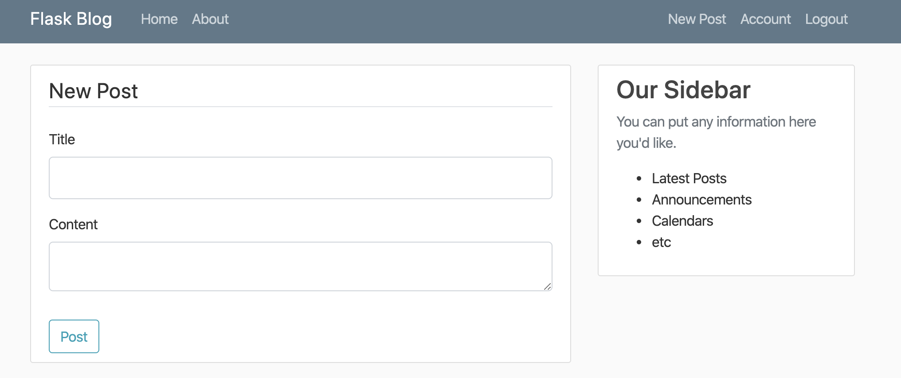

接下来我们将post存储到db, 并且在首页显示

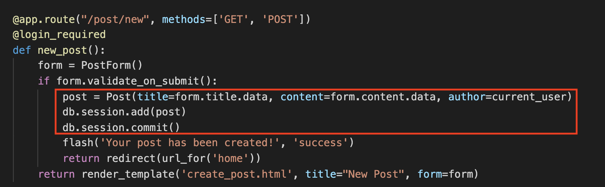

```python
@app.route("/")
@app.route("/home")
def home():
    posts = Post.query.all()
    return render_template('home.html', posts=posts)
```


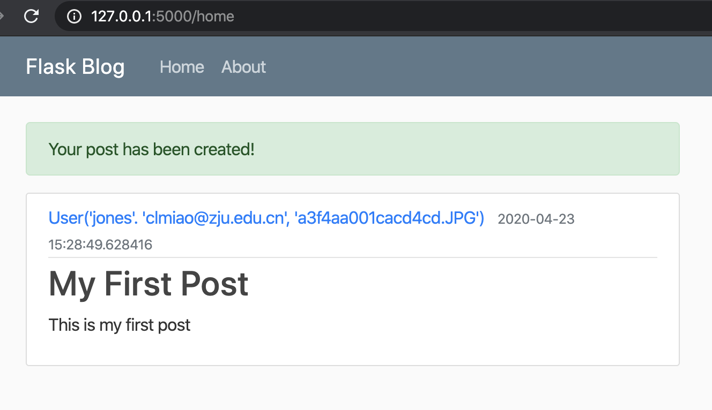

再做一些修改

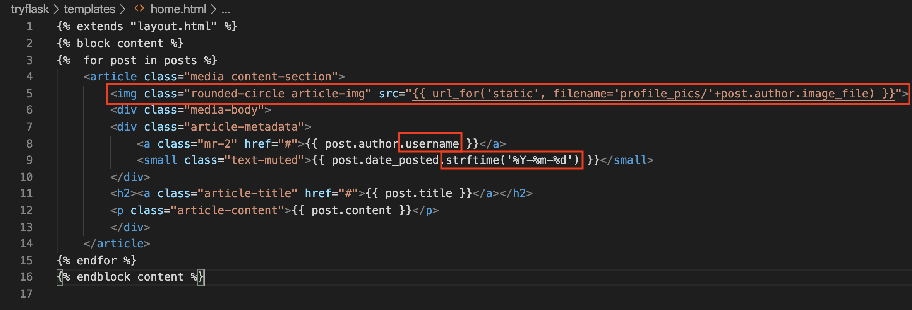

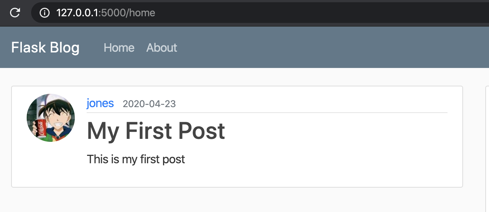


增加post.html用来展示点进去的某一个post

```html


<article class="media content-section">
    
    <div class="media-body">
    <div class="article-metadata">
        <a class="mr-2" href="#">{{ post.author.username }}</a>
        <small class="text-muted">{{ post.date_posted.strftime('%Y-%m-%d') }}</small>
    </div>
    <h2 class="article-title">{{ post.title }}</h2>
    <p class="article-content">{{ post.content }}</p>
    </div>
</article>

```

在routes.py中增加

```python
@app.route("/post/<int:post_id>", methods=['GET', 'POST'])
def post(post_id):
    post = Post.query.get_or_404(post_id) #if doesn't exist, return 404
    return render_template('post.html', title=post.title, post=post)
```

修改home.html使得点击post可以direct到某一个post

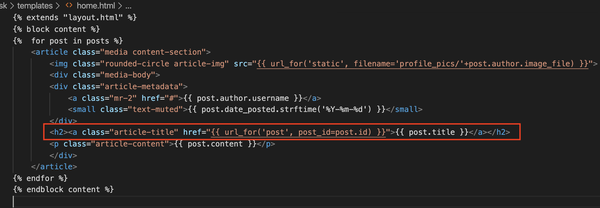

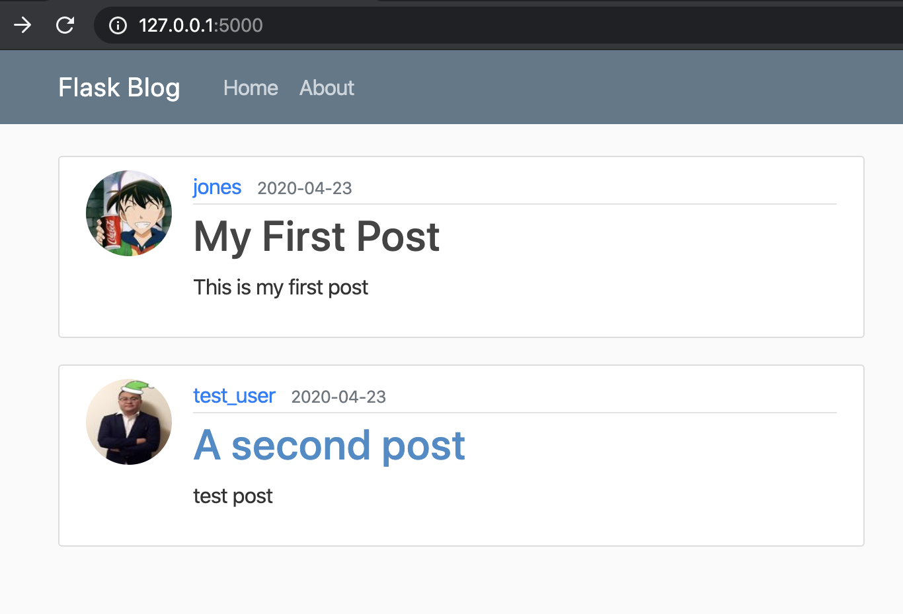

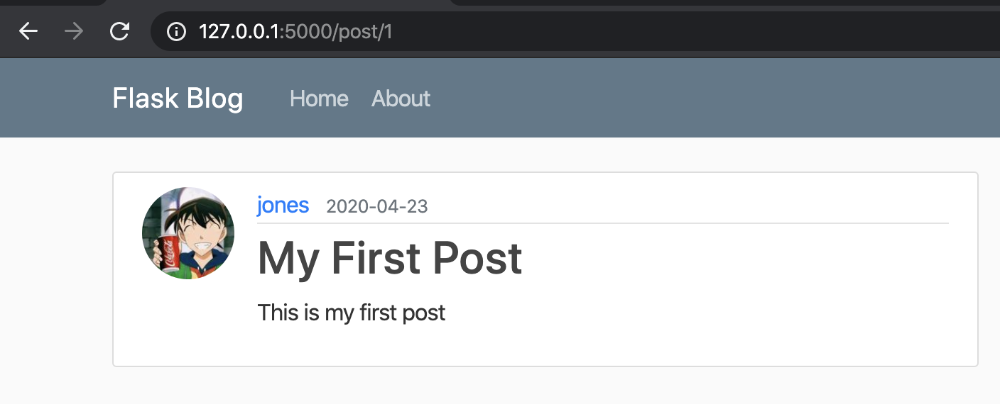

再增加delete和update post的功能


```python
@app.route("/post/<int:post_id>/update", methods=['GET', 'POST'])
@login_required
def update_post(post_id):
    post = Post.query.get_or_404(post_id) #if doesn't exist, return 404
    if post.author != current_user:
        abort(403)
    form = PostForm()
    if form.validate_on_submit():
        post.title = form.title.data
        post.content = form.content.data
        db.session.commit()
        flash('Your post has been updated!', 'success')
        return redirect(url_for('post', post_id=post.id))
    elif request.method == 'GET':
        form.title.data = post.title
        form.content.data = post.content
    return render_template('create_post.html', title="Update Post", 
                        form=form, legend='Update Post')

```

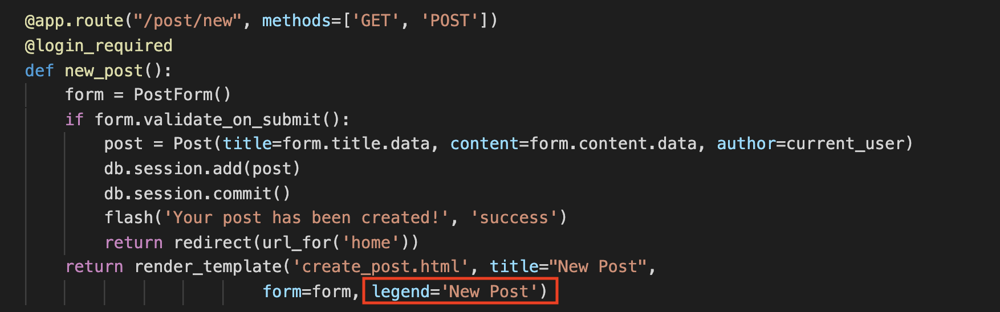

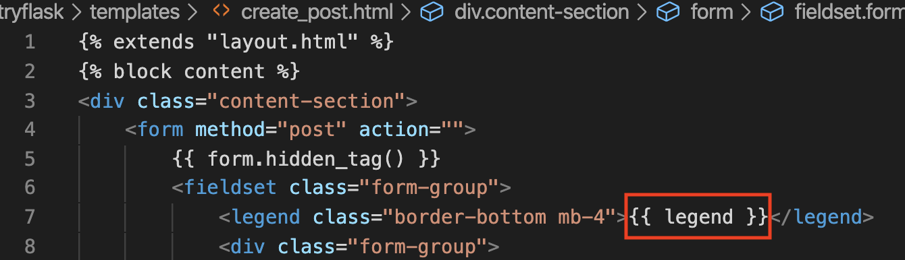

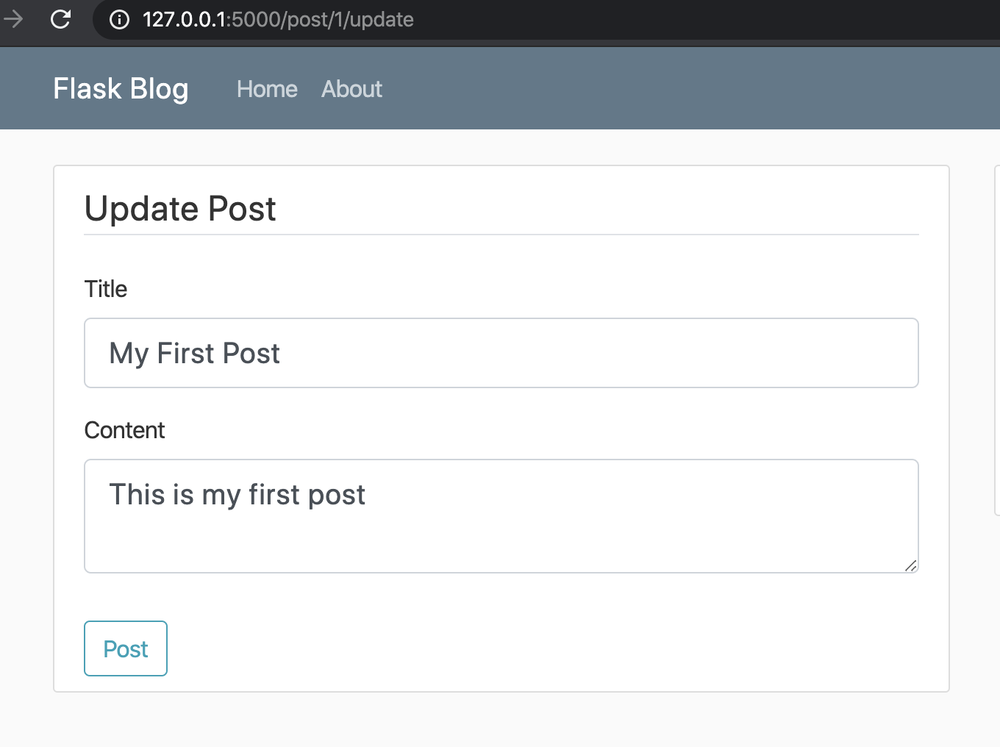

增加update link, delete link

post.html

```html


<article class="media content-section">
    
    <div class="media-body">
        <div class="article-metadata">
            <a class="mr-2" href="#">{{ post.author.username }}</a>
            <small class="text-muted">{{ post.date_posted.strftime('%Y-%m-%d') }}</small>
            
                <div>
                    <a class="btn btn-secondary btn-sm m-1" href="{{ url_for('update_post', post_id=post.id) }}">Update</a>
                    <button type="button" class="btn btn-danger btn-sm m-1" data-toggle="modal" data_target="#DeleteModal">Delete</button>
                </div>
            
        </div>
    <h2 class="article-title">{{ post.title }}</h2>
    <p class="article-content">{{ post.content }}</p>
    </div>
</article>
<!-- 模态框（Modal） -->
<div class="modal fade" id="DeleteModal" tabindex="-1" role="dialog" aria-labelledby="DeleteModalLabel" aria-hidden="true">
    <div class="modal-dialog">
        <div class="modal-content">
            <div class="modal-header">
                <button type="button" class="close" data-dismiss="modal" aria-hidden="true">&times;</button>
                <h4 class="modal-title" id="DeleteModalLabel">模态框（Modal）标题</h4>
            </div>
            <div class="modal-body">在这里添加一些文本</div>
            <div class="modal-footer">
                <button type="button" class="btn btn-default" data-dismiss="modal">关闭</button>
                <button type="button" class="btn btn-primary">提交更改</button>
            </div>
        </div><!-- /.modal-content -->
    </div><!-- /.modal -->
</div>

```


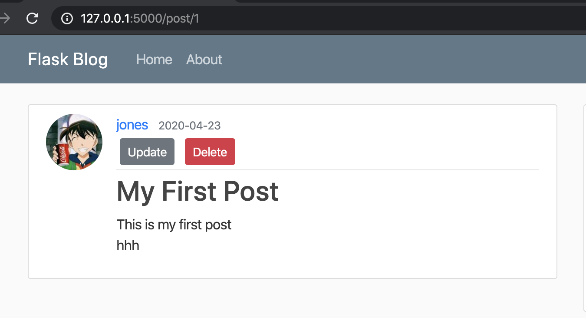

点击删除之后

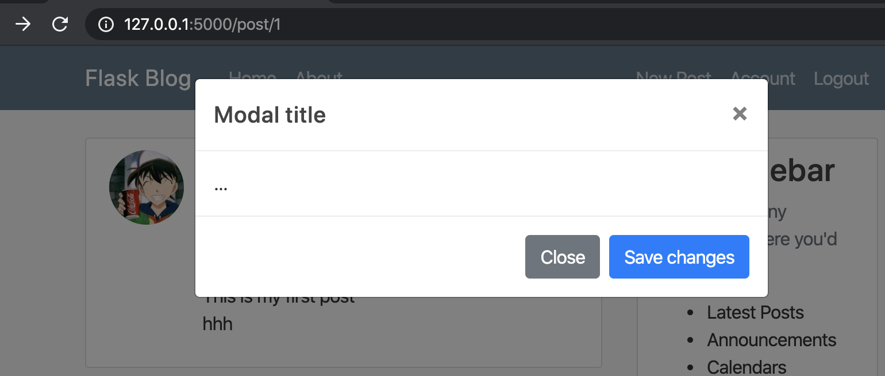

<br>

实现delete功能

post.html

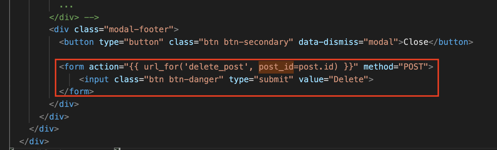

在routes.py中增加delete

```python
@app.route("/post/<int:post_id>/delete", methods=['POST'])
@login_required
def delete_post(post_id):
    post = Post.query.get_or_404(post_id)
    if post.author != current_user:
        abort(403)
    db.session.delete(post)
    db.session.commit()
    flash('Your post has been deleted!', 'success')
    return redirect(url_for('home'))
```


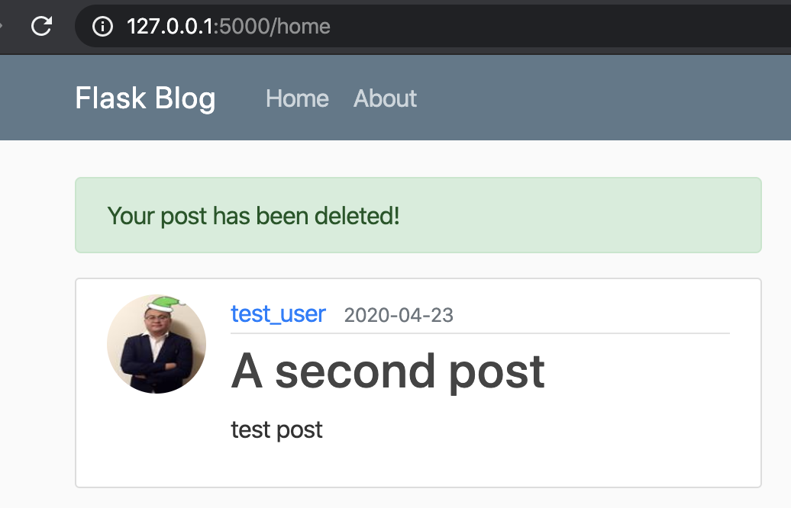