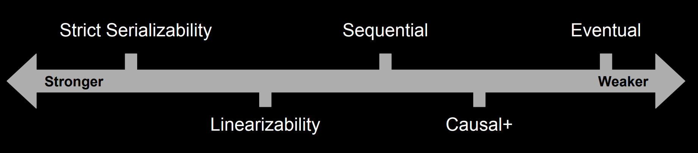

# Linearizability VS. Serializability

# Consistency Models

### Linearizability

keywords: single-operation, single-object, real-time order.

对应于ACID中的atomic consistency

> Linearizability is a guarantee about single operations on single objects. It provides a real-time guarantee on the behavior of a set of a single operations on a single object. <a href="#1">[1]</a>

特点：

* total order: There exists a legal total ordering of operations. (legal total ordering: a read operation sees the latest write operation)

* Preserves real-time ordering: Any **operation** A that completes before operation B occurs before B in the total order.

### Serializability

keywords: multi-operation, multi-object, arbitrary total order

对应于ACID中的Isolation

> Serializability guarantees that the execution of a set of transactions over multiple items is equivalent to some serial execution of the transactions. <a href="#1">[1]</a>

### Strict Serializability

strict serializability = linearizability + serializability

特点：

* Total order: There exists a legal total ordering of transactions. (legal total ordering: a read operation sees the latest write operation)

* Preserves real-time ordering: Any **transaction** A that complete before transaction transaction B begins, occurs before B in the total order.

所以linearizability和strict serializability有什么区别呢？

> linearizability只需要考虑operation之间的consistency, 而strict serializability还要考虑transaction之间的consistency

serializability和strict serializability有什么区别呢？

> For example, say I begin and commit transaction T1, which writes to item *x*, and you later begin and commit transaction T2, which reads from *x*. A database providing strict serializability for these transactions will place T1 before T2 in the serial ordering, and T2 will read T1’s write. A database providing serializability (but not strict serializability) could order T2 before T1. <a href="#1">[1]</a>

Reference:

<a href="http://www.bailis.org/blog/linearizability-versus-serializability/#fn:implementation" name="1">[1]</a> http://www.bailis.org/blog/linearizability-versus-serializability/#fn:implementation

