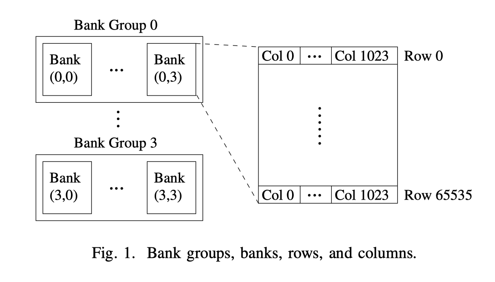
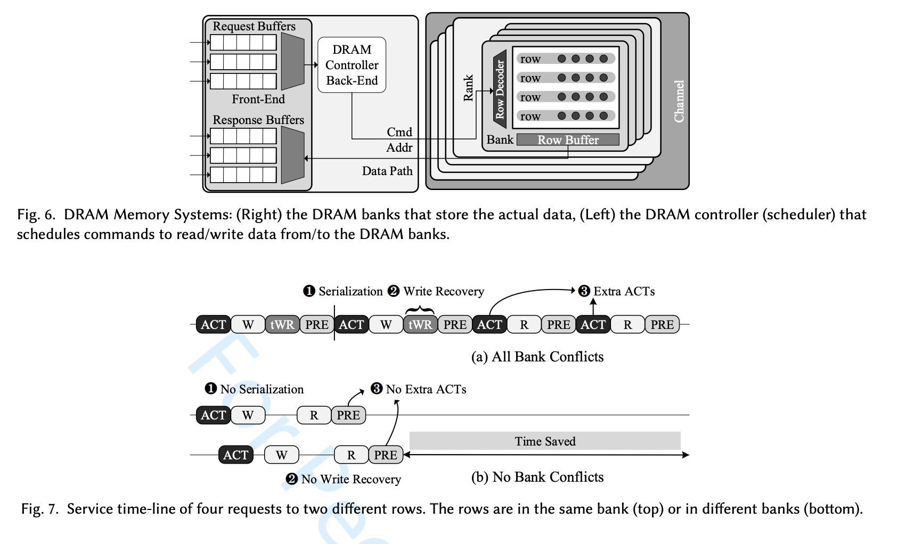

#### DRAM Organization

DRAM is organized into banks that allow independent memory requests to be serviced concurrently. A DRAM bank is divided into rows, with each row divided into columns. Only one row can be activated at any given time in each bank.

#### DRAM Operation

* **ACT**: the activation command taht senses and amplifies the data from the target row into the row buffer
* **RD/WR**: the read/write command transfers data to/from the DRAM bus
* **PRE**: the precharge command that clears the row buffer and prepares the subarrray for subsequent read/write operations

 

Row buffer hit and miss

* Accesses to data in the already activated row are row buffer hits and have much lower latency.

* If one wishes to access data in a row different than the one currently activated, one must first **Precharge** the bank, then **Activate** the desired row. Once the desired row is activated, then **Read** and **Write** commands can be issued to desired columns within the activated row.

