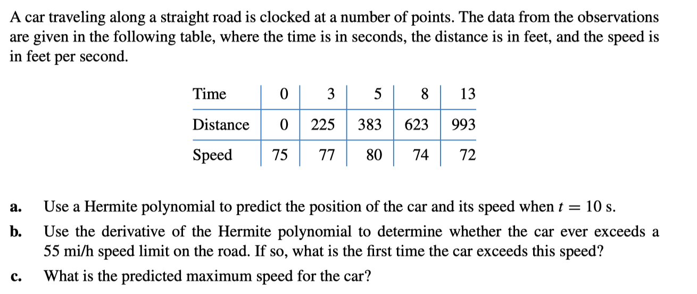

<!--more-->

如果一个函数$y=f(x)$非常复杂甚至没有他的解析式，可以采样去构造一个近似函数。首先在$x_0,\cdots,x_n$处采样$y_0=f(x_0),\cdots,y_n=f(x_n)$,然后构造一个相对简单的approximating function $g(x)\approx f(x)$

如果对所有$i=0,\cdots,n$, $g(x)$满足$g(x_i)=f(x_i)$, 那么$g(x)$就叫做$f(x)$的***插值函数(interpolating function)***

# 1. Interpolation and the Lagrange Polynomial

## 1.1 Lagrange Polynomial

Find a polynomial of degree n, $P_n(x)=a_0+a_1x+\cdots+a_nx^n$, such that $P_n(x_i)=y_i$ for all $i=0,\cdots,n$.

Note: for any $i\not= j$, we must have $x_i\not= x_j$, 即$x_i$各不相同

#### 先考虑$n=1$的情况

Given $x_0,x_1;y_0,y_1$. Find $P_1(x)=a_0+a_1x$ such that $P_1(x_0)=y_0$ and $P_1(x_1)=y_1$

$P_1$是经过$(x_0,y_0),(x_1,y_1)$的线性函数

$$P_1(x)=y_0+\frac{y_1-y_0}{x_1-x_0}(x-x_0)=(\frac{x-x_1}{x_0-x_1})y_0+(\frac{x-x_0}{x_1-x_0})y_1$$

令$\frac{x-x_1}{x_0-x_1}=L_{1,0}(x)$

令$\frac{x-x_0}{x_1-x_0}=L_{1,1}(x)$

$L_{i,j}$是Lagrange Basis, 第一个下标代表几阶，第二个下标代表在x为x几时该项为1,$L_{1,i}(x_j)=\delta_{ij}$

$P_1(x)=\sum_{i=0}^1 L_{1,i}(x)y_i$

 

#### 再考虑$n\geq 1$

Find $L_{n,i}(x)$ for $i=0,\cdots,n$ such that $L_{n,i}(x_j)=\delta_{ij}$. Then let $P_n(x)=\sum_{i=0}^n L_{n,i}(x)y_i$. Hence $P_n(x_i)=y_i$

Each $L_{n,i}$ has n roots $x_0,\cdots,\widehat{x_i},\cdots,x_n$($\widehat{x_i}$是跳过$x_i$的意思)

$L_{n,i}(x)=C_i(x-x_0)\cdots(\widehat{x-x_i})\cdots(x-x_n)=C_i\Pi_{j\not= i}(x-x_j)$

$L_{n,i}(x_i)=1\Rightarrow C_i=\Pi_{j\not= i}\frac{1}{(x_i-x_j)}$

因此

$L_{n,i}(x)=\Pi_{j\not=i,j=0}^n\frac{(x-x_j)}{(x_i-x_j)}$

$P_n(x)=\sum_{i=0}^n L_{n,i}(x)y_i$

{:.warning}

n+1个插值点$\Rightarrow$ n阶拉格朗日插值多项式

 

`Theorem`{:.error}

If $x_0,x_1,\cdots,x_n$ are n+1 distinct numbers and f is a function whose values are given at these numbers, then the n-th Lagrange interpolating polynomial is unique

Proof:

srds, 这个问题和Lagrange并没有什么大的关系

反证：如果不是unique的

那么就会存在两个polynomials $P_n(x)$和 $Q_n(x)$同时满足插值条件

$D(x)=P_n(x)-Q_n(x)$是一个$\leq n$阶的多项式

但是$D(x)$有$x_0,x_1,\cdots,x_n$这n+1个根，然而n阶多项式最多只有n个根，矛盾！

 

从另一个方面来证明

令$P_n(x)=a_0+a_1x+\cdots+a_nx^n$

$P_n(x_0)=y_0, P_n(x_1)=y_1,\cdots,P_n(x_n)=y_n$

最后可以写成

$$\left[\begin{matrix}1&x_0&x_0^2&\cdots&x_0^n\\ 1&x_1&x_1^2&\cdots&x_1^2\\\cdots\\1&x_n&x_n^2&\cdots&x_n^n \end{matrix}\right]\left[\begin{matrix}a_0\\a_1\\\vdots\\a_n\end{matrix}\right]=\left[\begin{matrix}y_0\\y_1\\\vdots\\y_n\end{matrix}\right]$$

$X\vec{a}=\vec{y}$

因为x的值是互不相同的，因此X矩阵是可逆矩阵，所以$\vec{a}$是唯一的

 

Note:  The interplating polynomial is NOT unique unless its degree is constrained to be no greater than $n$.

Counterexample: $P(x)=L_n(x)+p(x)\Pi_{i=0}^n(x-x_i)$, where $p(x)$ can be a polynomial of any degree.

 

## 1.2  Analyze the Remainder

Suppose $a\leq x_0< x_1< \cdots <x_n\leq b$ and $f\in C^{n+1}[a,b]$

Consider the truncation error: $R_n(x)=f(x)-P_n(x)$

`Rolle's Theorem`{:.error}

If $\varphi(x)$ is sufficiently smooth with $\varphi(x_0)=\varphi(x_1)=0$, then there exists $\xi\in(x_0,x_1)$ such that $\varphi'(\xi)=0$

In general, if $\varphi(x_0)=\varphi(x_1)=\varphi(x_2)=0$

There exist $\xi_0\in(x_0,x_1),\xi_1\in(x_1,x_2)$ such that $\varphi'(\xi_0)=\varphi'(\xi_1)=0$

$\Rightarrow$ There exists $\xi\in (\xi_0,\xi_1)$ such that $\varphi''(\xi)=0$

再推广

$\varphi(x_0)=\cdots=\varphi(x_n)=0\Rightarrow$ There exists $\xi\in(a,b)$ such that $\varphi^{(n)}(\xi)=0$

 

$R_n(x)=f(x)-P_n(x)$ ,其中$f\in C^{n+1}[a,b]$并且$P_n(x)$是一个n阶多项式

那么$R_n(x)$至少有n+1个根$\Rightarrow$ $R_n(x)=K(x)\Pi_{i=0}^n(x-x_i)$ ($K(x)$必定是个连续函数)

对于任何$x\not= x_i, i=0,1,\cdots,n$ . 以$t\in[a,b]$ 为自变量定义函数$g(t)$

$$g(t)=R_n(t)-K(x)\Pi_{i=0}^n(t-x_i)$$

$g(t)$有$n+2$个不同的根$x_0,x_1,\cdots,x_n,x$(多了一个x)

则根据前面的Rolle定理，$g^{(n+1)}(\xi_x)=0,\xi_x\in(a,b)$

根据$g(t)=R_n(t)-K(x)\Pi_{i=0}^n(t-x_i)$, 对t求n+1阶导，$g^{(n+1)}(\xi_x)=R^{(n+1)}_n(\xi_x)-K(x)(n+1)!=f^{(n+1)}(\xi_x)-P_n^{(n+1)}(\xi_x)-K(x)(n+1)!$

推出$K(x)=\frac{f^{(n+1)}(\xi_x)}{(n+1)!}$

所以最后得到

$$R_n(x)=\frac{f^{(n+1)}(\xi_x)}{(n+1)!}\Pi_{i=0}^n(x-x_i)$$

Remark:

看到这个式子,感觉很熟悉，想到了泰勒展开的余项。Taylor: $\frac{f^{(n+1)}(\xi(x))}{(n+1)!}(x-x_0)^{n+1}$.  如果$R_n(x)$中$x_i$都趋向于某个中心点$x_0$的话，就可以写成泰勒展开余项的形式

 

Note:

在大多数情况下$\xi_x$是不能被确定的，但是我们可以知道他的upper bound. 即估计$M_{n+1}$使得$\vert f^{(n+1)}(x)\vert\leq M_{n+1}$ for all $x\in (a,b)$, 那么$R_n(x)\leq \frac{M_{n+1}}{(n+1)!}\Pi_{i=0}^n\vert x-x_i\vert$

插值函数对于任何阶<=n的多项式函数都是accurate的，因为$f^{(n+1)}(x)\equiv 0$

首先$L_{5,2}(x_2)=1$其他都为0

其次连续

最后二阶连续

 

在计算机中很多计算时通过查表来实现的。假设为$f(x)=e^x,x\in[0,1]$准备了一张表。假设表中每一项accurate up to 8 decimal places并且步长为h。那么为了使absolute error最多为$10^{-6}$的话h应该怎么选择

Solution:

将$[0,1]$划分成n个等长区间$[x_0,x_1],[x_1,x_2],\cdots,[x_{n-1},x_n]$, 并且x在区间$[x_k,x_{k+1}]$内

$\vert f(x)-P_1(x)\vert =\vert \frac{f^{(2)}(\xi)}{2!}(x-x_k)(x-x_{k+1})\vert$

$=\vert\frac{e^{\xi}}{2}(x-kh)(x-(k+1)h)\vert\leq \frac{e}{2}\times \frac{h^2}{4}$

 

$\frac{eh^2}{8}\leq 10^{-6}\Rightarrow h\leq 1.72\times 10^{-3}$

Simply take n = 1000 and h = 0.001

 

Example: Given sin$\frac{\pi}{6}=\frac{1}{2}$, sin$\frac{\pi}{4}=\frac{1}{\sqrt{2}}$, sin$\frac{\pi}{3}=\frac{\sqrt{3}}{2}$

Use the linear and the quadratic Lagrange polynomial of sin $x$  to compute sin $50^\circ$ and then estimate the errors.

Solution:

**(1) Linear**

* 外插 Use $x_0=\frac{\pi}{6}, x_1=\frac{\pi}{4}$ 

$$P_1(x)=\frac{x-\pi/4}{\pi/6-\pi/4}\cdot\frac{1}{2}+\frac{x-\pi/6}{\pi/4-\pi/6}\cdot\frac{1}{\sqrt{2}}$$

sin$50^\circ\approx=P_1(\frac{5\pi}{18})\approx 0.77614$

然后我们来估计一下误差

Here $f(x)=sin x$, $f^{(2)}(\xi_x)=sin\xi_x, \xi_x\in(\frac{\pi}{6},\frac{\pi}{3})$

$\frac{1}{2}<sin\xi_x<\frac{\sqrt{3}}{2}$

那么$R_1(x)=\frac{f^{2}(\xi_x)}{2!}(x-\frac{\pi}{4})(x-\frac{\pi}{6})$

$-0.01319<R_1(\frac{5\pi}{18})<-0.00762$

精确值 sin50$^\circ$=0.7660444

外插的误差$\approx -0.01001$

* 内插 Use $x_1=\frac{\pi}{4}，x_2=\frac{\pi}{3}$ 

$$P_1(x)=\frac{x-\pi/3}{\pi/4-\pi/3}\cdot\frac{1}{\sqrt{2}}+\frac{x-\pi/4}{\pi/3-\pi/4}\cdot\frac{\sqrt{3}}{2}$$

sin$50^\circ\approx=P_1(\frac{5\pi}{18})\approx 0.76008$

然后我们来估计一下误差

那么$R_1(x)=\frac{f^{2}(\xi_x)}{2!}(x-\frac{\pi}{4})(x-\frac{\pi}{6})$

$0.00538<R_1(\frac{5\pi}{18})<0.00660$

精确值 sin50$^\circ$=0.7660444

内插的误差$\approx -0.00596$

{:.warning}

通常，interpolation(内插) is better than extrapolation(外插)

为什么呢？

考虑$R_n(x)=\frac{f^{(n+1)}(\xi_x)}{(n+1)!}\Pi_{i=0}^n(x-x_i)$， 内插的话$\Pi_{i=0}^n(x-x_i)$会比较小

**(2) quadratic interpolation** 

$P_2(x)=\frac{(x-\frac{\pi}{4})(x-\frac{\pi}{3})}{(\frac{\pi}{6}-\frac{\pi}{4})(\frac{\pi}{6}-\frac{\pi}{4})}\cdot \frac{1}{2}+ \frac{(x-\frac{\pi}{6})(x-\frac{\pi}{3})}{(\frac{\pi}{4}-\frac{\pi}{6})(\frac{\pi}{4}-\frac{\pi}{3})}\cdot \frac{1}{\sqrt{2}}+ \frac{(x-\frac{\pi}{6})(x-\frac{\pi}{4})}{(\frac{\pi}{3}-\frac{\pi}{6})(\frac{\pi}{3}-\frac{\pi}{4})}\cdot \frac{\sqrt{3}}{2}$

sin50$^\circ\approx P_2(\frac{5\pi}{18})=0.76543$

$R_2(x)=\frac{-cos(\xi_x)}{3!}(x-\frac{\pi}{6})(x-\frac{\pi}{4})(x-\frac{\pi}{3})$

由于$\frac{1}{2}<cos\xi_x<\frac{\sqrt{3}}{2}$

$0.00044<R_2(\frac{5\pi}{18})<0.00077$

Error of quadratic interpolation$\approx 0.00061$

{:.warning}

Interpolation with higher degree usually obtain better results.

为什么呢？

因为$R_n(x)=\frac{f^{(n+1)}(\xi_x)}{(n+1)!}\Pi_{i=0}^n(x-x_i)$, n大了, 连乘项数变多，同时$(n+1)!$变大，误差变小

但是高阶计算量大

 

如何渐进的提高精度和计算量呢？

`Definition`{:.warning}

令$f$ 是定义在 $x_0, x_1, \cdots, x_n$上的函数, 假设 $m_1,\cdots, m_k$ 是$k$个不同的整数，并且 $0\leq m_i\leq n$ for each $i$.  $f(x)$ 在 $k$ 个点$x_{m_1}, x_{m_2},\cdots,x_{m_k}$点lagrange多项式表示为$P_{m_1,\cdots,m_k}(x)$

 

`Theorem`{:.error}

令$f$ 是定义在 $x_0, x_1, \cdots, x_k$上的函数, 令$x_i, x_j$是这个集合中两个不同的数，则

$$P(x)=\frac{(x-x_j)P_{0,1,\cdots,j-1,j+1,\cdots,k}(x)-(x-x_i)P_{0,1,\cdots,i-1,i+1,\cdots,k}(x)}{x_i-x_j}$$

$P(x)$就是$k$阶的lagrange多项式，插值点为$x_0,x_1,\cdots,x_k$

Proof:

对于任意$0\leq r\leq k$并且$r\not= i,j$, 那么

$P(x_r)=\frac{(x_r-x_j)f(x_r)-(x_r-x_i)f(x_r)}{x_i-x_j}=f(x_r)$

并且$P(x_i)=\frac{(x_i-x_j)f(x_i)-0}{x_i-x_j}=f(x_i)$, $P(x_j)=\frac{0-(x_j-x_i)f(x_j)}{x_i-x_j}=f(x_j)$

{:.success}

记忆方法: $P(x)=\frac{x-x_j}{x_i-x_j}P_{has\;i}+\frac{x-x_i}{x_j-x_i}P_{has\;j}$

### Neville's Method:

$P_0$是常数函数, $P_0(x_0)=y_0$

Neville's iterated interpolation algorithm

**INPUT** numbers $x, x_0,x_1,\cdots,x_n$; values $f(x_0),f(x_1),\cdots,f(x_n)$ as the first column $Q_{0,0},Q_{1,0},\cdots,Q_{n,0}$ of Q

**OUTPUT** the table Q with $P(x)=Q_{n,n}$

**Step 1** For i = 1, 2, ..., n

&emsp;&emsp;&emsp;&emsp;for j = 1, 2, ..., i

&emsp;&emsp;&emsp;&emsp;&emsp;set $Q_{i,j}=\frac{(x-x_{i-j})Q_{i,j-1}-(x-x_i)Q_{i-1,j-1}}{x_i-x_{i-j}}$

**Step 2** OUTPUT(Q)

&emsp;&emsp;&emsp;STOP.

 

Example:   Apply Neville’s method to the data by constructing a recursive table of the form shown in following table

| x    | f(x)      |
| ---- | --------- |
| 1.0  | 0.7651977 |
| 1.3  | 0.6200860 |
| 1.6  | 0.4554022 |
| 1.9  | 0.2818186 |
| 2.2  | 0.1103623 |

Let $x_0=1.0,x_1=1.3,x_2=1.6,x_3=1.9,x_4=2.2$, then $P_0=f(1.0),P_1=f(1.3),P_2=f(1.6),P_3=f(1.9),P_4=f(2.2)$

$P_{0,1}(1.5)=\frac{(x-x_0)P_1(1.5)-(x-x_1)P_0(1.5)}{x_1-x_0}=0.5233449$

同理：

$P_{1,2}(1.5)=\frac{(x-x_1)P_2(1.5)-(x-x_2)P_1(1.5)}{x_2-x_1}=0.5102968$

$P_{2,3}(1.5)=0.5132634$

$P_{3,4}(1.5)=0.5104270$

然后

$P_{0,1,2}(1.5)=\frac{(x-x_0)P_{1,2}(1.5)-(x-x_2)P_{0,1}(1.5)}{x_2-x_0}=0.5124715$

$P_{1,2,3}=\frac{(x-x_1)P_{2,3}(1.5)-(x-x_3)P_{1,2}(1.5)}{x_3-x_1}=0.5112857$

$P_{2,3,4}=0.5137361$

...

Homework:

Use Neville's method to approximate $\sqrt{3}$ with the following functions and values.

$ f (x) = 3 x$ and the values $x_0 = −2, x_1 = −1, x_2 = 0, x_3 = 1, x_4 = 2$.

Homework: Suppose you need to construct eight-decimal-place tables for the common, or base-10, logarithm function from $x = 1$ to $x = 10$ in such a way that linear interpolation is accurate to within $10^{−6}$ . Determine a bound for the step size for this table. What choice of step size would you make to ensure that $x = 10$ is included in the table?

# 2. Newton Interpolation

## 2.1 think in matrix form

和Neville's method类似， newton interpolation也希望渐进的提高精度

### A. The Simple Idea

Giving $x_0,x_1,\cdots,x_n$

* Fitting $x_0$ first:

$$f(x)\approx f_0,f_0=f(x_0)$$

* Add one more point $x_1$, $f_1=f(x_1)$

$$f(x)\approx f_0+\alpha_1(x-x_0), \alpha_1=\frac{f_1-f_0}{x_1-x_0}$$

* More points

$$f(x)\approx f_0+\alpha_1(x-x_0)+\alpha_2(x-x_0)(x-x_1)+\cdots$$

### B. The pattern and coefficients

$$f(x)=\sum_{i=0}^n\alpha_i\Pi_{j=0}^{j<i}(x-x_j)=\sum_{i=0}^n\alpha_i N^{(i)}(x)$$

$$\left[\begin{matrix}f_0\\f_1\\\vdots\\f_n\end{matrix}\right]=\left[\begin{matrix}N^{(0)}(x_0)&N^{(1)}(x_0)&\cdots &N^{(n)}(x_0)\\N^{(0)}(x_1)&N^{(1)}(x_1)&\cdots &N^{(n)}(x_1)\\\vdots&\vdots&\cdots&\vdots\\ N^{(0)}(x_n)&N^{(1)}(x_n)&\cdots &N^{(n)}(x_ n)\end{matrix}\right]\left[\begin{matrix}\alpha_0\\\alpha_1\\\vdots\\\alpha_n\end{matrix}\right]$$

其中

$$N^{(i)}(x_k)=\begin{aligned}&0 & \quad k<i\\ &\Pi_{j=0}^{j<i}(x_k-x_j) & k\geq i\end{aligned}$$

$N^{(0)})x=1$

So

$$\left[\begin{matrix}1&0&\cdots &0\\1&(x_1-x_0)&\cdots &0\\\vdots&\vdots&\cdots&\vdots\\ 1&(x_n-x_0)&\cdots &\Pi_{j=0}^{j<n}(x_n-x_j)\end{matrix}\right]$$

这是一个Lower Trianglar Matrix!

### C. Lagrange Interpolation

取一系列基函数$(\phi^{(0)}(x),\phi^{(1)}(x),\cdots,\phi^{(n)}(x))$

$$\left[\begin{matrix}f_0\\f_1\\\vdots\\f_n\end{matrix}\right]=\left[\begin{matrix}L^{(0)}(x_0)&L^{(1)}(x_0)&\cdots &L^{(n)}(x_0)\\L^{(0)}(x_1)&L^{(1)}(x_1)&\cdots &L^{(n)}(x_1)\\\vdots&\vdots&\cdots&\vdots\\ L^{(0)}(x_n)&L^{(1)}(x_n)&\cdots &L^{(n)}(x_ n)\end{matrix}\right]\left[\begin{matrix}\alpha_0\\\alpha_1\\\vdots\\\alpha_n\end{matrix}\right]$$

$L_{n,i}(x)=\Pi_{j\not=i,j=0}^n\frac{(x-x_j)}{(x_i-x_j)}$

因此，这个矩阵应该是一个 单位阵

### D. The General Form of Interpolation

$$\begin{aligned}P(x)=&\phi^{(0)}(x)\alpha_0+\phi^{(1)}(x)\alpha_1+\cdots+\phi^{(n)}(x)\alpha_n\\=&(\phi^{(0)}(x), \phi^{(1)}(x),\cdots,\phi^{(n)}(x))\left[\begin{matrix}\alpha_0\\\alpha_1\\\vdots\\\alpha_n\end{matrix}\right]  \end{aligned}$$

$$f_i=P(x_i)=(\phi^{(0)}(x_i), \phi^{(1)}(x_i),\cdots,\phi^{(n)}(x_i))\left[\begin{matrix}\alpha_0\\\alpha_1\\\vdots\\\alpha_n\end{matrix}\right]$$

因此

$$\begin{aligned}\left[\begin{matrix}f_0\\f_1\\\vdots\\f_n\end{matrix}\right]=&\left[\begin{matrix}\phi^{(0)}(x_0)&\phi^{(1)}(x_0)&\cdots &\phi^{(n)}(x_0)\\\phi^{(0)}(x_1)&\phi^{(1)}(x_1)&\cdots &\phi^{(n)}(x_1)\\\vdots&\vdots&\cdots&\vdots\\ \phi^{(0)}(x_n)&\phi^{(1)}(x_n)&\cdots &\phi^{(n)}(x_ n)\end{matrix}\right]\left[\begin{matrix}\alpha_0\\\alpha_1\\\vdots\\\alpha_n\end{matrix}\right]\\=& (\Phi)\left[\begin{matrix}\alpha_0\\\alpha_1\\\vdots\\\alpha_n\end{matrix}\right]\end{aligned}$$

那么我们通过解这个方程可以求出$(\alpha)$, $(\alpha)=(\Phi)^{-1}(f)$

然后我们可以得到$f(x)$的式子$f(x)\approx (\Phi(x))(\alpha)$

 

基函数的选取会影响方程的求解

Lagrange插值的基函数是单位阵，条件数为1

Newton插值的条件数不一定是1

那还有什么简单的多项式呢:

$\phi^{(0)}=x^0,\phi^{(1)}=x^1,\cdots,\phi^{(n)}=x^n$

$$\begin{aligned}P(x)=&\alpha_0x^0+\alpha_1x^1+\cdots+\alpha_nx^n\\=&(x^0, x^1,\cdots,x^n)\left[\begin{matrix}\alpha_0\\\alpha_1\\\vdots\\\alpha_n\end{matrix}\right]  \end{aligned}$$

最后矩阵为

$$\left[\begin{matrix}x_0^0&x_0&x_0^1&\cdots&x_0^n\\ \vdots&\vdots&\vdots&\cdots&\vdots\\x_n^0&x_n^1&x_n^2&\cdots&x_n^n\end{matrix}\right]$$

### E. Basic Transformation

$$\left[\begin{matrix}1\\(x-x_0)\\(x-x_0)(x-x_1)\\\vdots\end{matrix}\right]=(?)\left[\begin{matrix}1\\x\\x^2\\\vdots\end{matrix}\right]$$

$(\Phi_B)=(\Phi_A)(T_A^B)$

也就是说N维空间的一组基可以变换到另一组基

$$(\Phi_A)(\alpha_A)=(f)=(\Phi_B)(\alpha_B)=(\Phi_A)(T_A^B)(\alpha_B)$$

$$\begin{aligned}(\alpha_A)=&(T_A^B)(\alpha_B)\\(\alpha_B)=&(T_A^B)^{-1}(\alpha_A)\\=&(T_B^A)(\alpha_A)\end{aligned}$$

### F. Another Point of View

Progressive Linear approximation

$$\begin{aligned}f(x)=&f(x_0)+(x-x_0)f^{(1)}(\xi_1)\\=&f(x_0)+(x-x_0)(\frac{f_1-f_0}{x_1-x_0}+(x-x_1)f^{(2)}(\xi_2))\\=&\cdots \end{aligned}$$

有泰勒展开内味了

## 2.2 Divided Difference

上述使用递归方法计算的，我们也可以直接写出k阶差商的式子

$f[x_0,\cdots,x_k]=\sum_{i=0}^k\frac{f(x_i)}{\omega_{k+1}'(x_i)}$

其中$\omega_{k+1}(x)=\Pi_{i=0}^k(x-x_i),\omega_{k+1}'(x_i)=\Pi_{j=0,j\not=i}^k(x_i-x_j)$

这可以用归纳法证明

 

因此，Newton interpolation可以写为

* 因为对应的n阶插值多项式是唯一的，所以牛顿插值多项式和拉普朗日插值多项式相同: $N_n(x)\equiv P_n(x)$。(我认为可以这样理解，对应的n阶插值多项式是一个向量，牛顿插值和拉格朗日插值的区别只是选择的基不同)

* 牛顿插值多项式和拉格朗日插值多项式的trunction error相同

$f[x,x_0,\cdots,x_n]\omega_{k+1}(x)=\frac{f^{n+1}(\xi_x)}{(n+1)!}\omega_{k+1}(x)$

* $f[x_0,\cdots,x_k]=\frac{f^{(k)}(\xi)}{k!},\xi\in(x_{min},x_{max})$

Proof:

Let $g(x)=f(x)-P_n(x)$

$f(x_i)=P_n(x_i)$ for each $i=0,1\cdots,n$, 因此g在$[a,b]$上有n+1个零点。根据Rolle's 定理

存在$\xi\in(a,b),s.t. \; g^{(n)}(\xi)=0$

所以$0=f^{(n)}(\xi)-P_n^{(n)}(\xi)$

$P_n^{(n)}(x)=n!f[x_0,x_1,\cdots,x_n]$

因此，得出$f[x_0,x_1,\cdots,x_n]=\frac{f^{(n)}(\xi)}{n!}$

 

### Formulae with equal spacing

 

If the points are equally spaced: $x_i=x_0+ih(i=0,\cdots, n)$

* ***Forward Difference***

$$\Delta f_i=f_{i+1}-f_i$$

$$\Delta^k f_i=\Delta(\Delta^{k-1}f_i)=\Delta^{k-1}f_{i+1}-\Delta^{k-1}f_i$$

* ***Backward Difference***

$$\nabla f_i=f_{i}-f_{i-1}$$

$$\nabla^k f_i=\nabla^{k-1}f_{i}-\nabla^{k-1}f_{i-1}$$

* ***Centered Difference***

$$\delta^k f_i=\delta^{k-1}f_{i+\frac{1}{2}}-\delta^{k-1}f_{i-\frac{1}{2}}$$

其中$f_{i\pm \frac{1}{2}}=f(x_i\pm\frac{h}{2})$

 

#### Some important properties

* Linearity: 

$$\Delta(af(x)+bg(x))=a\Delta f+b\Delta g$$

* If $f(x)$ 是$m$阶多项式, 那么$\Delta^k f(x)\, (0\leq k\leq m)$是一个$m-k$阶多项式并且$\Delta^k f(x)=0\,(k>m)$
* The values of the differences can be obtained from the function

$$\Delta^n f_k=\sum_{j=0}^n(-1)^j\left(\begin{matrix}n\\j\end{matrix}\right)f_{n+k-j}$$

$$\nabla^n f_k=\sum_{j=0}^n(-1)^{n-j}\left(\begin{matrix}n\\j\end{matrix}\right)f_{k+j-n}$$

where $$\left(\begin{matrix}n\\j\end{matrix}\right)=\frac{n(n-1)\cdots(n-j+1)}{j!}$$

* And 
* $f[x_0,\cdots,x_k]=\frac{\Delta^k f_0}{k!h^k}$, $f[x_n,x_{n-1},\cdots,x_{n-k}]=\frac{\nabla^k f_n}{k!h^k}$

#### Newton's formulae

* **Newton's forward-difference formula**

$$P_n(x)=f(x_0)+f\left[x_0,x_1\right](x-x_0)+\cdots+f\left[x_0,\cdots,x_n\right](x-x_0)\cdots(x-x_{n-1})$$

使用notation $h=x_{i+1}-x_i$, 令$x=x_0+th$, 那么$x-x_i=(t-i)h$

$P_n(x)=P_n(x_0+th)=f[x_0]+th\cdot f[x_0,x_1]+th(t-1)h\cdot f[x_0,x_1,x_2]+\cdots$

$+th(t-1)h\cdots(t-n+1)h\cdot f[x_0,x_1,\cdots,x_n]$

$=f[x_0]+\sum_{k=1}^n t(t-1)(t-k+1)h^kf[x_0,x_1,\cdots,x_k]$

二项式系数

$$\left(\begin{matrix}t\\k\end{matrix}\right)=\frac{t(t-1)\cdots(t-j+1)}{k!}$$

因此$P_n(x)$可以写成

$$P_n(x)=P_n(x_0+sh)=f[x_0]+\sum_{k=1}^n \left( \begin{matrix}t\\k\end{matrix}\right)h^kk!f[x_0,x_1,\cdots,x_k] $$

 

$f[x_0,x_1]=\frac{f(x_1)-f(x_0)}{x_1-x_0}=\frac{1}{h}(f(x_1)-f(x_0))=\frac{1}{h}\Delta f(x_0)$

$f[x_0,x_1,x_2]=\frac{1}{2h}[\frac{\Delta f(x_1)-\Delta f(x_0)}{h}]=\frac{1}{2h^2}\Delta^2 f(x_0)$

因此: $f[x_0,x_1,\cdots,x_k]=\frac{1}{k!h^k}\Delta^k f(x_0)$

可以得到

Let $x=x_0+th$

$$N_n(x)=N_n(x_0+th)=\sum_{k=0}^n\left(\begin{matrix}n\\j\end{matrix}\right)\Delta^k f(x_0)$$

$R_n(x)=\frac{f^{n+1}(\xi)}{(n+1)!}t(t-1)\cdots(t-n)h^{n+1}, \xi\in(x_0,x_n)$

* **Newton's backward-difference formula**

$$P_n(x)=f(x_n)+f\left[x_n,x_{n-1}\right](x-x_n)+\cdots+f\left[x_n,\cdots,x_0\right](x-x_n)\cdots(x-x_1)$$

使用notation $h=x_{i+1}-x_i$, 令$x=x_n+th$

$P_n(x)=P_n(x_n+th)=f[x_n]+th\cdot f[x_n,x_{n-1}]+th(t+1)h\cdot f[x_n,x_{n-1},x_{n-2}]+\cdots$

$+th(t+1)h\cdots(t+n-1)h\cdot f[x_n,x_{n-1},\cdots,x_0]$

$=f[x_n]+\sum_{k=n}^1 t(t+1)\cdots(t+k-1)h^kf[x_n,\cdots,x_{n-k}]$

二项式系数

$$\left(\begin{matrix}-t\\k\end{matrix}\right)=\frac{-t(-t-1)\cdots(-t-k+1)}{k!}=(-1)^k\frac{s(s+1)\cdots (s+k-1)}{k!}$$

因此$P_n(x)$可以写成

$$P_n(x)=P_n(x_0+sh)=f[x_n]+\sum_{k=n}^1 (-1)^k\left( \begin{matrix}t\\k\end{matrix}\right)h^kk!f[x_n,x_{n-1},\cdots,x_{n-k}] $$

 

$f[x_n,x_{n-1}]=\frac{1}{h}\nabla f(x_n)$

$f[x_n,x_{n-1},x_{n-2}]=\frac{1}{2h^2}\nabla^2 f(x_n)$

因此: $f[x_n,x_{n-1},\cdots,x_{n-k}]=\frac{1}{k!h^k}\nabla^k f(x_n)$

$$N_n(x)=N_n(x_0+th)=\sum_{k=0}^n(-1)^k\left(\begin{matrix}-t\\k\end{matrix}\right)\Delta^k f(x_n)$$

 

Example:

calculate the value at 1.1

$P_4(1.1)=P_4(1.0+\frac{1}{3}\cdot 0.3)$

$=0.7651977+0.1\cdot (−0.4837057)+0.1\cdot (-0.2)\cdot(−0.1087339)$

$+0.1\cdot (-0.2)\cdot(-0.5)\cdot(0.0658784)$

$+0.1\cdot (-0.2)\cdot(-0.5)\cdot(-0.8)\cdot(0.0018251)$

$=0.7196460$

$P_4(2.0)=P_4(2.2-\frac{2}{3}\cdot 0.3)$

$=0.1103623+(2.0-2.2)\cdot (−0.5715210)+(2.0-2.2)(2.0-1.9)\cdot(0.0118183)$

$+(2.0-2.2)(2.0-1.9)(2.0-1.6)\cdot(0.0680685)$

$+(2.0-2.2)(2.0-1.9)(2.0-1.6)(2.0-1.3)\cdot(0.0018251)$

$=0.2238754.$

# 3. Hermite Interpolation

hermite中加入了多一些的条件，除了点之外还有导数信息

$P(x_i)=f(x_i), P'(x_i)=f'(x_i),\cdots,P^{(m_i)}(x_i)=f^{(m_i)}(x_i)$

 

给定N个条件，可以确定一个N-1阶的多项式

The osculating polynomial that agrees with $f$ and all its derivatives of order  $\leq m_0$ at one point $x_0$ is just the Taylor polynomial

$P(x)=f(x_0)+f'(x_0)(x-x_0)+\cdots+\frac{f^{(m_0)}(x_0)}{m_0!}(x-x_0)^{m_0}$

Remainder:

$R(x)=f(x)-\varphi(x)=\frac{f^{(m_0+1)}(\xi)}{(m_0+1)!}(x-x_0)^{(m_0+1)}$

当$m_i=1,i=0,1,\cdots,n$的时候称其Hermite polynomials

Example: 假设$x_0\not= x_1\not= x_2$, 给定$f(x_0),f(x_1),f(x_2)$以及$f'(x_1)$, 寻找多项式$P(x)$使得$P(x_i)=f(x_i),i=0,1,2$ 并且$P'(x_1)=f'(x_1)$

一共4个条件，我们可以确定一个三阶多项式

类似拉格朗日多项式，我们可以假设Hermite polynomial有如下形式

$P_3(x)=\sum_{i=0}^2f(x_i)h_i(x)+f'(x_1)\hat{h_1}(x)$

其中

* $h_i(x_j)=\delta_{ij},h_i'(x_1)=0$ 这里保证了$P_3(x_j)=f(x_j)$, 并且$h_i(x)$的导数不会污染$P_3'(x)$
* $\hat{h_1}(x_i)=0,\hat{h_1}'(x_1)=1$ 这里保证了$P_3(x_1)=f'(x_1)$, 并且$\hat{h_1}(x_i)$的值不会污染$P_3(x)$

考虑

* $h_0(x)$

$h_0(x_1)=0, h_0(x_2)=0, h_0'(x_1)=0$ 因此$x_1$是multiple root

令$h_0(x)=C_0(x-x_1)^2(x-x_2)$， 待定系数

$h_0(x_0)=1\Rightarrow C_0=\frac{1}{(x_0-x_1)^2(x_0-x_2)}$

因此$h_0(x)=\frac{(x-x_1)^2(x-x_2)}{(x_0-x_1)^2(x_0-x_2)}$

* $h_2(x)$同$h_0(x)$
* $h_1(x)$

$h_1(x_0)=0,h_1(x_2)=0$

因此$h_1(x)=(Ax+b)(x-x_0)(x-x_2)$

A和B可以根据$h_1(x_1)=1, h_1'(x_1)=0$计算

* $\hat{h_1}(x)$

$\hat{h_1}(x_0)=0,\hat{h_1}(x_1)=0,\hat{h_1}(x_2)=0$

因此$\hat{h_1}(x)=C_1(x-x_0)(x-x_1)(x-x_2)$

$C_1$可以根据$\hat{h_1}'(x_1)$计算

 

In general

给定$x_0,\cdots,x_n;y_0,\cdots,y_n$以及$y_0',\cdots,y_n'$

Hermite polynomial $H_{2n+1}(x)$满足$H_{2n+1}(x_i)=y_i$并且$H'_{2n+1}(x_i)=y_i'$

令

$$H_{2n+1}(x)=\sum_{i=0}^ny_ih_i(x)+\sum_{i=0}^ny_i'\hat{h_i}(x)$$

其中$h_i(x_j)=\delta_{ij},h_i'(x_j)=0,\hat{h_i}(x_j)=0,\hat{h_i}'(x_j)=\delta_{ij}$

* $h_i(x)$

$x_0,\cdots,\hat{x_i},\cdots,x_n$都是二重

$h_i(x)=(A_ix+B_i)L_{n,i}^2(x)$

$L_{n,i}(x)=\Pi_{j\not= i}\frac{(x-x_j)}{(x_i-x_j)}$

乘上$A_ix+B_i$是因为$h_i(x)$是$2n+1$阶多项式

其中$A_i,B_i$通过$h_i(x_i)=1,h_i'(x_i)=0$计算

$$h_i(x)=[1-2L'_{n,i}(x_i)(x-x_i)]L^2_{n,i}(x)$$

* $\hat{h_i}(x)$

除了$x_i$, 其他所有根$x_0,\cdots,x_n$都是二重根

$\hat{h_1}(x)=C_i(x-x_i)L_{n,i}^2(x)$

根据$\hat{h_i}'(x_i)=1$求解$C_i=1$

$$\hat{h_i}(x)=(x-x_i)L_{n,i}^2(x)$$

 

Example: Use the Hermite polynomial that agrees with the data listed in Table to find an approximation of $f (1.5)$.

$H_5(x)=\sum_{i=0}^2f(x_i)h_i(x)+\sum_{i=0}^2f'(x_i)\hat{h_i}(x)$

其中$h_i(x_j)=\delta_{ij}, h_i'(x_j)=0,\hat{h_i}'(x_j)=\delta_{ij},\hat{h_i}(x_j)=0$

$h_i(x)=[1-2L_{n,i}'(x_i)(x-x_i)]L_{n,i}^2(x)$

$\hat{h_i}(x)=(x-x_i)L_{n,i}^2(x)$

 

$L_{2,0}(x)=\frac{(x-x_1)(x-x_2)}{(x_0-x_1)(x_0-x_2)}=\frac{50}{9}x^2-\frac{175}{9}x+\frac{152}{9}$

$L_{2,0}'(x)=\frac{100}{9}x^2-\frac{175}{9}$

$L_{2,1}(x)=\frac{(x-x_0)(x-x_2)}{(x_1-x_0)(x_1-x_2)}=\frac{-100}{9}x^2+\frac{320}{9}x-\frac{247}{9}$

$L_{2,1}'(x)=-\frac{200}{9}x+\frac{320}{9}$

$L_{2,2}(x)=\frac{(x-x_0)(x-x_1)}{(x_2-x_0)(x_2-x_1)}=\frac{50}{9}x^2+\frac{-145}{9}x+\frac{104}{9}$

$L_{2,2}'(x)=\frac{100}{9}x-\frac{145}{9}$

 

因此

$h_0(x)=(1-2L_{2,0}'(x_0)(x-x_0))L_{2,0}^2(x)=(10x-12)(\frac{50}{9}x^2-\frac{175}{9}x+\frac{152}{9})^2$

$h_1(x)=1\cdot(\frac{-100}{9}x^2+\frac{320}{9}x-\frac{247}{9})^2$

$h_2(x)=10(2-x)(\frac{50}{9}x^2+\frac{-145}{9}x+\frac{104}{9})^2$

$\hat{h_0}(x)=(x-1.3)(\frac{50}{9}x^2-\frac{175}{9}x+\frac{152}{9})^2$

$\hat{h_1(x)}=(x-1.6)(\frac{-100}{9}x^2+\frac{320}{9}x-\frac{247}{9})^2$

$\hat{h_2}(x)=(x-1.9)(\frac{50}{9}x^2+\frac{-145}{9}x+\frac{104}{9})^2$

 

$H_5(1.5)=0.6200860(\frac{4}{27})+0.4554022(\frac{64}{81})+0.2818186(\frac{5}{81})$

$- 0.5220232(\frac{4}{405})-0.5698959(\frac{-32}{405})-0.5811571(\frac{-2}{405})$

$=0.5118277$

# 4. Spline

* lofting放样
* 用一些木片经过这些点
* 使木片弯曲程序最小

### A. Cubic Spline

为什么要cubic?

考虑物理中的运动学

一次：位移

二次： 速度

三次：加速度

 

给定一个顶点序列

$a=x_0<x_1<\cdots <x_n=b$

每一段都是cubic polynomial $S_i(x), x\in[x_i,x_{i+1}]$, 因为三次多项式，所以有4个自由度。n段就是4n个自由度

有4n个约束条件

* 2n interpolation constraints

$$S_j(x_i)=f(x_j),S_j(x_{j+1})=f(x_{j+1})$$

$j=0,1,\cdots,n-1$

* n-1 $C^1$ constraints 速度相切

$$S'_i(x_{i+1})=S'_{i+1}(x_{i+1})$$

$i=0,1,\cdots,n-2$

* n-1 $C^2$ constraints 加速度要相等

$$S''_i(x_{i+1})=S''_{i+1}(x_{i+1})$$

$i=0,1,\cdots,n-2$

* 2 boundary conditions

待定系数解方程

### B. Method of Bending Moment

令$h_j=x_j-x_{j-1}$并且$S(x)=S_j(x),x\in[x_{j-1},x_j]$

因为$S_j(x)$是三次多项式，所以$S''_j(x)$是一次的，确定两个端点就可以得到该线性方程的表达式。假设

$$S''_j(x_{j-1})=M_{j-1},S''_j(x_j)=M_j$$ 

(M被称为bending moment), 对于所有$x\in[x_{j-1},x_j]$

$$S''_j(x)=M_{j-1}\frac{x_j-x}{h_j}+M_j\frac{x-x_{j-1}}{h_j}$$

$S_j(x), S_j'(x)$可以通过积分求得

$$S_j'(x)=-M_{j-1}\frac{(x_j-x)^2}{2h_j}+M_{j}\frac{(x-x_{j-1})^2}{2h_j}+A_j$$

$S_j(x)=M_{j-1}\frac{(x_j-x)^3}{6h_j}+M_{j}\frac{(x-x_{j-1})^3}{6h_j}+A_jx+B_j$

接下来通过待定系数法求解

* 根据$S_j(x_{j-1})=y_{j-1},S_j(x_j)=y_j$求解$A_j,B_j$

$y_{j-1}=M_{j-1}\frac{h^3}{6h_j}+A_jx_{j-1}+B_j$

$y_{j}=M_{j}\frac{h^3}{6h_j}+A_jx_{j}+B_j$

解得: 

$A_j=\frac{y_j-y_{j-1}}{h_j}-\frac{M_j-M_{j-1}}{6}h_j$

$A_jx+B_j=(y_{j-1}-\frac{M_{j-1}}{6}h_j^2)\frac{x_j-x}{h_j}+(y_j-\frac{M_j}{6}h_j^2)\frac{x-x_{j-1}}{h_j}$

* 接下来求解$M_j$

$[x_{j-1},x_j]$: $S_j'(x)=-M_{j-1}\frac{(x_j-x)^2}{2h_j}+M_{j}\frac{(x-x_{j-1})^2}{2h_j}+f[x_{j-1},x_j]-\frac{M_j-M_{j-1}}{6}h_j$

$[x_{j},x_{j+1}]$: $S_{j+1}'(x)=-M_{j}\frac{(x_{j+1}-x)^2}{2h_{j+1}}+M_{j+1}\frac{(x-x_{j})^2}{2h_{j+1}}+f[x_{j},x_{j+1}]-\frac{M_{j+1}-M_{j}}{6}h_{j+1}$

根据$S_j'(x_j)=S_{j+1}'(x_j)$, 我们可以得到$M_{j-1},M_j,M_{j+1}$的关系

定义$\lambda_j=\frac{h_{j+1}}{h_j+h_{j+1}}$, $u_j=1-\lambda_j$, 以及$g_j=\frac{6}{h_j+h_{j+1}}(f[x_j,x_{j+1}]-f[x_{j-1},x_j])$

$$u_jM_{j-1}+2M_j+\lambda_j M_{j+1}=g_j, 1\leq j\leq n-1$$

有n-1个方程，n+1个未知数，因此我们还需要2个boundary conditions

* boundary conditions

1. Clamped boundary

$S'(a)=y_0',S'(b)=y_n'$

$[a,x_1]$: $S_1'(x)=-M_0\frac{(x_1-x)^2}{2h_1}+M_1\frac{(x-a)^2}{2h_1}+f[x_0,x_1]-\frac{M_1-M_0}{6}h_1$

$[x_{n-1},b]$: $S'_n(x)$同理

得到方程

$$\begin{aligned} 2M_0+M_1&=\frac{6}{h_1}(f[x_0,x_1]-y_0')=g_0\\ M_{n-1}+2M_n&=\frac{6}{h_n}=\frac{6}{h_n}(y_n'-f[x_{n-1},x_n]) =g_n  \end{aligned}$$

2. 定二阶导

$$S''(a)=y_0''=M_0,S''(b)=y_n''=M_n$$

Then $\lambda_0=0,g_0=2y_0'';\lambda_n=0,g_n=2y_n''$

当$M_0=M_n=0$时，称为free boundary, 此时的spline叫做natural spline

3. Periodic boundary

如果$f$是个周期函数

$y_n=y_0$且$S'(a+)=S'(b-)\Rightarrow M_0=M_n$

 

Remark:

* Cubic Spline can be uniquely determined by its boundary conditions as long as the coefficient matrix is strictly diagonally dominant.
* $h_i$越小，近似得越好

* more accurate approximation: 升阶或者分段，升阶会导致震荡

 

Appendix:  in the book

$$S_j(x)=a_j+b_j(x-x_j)+c_j(x-x_j)^2+d_j(x-x_j)^3$$

for each $j=0,1,\cdots,n-1$

* $S_j(x_j)=a_j=f(x_j)$， 因此

$a_{j+1}=S_{j+1}(x_{j+1})=S_j(x_{j+1})=a_j+b_j(x_{j+1}-x_j)+c_j(x_{j+1}-x_j)^2+d_j(x_{j+1}-x_j)^3$

for each $j=0,1,\cdots,n-2$

令

$$h_j=x_{j+1}-x_j$$

for each $j=0,1,\cdots,n-1$

可以得到

$$a_{j+1}=a_j+b_jh_j+c_jh_j^2+d_jh_j^3$$

for each $j=0,1,\cdots,n-2$

* 同样，定义$b_n=S'(x_n)$

$$S'_j(x)=b_j+2c_j(x-x_j)+3d_j(x-x_j)^2$$

说明$S'_j(x_j)=b_j$, for each $j=0,1,\cdots,n-1$

$$b_{j+1}=b_j+2c_jh_j+3d_jh_j^2$$

for each $j=0,1,\cdots,n-1$

* 定义$c_n=\frac{S''(x_n)}{2}$

$$c_{j+1}=c_j+3d_jh_j$$

for each $j=0,1,\cdots,n-1$

解出

$$d_j=\frac{c_{j+1}-c_j}{3h_j}$$

 

将$d_j$表达式带入$a_{j+1},b_{j+1}$

得到

$$a_{j+1}=a_j+b_jh_j+\frac{h_j^2}{3}(2c_j+c_{j+1})$$

$$b_{j+1}=b_j+h_j(c_j+c_{j+1})$$

根据$a_{j+1}$的方程解出$b_j$

$$b_j=\frac{1}{h_j}(a_{j+1}-a_j)-\frac{h_j}{3}(2c_j+c_{j+1})$$

那么有

$$b_{j-1}=\frac{1}{h_{j-1}}(a_j-a_{j-1})-\frac{h_{j-1}}{3}(2c_{j-1}+c_j)$$

将这个方程带入$b_{j}=b_{j-1}+h_{j-1}(c_{j-1}+c_{j})$

我们可以得到

$\frac{1}{h_j}(a_{j+1}-a_j)-\frac{h_j}{3}(2c_j+c_{j+1})=\frac{1}{h_{j-1}}(a_j-a_{j-1})-\frac{h_{j-1}}{3}(2c_{j-1}+c_j)+h_{j-1}(c_{j-1}+c_{j})$

$$\Rightarrow h_{j-1}c_{j-1}+2(h_{j-1}+h_j)c_j+h_jc_{j+1}=\frac{3}{h_j}(a_{j+1}-a_j)-\frac{3}{h_{j-1}}(a_j-a_{j-1})$$

 

这个系统里面只需要解 

$$\{c_j\}_{j=0}^n$$

### Natural Splines

对于$a=x_0<x_1<\cdots <x_n=b$

两个边界条件

$$S''(a)=0, S''(b)=0$$

 

$0=S''(x_0)=2c_0+6d_0(x_0-x_0)$

因此$c_0=0$, 同理$c_n=0$

写成一个$AX=b$的形式，其中$A$是一个$(n+1)\times (n+1)$的矩阵

矩阵A是一个diagonally dominant矩阵，也就是说对角线上的元素大于该行其他元素之和。因此存在唯一解$c_0,c_1,\cdots,c_n$

### Clamped Splines

$a=x_0<x_1<\cdots<x_n=b$

边界条件

$S'(a)=f'(a), S'(b)=f'(b)$

$f'(a)=S'(a)=S'(x_0)=b_0$

因为前面得到

$$b_j=\frac{1}{h_j}(a_{j+1}-a_j)-\frac{h_j}{3}(2c_j+c_{j+1})$$

因此$f'(a)=S'(a)=\frac{1}{h_0}(a_1-a_0)-\frac{h_0}{3}(2c_0+c_1)$

转换后

$$2h_0c_0+h_0c_1=\frac{3}{h_0}(a_1-a_0)-2f'(a)$$

同理

$$f'(b)=b_n=b_{n-1}+h_{n-1}(c_{n-1}+c_n)$$

使用公式$b_j=\frac{1}{h_j}(a_{j+1}-a_j)-\frac{h_j}{3}(2c_j+c_{j+1})$

$$\begin{aligned}f'(b)&=\frac{a_n-a_{n-1}}{h_{n-1}}-\frac{h_{n-1}}{3}(2c_{n-1}+c_n)+h_{n-1}(c_{n-1}+c_n)\\&=\frac{a_n-a_{n-1}}{h_{n-1}}+\frac{h_{n-1}}{3}(c_{n-1}+2c_n) \end{aligned}$$

因此

$$h_{n-1}c_{n-1}+2h_{n-1}c_n=3f'(b)-\frac{3}{h_{n-1}}(a_n-a_{n-1})$$

