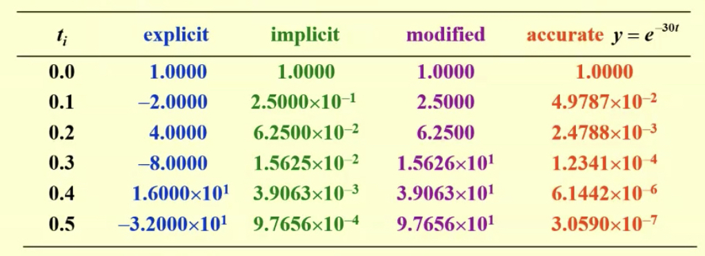

<!--more-->

# 1. The Elementary Theory of Initial-Value Problems(IVP)

一阶常微分方程的初值问题

$$\begin{aligned}\frac{dy}{dx}&=f(t,y)&t\in[a,b]\\ y(a)&=\alpha \end{aligned}$$

Compute the approximations of $y(t)$ at a set of (usually equally-spaced) mesh points $a=t_0<t_1<\cdots<t_n=b$. 

也就是说，计算$w_i\approx y(t_i)=y_i,i=1,\cdots,n$

 

下面给出一些定义和定理

`definition`{:.warning}

**Lipschitz condition**: A function $f(t,y)$ is said to satisfy a Lipschitz condition in the variable $y$ on a set $D\subset R^2$ if a constant $L>0$ exists with

$$\vert f(t,y_1)-f(t,y_2)\vert \leq L\vert y_1-y_2\vert$$

Whenever $(t,y_1),(t,y_2)\in D$. The constant $L$ is called a **Lipschitz constant** for $f$. (相当于导数有界)

> 李普希兹连续就是说，一块地不仅没有河流什么的玩意儿阻隔，而且这块地上没有特别陡的坡。其中最陡的地方有多陡呢？这就是所谓的李普希兹常数。
> 悬崖的出现导致最陡的地方有“无穷陡”，所以不是李普希兹连续。
>
> <a href="https://www.zhihu.com/question/51809602">ref</a>

 

`Theorem`{:.error}

Suppose that $D=\{(t,y)\vert a\leq t\leq b,-\infty<y<\infty\}$ and that $f(t,y)$ is continuous on $D$. If $f$ satisfies a Lipschitz condition on $D$ in the variable $y$, then the IVP

$$y'(t)=f(t,y),a\leq t\leq b,y(a)=\alpha$$

has a unique solution $y(t)$ for $a\leq t\leq b$

 

`Definition`{:.warning}

The IVP:

$$y'(t)=f(t,y),a\leq t\leq b,y(a)=\alpha$$

is said to be a well-posed problem if:

1. 该问题存在唯一解$y(t)$

2. 一个小扰动对问题的解产生的影响也很小。

   For any $\varepsilon>0$, there exists a positive constant $k(\varepsilon)$, such that whenever $\vert\varepsilon_0\vert<\varepsilon$ and $\delta(t)$ is continuous with $\vert\delta(t)\vert<\varepsilon$ on $[a,b]$, a unique solution, $z(t)$, to

$$z'(t)=f(t,z)+\delta(t),a\leq t\leq b, z(a)=\alpha+\varepsilon_0$$

exists with $\vert z(t)-y(t)\vert <k(\varepsilon)\varepsilon$, for all $a\leq t\leq b$

# 2. Euler's Method

$$\begin{aligned}\frac{dy}{dx}&=f(t,y)&t\in[a,b]\\ y(a)&=\alpha \end{aligned}$$

Compute the approximations of $y(t)$ at a set of (usually equally-spaced) mesh points $a=t_0<t_1<\cdots <t_n=b$

 

$$y(t_{i+1})=y(t_i)+(t_{i+1}-t_i)y'(t_i)+\frac{(t_{i+1}-t_i)^2}{2}y''(\xi_i)$$

for some number $\xi_i\in[t_i,t_{i+1}]$. Because $h=t_{i+1}-t_i$

We have:

$$y(t_{i+1})=y(t_i)+hy'(t_i)+\frac{h^2}{2}y''(\xi_i)$$

Because $\frac{dy}{dx}=f(t,y)$

$$y(t_{i+1})=y(t_i)+hf(t_i,y(t_i))+\frac{h^2}{2}y''(\xi_i)$$

 

Euler's method constructs $w_i\approx y(t_i)=y_i$ for $i=1,\cdots, n$, by ***deleting the remainder term***:

Difference equation:

{:.success}

$$w_0=\alpha, w_{i+1}=w_i+hf(t_i,w_i)\quad (i=0,\cdots,n-1)$$

Example: Use an algorithm for Euler’s method to approximate the solution to

$$y'=y-t^2+1,0\leq t\leq 2,y(0)=0.5$$

at $t=2$. $h = 0.5$

Solution:

$f(t,y)=y-t^2+1$

$w_0=y(0)=0.5$

$w_1=w_0+hf(t,w_0)=0.5+0.5(1.5)=1.25$

$w_2=w_1+hf(t,w_1)=2.25$

$w_3=w_2+hf(t,w_2)=3.375$

and 

$y(2)\approx w_4=w_3+hf(t,w_3)=4.4375$

 

## Error Bounds

`Theorem`{:.error}

假设函数$f$在区间$D=\{(t,y)\vert a\leq t\leq b,\infty<y<\infty\}$上连续并且满足Lipschitz condition with constant $L$, 并且存在常数$M$, 使得对于所有$a\leq t\leq b$, 有$\vert y''(t)\vert\leq M$。令$y(t)$为IVP $y'(t)=f(t,y),a\leq t\leq b$ 的唯一解,$y(a)=\alpha$, 并且$w_0,w_1,\cdots,w_n$为Euler's method生成的近似值。那么对于$i=0,1,\cdots,n$

$$\vert y_i-w_i\vert \leq \frac{hM}{2L}[e^{L(t_i-a)}-1]$$

证明：

$$y(t_{i+1})=y(t_i)+hy'(t_i)+\frac{h^2}{2}y''(\xi_i)$$

通过Euler's method得到的

$$w_{i+1}=w_i+hf(t_i,w_i)$$

So

$$y_{i+1}-w_{i+1}=y_i-w_i+h[f(t_i,y_i)-f(t_i,w_i)]+\frac{h^2}{2}y''(\xi_i)$$

Hence

$$\vert y_{i+1}-w_{i+1}\vert=\vert y_i-w_i\vert +h\vert f(t_i,y_i)-f(t_i,w_i)\vert+\frac{h^2}{2}\vert y''(\xi_i)\vert$$

接下来我们对这个式子中的项进行处理

* 因为$f$满足Lipschitz condition

$$\vert f(t_i,y_i)-f(t_i,w_i)\vert\leq L\vert y_i-w_i\vert$$

* 因为$\vert y''(t)\vert\leq M$

$$\vert {y''(\xi_i)}\vert\leq M$$

综上：

$$\vert y_{i+1}-w_{i+1}\vert \leq (1+hL)\vert y_i-w_i\vert +\frac{h^2M}{2}$$

根据<a href="#lemma2">lemma 2</a>, 得到

$$\vert y_{i+1}-w_{i+1}\vert \leq e^{(i+1)hL}(\vert y_0-w_0\vert+\frac{h^2M}{2hL})-\frac{h^2M}{2hL}$$

因为$\vert y_0-w_0\vert=0$，$(i+1)h=t_{i+1}-t_0=t_{i+1}-a$, 所以

$$\vert y_{i+1}-w_{i+1}\vert \leq \frac{hM}{2L}(e^{(t_{i+1}-a)L}-1)$$

 

Note: $y''(t)$ can be computed without explicitly knowing $y(t)$

$$y''(t)=\frac{d}{dt}y'(t)=\frac{d}{dt}f(t,y(t))=\frac{\partial}{\partial t}f(t,y(t))+\frac{\partial}{\partial y}f(t,y(t))\cdot f(t,y(t))$$

 

The roundoff error

$w_0=\alpha+\delta_0$

$w_{i+1}=w_i+hf(t_i,w_i)+\delta_{i+1},(i=0,\cdots,n-1)$

`Theorem`{:.error}

Let $y(t)$ denote the unique solution to the  IVP 

$$y'(t)=f(t,y), a\leq t\leq b,y(a)=\alpha$$

and $w_0,w_1,\cdots,w_n$ be the approximations obtained using hte above difference equations. If $\vert\delta_i\vert<\delta$ for $i=0,1,\cdots,n$, then for each $i$

$$\vert y_i-w_i\vert\leq \frac{1}{L}(\frac{hM}{2}+\frac{\delta}{h})[e^{L(t_i-a)}-1]+\vert\delta_0\vert e^{L(t_i-a)}$$

现在error bound和h不再呈现线性关系，事实上

$$\underset{h\rightarrow 0}{lim}(\frac{hM}{2}+\frac{\delta}{h})=\infty$$

当$h=\sqrt{\frac{2\delta}{M}}$时取到最小值

但是通常$\delta$都是非常非常小的, h的这个lower bound通常不会产生影响.

 

# 3. Higher Order Taylor Methods

`Definition`{:.warning}

The difference method

$$\begin{aligned}w_0&=\alpha\\ w_{i+1}&=w_i+h\phi(t_i,w_i)\end{aligned}$$

for each $i=0,1,\cdots,n-1$

has local truncation error: 可以认为是单位区间的误差

$\tau_{i+1}(h)=\frac{y_{i+1}-(y_i+h\phi(t_i,y_i))}{h}=\frac{y_{i+1}-y_i}{h}-\phi(t_i,y_i)$

for each $i=0,1,\cdots,n-1$

{:.warning}

事实上，local truncation error就是$\frac{remainder}{h}$。 你品，你细品

 

对于Euler's method

$$\tau_{i+1}(h)=\frac{y_{i+1}-y_i}{h}-f(t_i,y_i)$$

因为真实值$y(t_{i+1})=y(t_i)+hf(t_i,y(t_i))+\frac{h^2}{2}y''(\xi_i)$

因此

$$\tau_{i+1}(h)=\frac{h}{2}h''(\xi_i)$$

如果有条件$\vert y''(t)\vert \leq M$

那么

$$\vert \tau_{i+1}(h)\vert\leq \frac{h}{2}M$$

也就是说Euler's method的local truncation error是$O(h)$的

那如果要达到$O(h^p)$的local truncation error要怎么做呢？

 

## Taylor method of order n

考虑n阶泰勒展开

$y_{i+1}=y_i+hf(t_i,y_i)+\frac{h^2}{2}f'(t_i,y_i)+\cdots+\frac{h^n}{n!}f^{(n-1)}(t_i,y_i)+\frac{h^{n+1}}{(n+1)!}f^{(n)}(\xi_i,y(\xi_i))$

给出Taylor method of order n:

$$\begin{aligned}w_0&=\alpha\\ w_{i+1}&=w_i+hT^{(n)}(t_i,w_i)\end{aligned}$$

其中$i=0,1,\cdots,n-1$

$$T^{(n)}(t_i,w_i)=f(t_i,w_i)+\frac{h}{2}f'(t_i,w_i)+\cdots+\frac{h^{n-1}}{n!}f^{(n-1)}(t_i,w_i)$$

{:.error}

我觉得直接写成$w_{i+1}=w_i+hf(t_i,w_i)+\frac{h^2}{2}f'(t_i,w_i)+\cdots+\frac{h^n}{n!}f^{(n-1)}(t_i,w_i)$比较好记，相当于泰勒展开，其中$f^{(n)}$为$y$的$n+1$次导

那么local truncation error:

$\tau_{i+1}(h)=\frac{y_{i+1}-(y_i+hT^{(n)}(t_i,y_i))}{h}=\frac{y_{i+1}-y_i}{h}-T^{(n)}(t_i,y_i)=\frac{h^{n+1}}{(n+1)!}f^{(n)}(\xi_i,y(\xi_i))$

因此如果$y\in C^{n+1}[a,b]$, local truncation error为$O(h^n)$

Example:

Apply Taylor's method of orders (a) two and (b) four with $N = 10$ to the initial-value problem

$$y'=y-t^2+1,0\leq t\leq 2,y(0)=0.5$$

(a)

$f(t,y(t))=y(t)-t^2+1$

$f'(t,y(t))=\frac{d}{dt}(y-t^2+1)=y'-2t=y(t)-t^2+1-2t$

所以

$T^{(2)}(t_i,w_i)=f(t_i,w_i)+\frac{h}{2}f'(t_i,w_i)=w_i-t_i^2+1+\frac{h}{2}(w_i-t_i^2+1-2t_i)$

$=(1+\frac{h}{2})(w_i-t_i^2+1)-ht_i$

因为$N=10$, 因此我们有$h=0.2,t_i=0.2i$, 其中$i=1,2,\cdots,10$

$$\begin{aligned}w_0&=0.5\\w_{i+1}&=w_i+h[(1+\frac{h}{2})(w_i-t_i^2+1)-ht_i]\\&=1.22w_i-0.0088i^2-0.008i+0.22 \end{aligned}$$

然后计算

(b)

$f(t,y(t))=y(t)-t^2+1$

$f'(t,y(t))=\frac{d}{dt}(y-t^2+1)=y'-2t=y(t)-t^2+1-2t$

$f''(t,y(t))=\frac{d}{dt}(y-t^2+1-2t)=y'-2t-2=y-t^2-2t-1$

$f'''(t,y(t))=\frac{d}{dt}(y-t^2-2t-1)=y'-2t-2=y-t^2-2t-1$

因此

$$\begin{aligned}T^{(4)}(t_i,w_i)&=f(t_i,w_i)+\frac{h}{2}f'(t_i,w_i)+\frac{h^2}{6}f''(t_i,w_i)+\frac{h^3}{24}f'''(t_i,w_i)\\&=w_i-t_i^2+1+\frac{h}{2}(w_i-t_i^2+1-2t_i)+\frac{h^2}{6}(w_i-t_i^2-2t_i-1)+\frac{h^3}{24}(w_i-t^2-2t-1)\\&=(1+\frac{h}{2}+\frac{h^2}{6}+\frac{h^3}{24})(w_i-t_i^2)-(1+\frac{h}{3}+\frac{h^3}{12})(ht_i)+1+\frac{h}{2}-\frac{h^2}{6}-\frac{h^3}{24} \end{aligned}$$

因此

$$\begin{aligned}w_0&=0.5\\w_{i+1}&=w_i+h[(1+\frac{h}{2})(w_i-t_i^2+1)-ht_i]\\&=(1+\frac{h}{2}+\frac{h^2}{6}+\frac{h^3}{24})(w_i-t_i^2)-(1+\frac{h}{3}+\frac{h^3}{12})(ht_i)+1+\frac{h}{2}-\frac{h^2}{6}-\frac{h^3}{24} \end{aligned}$$

# 4. Other Euler's Method

### A. Implicit Euler's method

$y'(t_0)\approx \frac{y(t_0)-y(t_0-h)}{h}$

$y'(t_1)=\frac{y(t_1)-y(t_0)}{h}$

$\Rightarrow y(t_1)\approx y(t_0)+hy'(t_1)=\alpha+hf(t,y(t_1))$

因此，得到difference equation

$$\begin{aligned}w_0&=\alpha\\w_{i+1}&=w_i+hf(t_{i+1},w_{i+1}) \end{aligned}$$

一般，都会先用之前的Explicit Euler's method得出$w_{i+1}$的initial value

也就是说，写成

$$\begin{aligned}w_0&=\alpha\\w_{i+1}&=w_i+hf(t_{i+1},w_i+hf(t_i,w_i)) \end{aligned}$$

### B. Trapezoidal Method

就是将两个端点的导数平均了一下

$$\begin{aligned}w_0&=\alpha\\w_{i+1}&=w_i+\frac{h}{2}[f(t_i,w_i)+f(t_{i+1},w_{i+1})] \end{aligned}$$

local truncation error $O(h^2)$. 

An implicit equation has to be solved iteratively.

$$\begin{aligned}w_0&=\alpha\\w_{i+1}&=w_i+\frac{h}{2}[f(t_i,w_i)+f(t_{i+1},w_i+hf(t_i,w_i))] \end{aligned}$$

### C. Double-step Method

$y(t_0+h)=y(t_0)+hy'(t_0)+\frac{h^2}{2}y''(\xi_1)$

$y(t_0-h)=y(t_0)-hy'(t_0)+\frac{h^2}{2}y''(\xi_2)$

因此

$y(t_0+h)-y(t_0-h)=2hy'(t_0)+\frac{h^2}{2}(y''(\xi_1)-y''(\xi_2))$

$$y'(t_0)=\frac{1}{2h}[y(t_0+h)-y(t_0-h)]-\frac{h^4}{4}y'''(\xi)$$

因此

$y(t_2)\approx y(t_0)+2hf(t_1,y(t_1))$

$$\begin{aligned}w_0&=\alpha\\w_{i+1}&=w_{i-1}+2hf(t_i,w_i) \end{aligned}$$

# 5. Runge-Kutta Method

事实上，前面所述的euler's method或者高阶方法，他们每一步用到的信息都只有前面一个点的值，但是如果能够利用更多的点，可能就能获得更高的精度。

 

Check the modified Euler's method:

$$\begin{aligned} w_{i+1}&=w_i+h[\frac{1}{2}K_1+\frac{1}{2}K_2]\\ K_1&=f(t_i,w_i)\\ K_2&=f(t_i+h,w_i+hK_1) \end{aligned}$$

 

Generalize it to be:

$$\begin{aligned} w_{i+1}&=w_i+h[\lambda_1 K_1+\lambda_2 K_2]\\ K_1&=f(t_i,w_i)\\ K_2&=f(t_i+ph,w_i+phK_1) \end{aligned}$$

对$y$求二阶导

$$\begin{aligned} y''(t)&=\frac{d}{dt}f(t,y)\\&=f_t(t,y)+f_y(t,y)\frac{dy}{dt}\\ &=f_t(t,y)+f_y(t,y)f(t,y) \end{aligned}$$

Step1: Write the Taylor expansion of $K_2$ at $(t_i,y_i)$

$$\begin{aligned} K_2&=f(t_i+ph,y_i+phK_1)\\ &=f(t_i,y_i)+phf_t(t_i,y_i)+phf_y(t_i,y_i)f(t_i,y_i)+O(h^2)\\&=y'(t_i)+phy''(t_i)+O(h^2) \end{aligned}$$

Step2: 将 $K_2$ 代入第一个方x程

$$\begin{aligned}w_{i+1}&=y_i+h\{\lambda_1y't(_i)+\lambda_2[y'(t_i)+phy''(t_i)+O(h^2)] \}\\&=y_i+(\lambda_1+\lambda_2)hy'(t_i)+\lambda_2ph^2y''(t_i)+O(h^3) \end{aligned}$$

Step3: Find $\lambda_1,\lambda_2$ and $p$ 使得$\tau_{i+1}=\frac{y_{i+1}-w_{i+1}}{h}=O(h^2)$

我们要使得该式子符合泰勒展开，则

$$\begin{aligned}w_{i+1}&=y_i+(\lambda_1+\lambda_2)hy'(t_i)+\lambda_2ph^2y''(t_i)+O(h^3)\\y_{i+1}&=y_i+hy'(t_i)+\frac{h^2}{2}y''(t_i)+O(h^3) \end{aligned}$$

因此，

$$\lambda_1+\lambda_2=1,\lambda_2p=\frac{1}{2}$$

3个未知数，两个方程，有无数解

### 高阶Runge-Kutta

$$\begin{aligned}w_{i+1}&=y_i+h[\lambda_1K_1+\lambda_2K_2+\cdots+\lambda_mK_m]\\K_1&=f(t_i,w_i)\\K_2&=f(t_i+\alpha_2h,w_i+\beta_{21}hK_1)\\&\vdots\\K_m&=f(t_i+\alpha_mh,w_{i} +\beta_{m1} hK_1+\beta_{m2}hK_2+\cdots+\beta_{m\;m-1}hK_{m-1}) \end{aligned}$$

Classical Runge-Kutta Order 4 Method: the most popular one

$$\begin{aligned}w_{i+1}&=y_i+\frac{h}{6}[K_1+2K_2+2K_3+K_4]\\K_1&=f(t_i,w_i)\\K_2&=f(t_i+\frac{h}{2},w_i+\frac{h}{2}K_1) \\ K_3&=f(t_i+\frac{h}{2},w_i+\frac{h}{2}K_2)\\ K_4&=f(t_i+h,w_i+hK_3) \end{aligned}$$

Homework: Use the Modified Euler method to approximate the solutions to each of the following initial-value problems, and compare the results to the actual values.

$y'  = te^{3t} − 2y, 0 \leq t \leq 1$, $y(0) = 0$, with $h = 0.5$

{:.success}

个人认为rk在$t_i, t_{i+1}$中间插了这么多点, 但是这些中间点的函数值本质上依赖于$t_i$的函数值。所以我感觉和在$t_i$点泰勒展开没啥区别，但是泰勒展开要计算高阶导数，而rk只是用这些插值点代替了导数的计算

# 6. Multistep Methods

前面的方式我们每次计算$w_i$都只用到了$w_{i-1}$这一个信息，但事实上，我们可以用$w_{i-1},w_{i-2},\cdots,w_0$等信息

而且事实上error $\vert w_j-y(t_j)\vert$是随着j的增大而增大的，看起来似乎更应该用靠前的$w_j$

 

因此我们给出**m-step multistep method**

$$w_{i+1}=a_{m-1}w_i+a_{m-2}w_{i-1}+\cdots+a_0w_{i+1-m}+h[b_mf(t_{i+1},w_{i+1})+b_{m-1}f(t_i,w_i)+\cdots +b_0f(t_{i+1-m},w_{i+1-m})]$$

初值

$$w_0=\alpha,w_1=\alpha_1,\cdots,w_{m-1}=\alpha_{m-1}$$

如果$b_m\not=0$, 那么这个方法就是隐式方法

否则，就是显式方法。

 

接下来我们推导multistep method

IVP:

$$y'=f(t,y), a\leq t\leq b, y(a)=\alpha$$

在区间$[t_i,t_{i+1}]$上积分

$$y(t_{i+1})-y(t_i)=\int_{t_i}^{t_{i+1}}y'(t)dt=\int_{t_i}^{t_{i+1}}f(t,y(t))dt$$

因此

$$y(t_{i+1})=y(t_i)+\int_{t_i}^{t_{i+1}}f(t,y(t))dt$$

但是，因为我们不知道$y(t)$的表达式，无法做积分。因此我们想找$f(t,y(t))$的一个插值多项式$P(t)$来做积分

有一些data points $(t_0,w_0),(t_1,w_1),\cdots,(t_i,w_i)$。假定$y(t_i)\approx w_i$, 那么

$$y(t_{i+1})\approx w_i+\int_{t_i}^{t_{i+1}}P(t)dt$$

### Adams-Bashforth explicit m-step technique

Use the Newton backward-difference formula to interpolate on $(t_i,f_i), (t_{i-1},f_{i-1}),\cdots,(t_{i+1-m},f_{i+1-m})$ and obtain $P_{m-1}(t)$. Or let $t=t_i+sh$, then $s\in[0,1]$ and we have

$$\int_{t_i}^{t_{i+1}}f(t,y(t))dt=h\int_0^1P_{m-1}(t_i+sh)ds+h\int_0^1R_{m-1}(t_i+sh)ds$$

$\Rightarrow$ Explicit formula

$$w_{i+1}=w_i+h\int_0^1 P_{m-1}(t+sh)ds$$

Derive the Adams-Bashforth 2-step explicit method

Use the Newton backward-difference formula to interpolate $f$ on $(t_i,f_i)$ and $(t_{i-1},f_{i-1})$

$$P_1(t_i+sh)=f_i+s\nabla f_i=f_i+s(f_i-f_{i-1})$$

因此

$$w_{i+1}=w_i+h\int_0^1 [f_i+s(f_i-f_{i-1})]ds=w_i+\frac{h}{2}(3f_i-f_{i-1})$$

The local truncation error is:

$\tau_{i+1}=\frac{y(t_{i+1})-w_{i+1}}{h}=\int_0^1 R_1(t_i+sh)ds$

$=\int_0^1 \frac{d^2 f(\xi_i,y(\xi_i))}{dt^2}\frac{1}{2!}(sh)(s+1)h=\frac{5}{12}h^2y'''(\xi_i)$

{:.warning}

In general, $\tau_{i+1}=A_mh^my^{(m+1)}(\xi_i)$. $A_m$以及$f_i,f_{i-1},\cdots,f_{i+1-m}$的系数都可以查表得到

比如Adams-Bashforth Fourth-Step Explicit Method:

$$w_{i+1}=w_i+\frac{h}{24}(55f_i-59f_{i-1}+37f_{i-2}-9f_{i-3})$$

### Adams-Moulton implicit m-step technique

Use the Newton forward-difference formula to interpolate $f$ on $(t_{i+1},f_{i+1}),(t_i,f_i),\cdots,(t_{i+1-m}, f_{i+1-m})$ and obtain $P_m(t)$

$\tau_{i+1}=B_mh^{m+1}y^{(m+2)}(\xi_i)$

比如, Adams-Moulton Three-Step Implicit Method

$$w_{i+1}=w_i+\frac{h}{24}(9f_{i+1}+19f_i-5f_{i-1}+f_{i-2})$$

# 7. Higher-Order Equations and Systems of Differential Equations

考虑mth-order system of first-order IVP

$$\begin{aligned}u_1'(t)&=f_1(t, u_1(t),\cdots,u_m(t))\\u_2'(t)&=f_2(t,u_1(t),\cdots,u_m(t))\\\vdots\\u_m'(t)&=f_m(t,u_1(t),\cdots,u_m(t)) \end{aligned}$$

初值条件为$u_1(a)=\alpha_1,u_2(a)=\alpha_2,\cdots,u_m(a)=\alpha_m$

可以写成矩阵形式

$$\vec{y}=\left[\begin{matrix}u_1\\\vdots\\u_m\end{matrix}\right], \vec{f}=\left[\begin{matrix}f_1\\\vdots\\f_m\end{matrix}\right], \vec{\alpha}=\left[\begin{matrix}\alpha_1\\\vdots\\\alpha_m\end{matrix}\right]$$

原方程组可以写成

$$\begin{aligned}\vec{y} '(t)&=\vec{f}(t,\vec{y}) \\\vec{y}(a)&=\vec{\alpha}\end{aligned}$$

 

高阶微分方程，可以转换成一阶微分方程组

$$\begin{aligned}f^{(m)}(t)&=f(t,y,y',\cdots,y^{(m-1)}),a\leq t\leq b\\ y(a)&=\alpha_1,y'(a)=\alpha_2,\cdots,y^{(m-1)}(a)=\alpha_m \end{aligned}$$

如果令$u_1(t)=y(t), u_2(t)=y'(t),\cdots,u_m(t)=y^{(m-1)}(t)$

我们就可以得到方程组

$$\begin{aligned}u_1'&=y'=u_2\\u_2'&=y''=u_3\\\vdots\\ u_{m-1}'&=y^{(m-1)}=u_m\\ u_m'&=y^{(m)}=f(x,u_1,\cdots,u_m) \end{aligned}$$

初值条件为$u_1(a)=\alpha_1,u_2(a)=\alpha_2,\cdots,u_m(a)=\alpha_m$

Example: 使用modifies Euler's method to solve the following IVP using $h=0.1$

$y''-2y'+y=te^t-1.5t+1,0\leq t\leq 0.2$

$y(0)=0,y'(0)=-0.5$

Solution:

Modified Euler's method为

$$\begin{aligned} w_{i+1}&=w_i+h[\frac{1}{2}K_1+\frac{1}{2}K_2]\\ K_1&=f(t_i,w_i)\\ K_2&=f(t_i+h,w_i+hK_1) \end{aligned}$$

令$u_1=y(t),u_2=y'(t)$

可以写出方程组

$$\begin{aligned}u_1'&=y'=u_2\\ u_2'&=y''=te^t-1.5t+1-u_1(t)+2u_2(t) \end{aligned}$$

初值$u_1(0)=0, u_2(0)=-0.5$

因此

* round 1

$$\vec{K_1}(0)=\vec{f}(0,\vec{u}(0))=\left[\begin{matrix}-0.5\\0\end{matrix}\right]$$

$$\vec{K_2}(0)=\vec{f}(0.1,\left[\begin{matrix}-0.5\\0\end{matrix}\right])=\left[\begin{matrix}-0.5\\0.0105\end{matrix}\right]$$

$$\vec{u}(0.1)=\vec{u}(0)+0.05(\vec{K_1}(0)+\vec{K_2}(0))=\left[\begin{matrix}-0.05\\-0.4995\end{matrix}\right]$$

* round 2

$$\vec{K_1}(0.1)=\vec{f}(0.1,\vec{u}(0.1))=\left[\begin{matrix}-0.4995\\0.0115\end{matrix}\right]$$

$$\vec{K_2}(0.1)=\vec{f}(0.2,\left[\begin{matrix}-0.1000\\-0.4984\end{matrix}\right])=\left[\begin{matrix}-0.4984\\0.0475\end{matrix}\right]$$

$$\vec{u}(0.2)=\vec{u}(0.1)+0.05(\vec{K_1}(0.1)+\vec{K_2}(0.1))=\left[\begin{matrix}-0.0999\\-0.4966\end{matrix}\right]$$

 

# 8. Stability

`Definition`{:.warning}

A one-step difference equation method with local truncation error $\tau_i(h)$ is said to be consistent with the differential equation it approximates if

$$\underset{h\rightarrow 0}{lim}\;\underset{i\leq i\leq n}{max}\vert \tau_i(h)\vert = 0$$

 

For multistep methods it is also required that for $i=1,2,\cdots,m-1$

$$\underset{h\rightarrow 0}{lim}\vert w_i-y_i\vert=0$$

 

`Definition`{:.warning}

A one-step difference equaton method is said to be **convergent** with respect to the differential equation it approximates if 

$$\underset{h\rightarrow 0}{lim}\;\underset{i\leq i\leq n}{max}\vert w_i-y_i\vert = 0$$

`Definition`{:.warning}

简单说就是，初值有一个小的扰动，得到的结果也只有一个小的改变，这就是stable的

 

因此需要考虑改变一下输入，输出会变多少

Example: Use Euler's explicit and implicit methods, and on the modified Euler's method to solve IVP: $y'(t)=-30y(t),y(0)=1$, on the interval $[0,0.5]$ with $h=0.1$

# Appendix

<a name="lemma1">Lemma1</a>

For all $x\geq -1$ and any positive $m$, we have $0\leq (1+x)^m\leq e^{mx}$

证明：

泰勒展开

$$e^x=1+x+\frac{1}{2}x^2e^{\xi}$$

所以

$$0\leq 1+x\leq 1+x+\frac{1}{2}x^2e^{\xi}=e^x$$

因为$1+x\geq 0$，可以得到

$$0\leq (1+x)^m\leq (e^x)^m=e^{mx}$$

证毕！

 

<a name="lemma2">Lemma 2</a>

If $s$ and $t$ are positive real numbers, $\{a_i\}_{i=0}^k$ is a sequence satisfying $a_0\geq -\frac{t}{s}$, and 

$$a_{i+1}\leq (1+s)a_i+t$$

for each $i=0,1,\cdots,k-1$

then 

$$a_{i+1}\leq e^{(i+1)s}(a_0+\frac{t}{s})-\frac{t}{s}$$

证明

$$\begin{aligned}a_{i+1}&\leq (1+s)a_i+t\\&\leq (1+s)[(1+s)a_{i-1}+t]+t=(1+s)^2a_{i-1}+[1+(1+s)]t\\&\leq (1+s)^3a_{i-2}+[1+(1+s)+(1+s)^2]t\\&\vdots\\&\leq (1+s)^{i+1}a_0+[1+(1+s)+\cdots+(1+s)^i]t \end{aligned}$$

$1+(1+s)+\cdots+(1+s)^i=\frac{1-(1+s)^{i+1}}{1-(1+s)}=\frac{1}{s}[(1+s)^{i+1}-1]$

Thus

$$a_{i+1}\leq (1+s)^{i+1}a_0+\frac{1}{s}[(1+s)^{i+1}-1]t=(1+s)^{i+1}(a_0+\frac{t}{s})-\frac{t}{s}$$

根据前述<a href="#lemma1">lemma1</a>, 可以得到

$$a_{i+1}\leq e^{(i+1)s}(a_0+\frac{t}{s})-\frac{t}{s}$$

