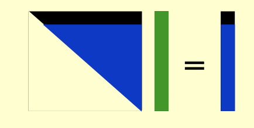
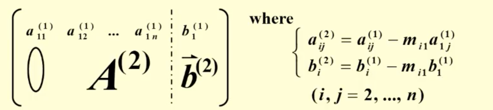
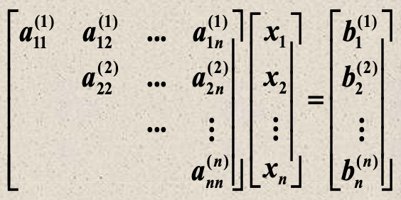

<!--more-->

Solve $AX=b$

# 1. Linear Systems of Equations

* Gaussian Elimination

First reduce A into an upper-triangular matrix, and then solve for the unknown by a backward-substitution process

Elimination: Let $A^{(1)}=A=(a_{ij}^{(1)})_{n\times n}, \vec{b}^{(1)}=\vec{b}=\left[\begin{matrix}b_1^{(1)}\\ \vdots \\ b_n^{(1)}\end{matrix}\right]$

Step 1: If $a_{11}^{(1)}\not= 0$, compute $m_{i1}=\frac{a_{i1}^{(1)}}{a_{11}^{(1)}}\;(i=2,\cdots,n)$

$row_i$ of the augmented matrix - $m_{i1}\times row_1$

Step k:   If $a_{kk}^{(k)}\not= 0$, compute $m_{ik}=\frac{a_{ik}^{(k)}}{a_{kk}^{(k)}}\;(i=k+1,\cdots,n)$

Backward-substitution: 

$x_n=\frac{b_n^{(n)}}{a_{nn}^{(n)}};\quad x_i=\frac{b_i^{(i)}-\sum_{j=i+1}^n a_{ij}^{(i)}x_j}{a_{ii}^{(i)}}\;\;(i=n-1,\cdots,1)$

#### Amount of Computation (count multiplications/divisions only)

* Elimination

$$(n-i)+(n-i)(n-i+1)=(n-i)(n-i+2)$$

$(n-i)$求$m_{i1}\quad (i={i+1,\cdots,n})$

$(n-i)(n-i+1)$代表有$n-i$行，每一行乘法计算是$(n-i+1)$    $+1$是因为要算b

总共 $\sum_{k=1}^{n-1}(n-k)(n-k+2)=\frac{n^3}{3}+\frac{n^2}{2}-\frac{5}{6}n$

* Backward-substitution

1: compute $x_n$

(n-i+1): compute $x_i$  因为$x_i=\frac{b_i^{(i)}-\sum_{j=i+1}^n a_{ij}^{(i)}x_j}{a_{ii}^{(i)}}$, 乘法$n-j=n-i$次，再加一次除法

所以总共$1+\sum_{i=1}^{n-1}(n-i+1)=\frac{n^2}{2}+\frac{n}{2}$

