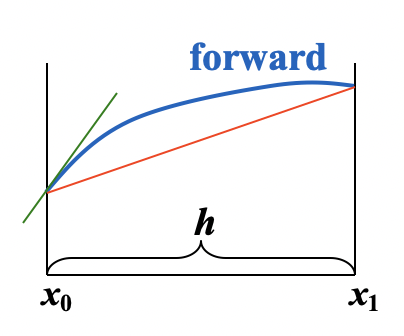
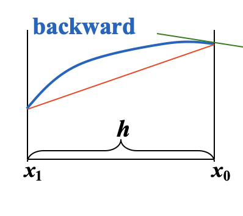

# Numerical Defferentiation and Integration

# 1. Numerical Differentiation

给定$x_0$, 近似$f'(x_0)$

$$f'(x_0)=\underset{h\rightarrow 0}{lim}\frac{f(x_0+h)-f(x_0)}{h}$$

 

* Forward

$$f'(x_0)\approx \frac{f(x_0+h)-f(x_0)}{h}$$

* Backward

$$f'(x_0)\approx\frac{f(x_0+h)-f(x_0)}{h}$$

Approximate $f(x)$ by its Lagrange polynomial with interpolating points $x_0$ and $x_0+h$

$f(x)=\frac{(x-(x_0+h))}{x_0-(x_0+h)}f(x_0)+\frac{x-x_0}{(x_0+h)-x_0}f(x_0+h)+\frac{f''(\xi_x)}{2}{(x-x_0)(x-x_0-h)}$

$f'(x)=\frac{f(x_0+h)-f(x_0)}{h}+\frac{2(x-x_0)-h}{2}f''(\xi_x)+\frac{(x-x_0)(x-x_0-h)}{2}\cdot \frac{d}{dx}[f''(\xi_x)]$

$\Rightarrow f'(x_0)=\frac{f(x_0+h)-f(x_0)}{h}-\frac{h}{2}f''(\xi)$

误差项就是$\frac{-h}{2}f''(\xi)$

不管什么插值方法，误差就是remainder求导

 

Given 3 points $x_0,x_0+h,x_0+2h$, please derive the three-point formulae for each of the points. Then give the best three-point formula for $f'(x)$

$f(x)=\frac{(x-(x_0+h))(x-(x_0+2h))}{(x_0-(x_0+h))(x_0-(x_0+2h))}f(x_0)+\frac{(x-x_0)(x-(x_0+2h))}{((x_0+h)-x_0)((x_0+h)-(x_0+2h))}f(x_0+h)$

$+\frac{(x-x_0)(x-(x_0+h))}{(x_0+2h-x_0)(x_0+2h-(x_0+h))}f(x_0+2h)+\frac{f^{(3)}(x)}{6}(x-x_0)(x-(x_0+h))(x-(x_0+2h))$

$f'(x_0)=\frac{1}{h}$

# Numerical Integration

