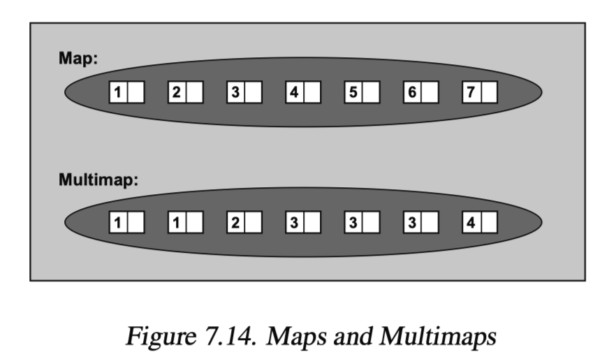
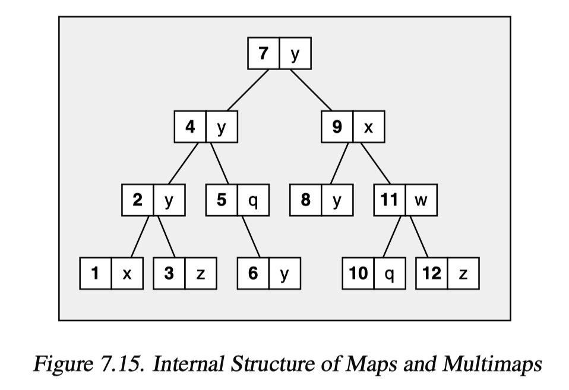

# Map and Multimap

map和multimap管理的元素是key/value pair。他可以根据key的排序准则自动为元素排序。

二者的区别是multimap允许重复元素，map不允许



使用map和multimap需要

```
#include<map>
```

map和multimap被定义为命名空间std内的class template

```cpp
namespace std {
  template <typename Key, typename T,
 						typename Compare = less<Key>,
  					typename Allocator = allocator<pair<const Key, T> > >
          class map;
  template <typename Key, typename T,
 						typename Compare = less<Key>,
  					typename Allocator = allocator<pair<const Key, T> > >
          class multimap;
}
```

参数：

* 第一个template实参将成为元素的key类型
* 第二个template实参将成为元素的value类型

> 他们需要满足两个条件
>
> 1. key和value都必须copyable或movable
> 2. 对制定的排序准则，key必须是comparable
>
> 元素类型是 pair<const Key, T>

* 第三个参数可有可无，用来定义Key的排序准则

<br>

## 1. Abilities of Maps and Multimaps

map/multimap通常用平衡二叉树完成。

通常set, multiset, map, multimap使用相同的内部结构，可以把set, multiset视为特殊的map和multimap



map和multima会根据元素的key自动对元素排序。

这样的结构决定了根据已知的key查找元素会有很好的效率；而根据已知value查找元素，效率会很糟糕

自动排序也限制了user不能直接改变元素的key, 要先删除拥有该key的元素，然后再插入拥有新key/value的元素。元素的value可以直接修改(如果不是常量的话)

# 2. 操作函数

## 2.1 create, copy and destroy

| 操作                    | 效果                                                         |
| ----------------------- | ------------------------------------------------------------ |
| **map** c               | default构造函数，建立空map/multimap, 不含任何元素            |
| **map** c(op)           | 建立一个空map/multimap, 以op为排序准则                       |
| **map** c(c2)           | copy构造函数，为相同类型的另一个map/multimap建立一份拷贝，所有元素均被复制 |
| **map** c = c2          | copy构造函数，为相同类型的另一个map/multimap建立一份拷贝，所有元素均被复制 |
| **map** c(rv)           | Move构造函数，建立一个新的map/multimap, 有相同类型，取rvalue rv的内容[暂时还不太懂move constructor] |
| **map** c = rv          | Move构造函数，建立一个新的map/multimap, 有相同类型，取rvalue rv的内容 |
| **map** c(beg, end)     | 以区间[beg, end]内的元素为初值，建立一个map/multimap         |
| **map** c(beg, end, op) | 以区间[beg, end]内的元素为初值，以op为排序准则，建立一个map/multimap |
| **map** c(initlist)     | 建立一个map/multimap， 以初值列initlist的元素为初值          |
| **map** c = initlist    | 建立一个map/multimap， 以初值列initlist的元素为初值          |
| c.~map()                | 销毁所有元素，释放内存                                       |

## 1.2 nomodifying operation

### A. 元素比较

元素比较只能用于类型相同的容器，也就是说两个容器的key, value, 排序准则都必须有相同的类型，否则会产生变异错误,如下

```cpp
int main() {
    map<float, string> c1;
    map<float, string, greater<float> > c2;
    
    if(c1 == c2) {
        cout << "true" << endl;
    }
}
```

<br>

| 操作           | 效果                                         |
| -------------- | -------------------------------------------- |
| c.key_comp()   | 返回comparison criterion                     |
| c.value_comp() | 返回value的comparison criterion              |
| c.empty()      | 返回容器是否为空(相当于size()==0,但也许更快) |
| c.size()       | 返回当前元素个数                             |
| c.max_size()   | 返回元素个数的最大可能量                     |
| c1 == c2       | 返回c1是否等于c2(相当于对每个元素调用==)     |
| c1 != c2       | 返回c1是否不等于c2                           |
| c1 < c2        | 返回c1是否小于c2                             |
| c1 > c2        |                                              |
| c1 <= c2       |                                              |
| c1 >= c2       |                                              |


### B. 特殊查找动作

| 操作               | 效果                                                         |
| ------------------ | ------------------------------------------------------------ |
| c.count(val)       | 返回key为val的元素个数                                       |
| c.find(val)        | 返回key为val的第一个元素，找不到就返回end()                  |
| c.lower_bound(val) | 返回key为val的元素的第一个可以安插的位置，也就是key>=val的第一个元素位置 |
| c.upper_bound(val) | 返回key为val的元素的最后一个可以安插的位置，也就是key>val的第一个元素的位置 |
| c.equal_range(val) | 返回key为val的元素第一个可以安插的位置和最后一个可以安插的位置 |

### C. 赋值

| 操作         | -                                           |
| ------------ | ------------------------------------------- |
| c = c2       | 将c2的全部元素赋值给c                       |
| c = rv       | 将rvalue rv的所有元素以move assign方式给予c |
| c = initlist | 将初值列initlist的所有元素赋值给c           |
| c1.swap(c2)  | 置换c1和c2的数据                            |
| swap(c1, c2) | 置换c1和c2的数据                            |

### D. 迭代器函数和元素访问

| 操作        | -                                                |
| ----------- | ------------------------------------------------ |
| c.begin()   |                                                  |
| c.end()     |                                                  |
| c.cbegin()  | 返回一个const bidirectional iterator指向第一元素 |
| c.cend()    |                                                  |
| c.rbegin()  | 返回一个反向的iterator指向反向迭代的第一元素     |
| c.rend()    |                                                  |
| c.crbegin() |                                                  |
| c.crend()   |                                                  |

在map和multimap中，所有元素的key都被视为常量。元素的失职类型是pair<const Key, T>

#### 循环访问map元素

1.

```cpp
map<string, float> coll;

for(auto elem& : coll) {
  cout << "Key:" << elem.first << "\t"
       << "value:" << elem.second << endl;
}
```

其中elem是个reference, 指向容器coll目前正在被处理的元素。因此elem的类型是pair<const string, float>

2. 

```cpp
map<string, float> coll;
map<string, float>::iterator pos;

for(pos = coll.begin(); pos != coll.end(); ++pos) {
  cout << "Key:" << elem->first << "\t"
       << "value:" << elem->second << endl;
}
```

3. 用lambda表达式来操作map元素

```cpp
map<string, float> coll;
for_each(coll.begin(), coll.end(), [](pair<const string, float>& elem) {elem.second += 10;});
```

可以不写pair<const string, float>

而改为:

map<string, float>::value_type

活着

decltype(coll)::value_type


### E. inserting and removing

| 操作                      | -                                                            |
| ------------------------- | ------------------------------------------------------------ |
| c.insert(val)             | 安插一个val拷贝，返回新元素位置                              |
| c.insert(pos, val)        | 安插一个val拷贝，返回新元素位置(pos是个提示，指出安插动作的查找起点) |
| c.insert(beg, end)        |                                                              |
| c.insert(initlist)        |                                                              |
| c.emplace(args)           |                                                              |
| c.emplace_hint(pos, args) |                                                              |
| c.erase(val)              | 移除与val相等的所有元素，返回被移除的元素个数                |
| c.erase(pos)              | 移除iterator位置pos上的元素                                  |
| c.erase(beg, end)         | 移除[beg, end)内的所有元素，无返回值                         |
| c.clear()                 | 移除所有元素，将容器清空                                     |


#### 插入

1. 以初值列的形式

```cpp
map<string, float> coll;
coll.insert({"otto", 22.3});
```

2. 运动value_type

```cpp
coll.insert(decltype(coll)::value_type("otto", 22.3));
```

3. 运用pair<>

```cpp
//use implicit conversion
coll.insert(pair<string, float>("otto", 22.3));
//use explicit conversion
coll.insert(pair<const string, float>("otto", 22.3));
```

4. 运用make_pair()

```cpp
coll.insert(make_pair("otto", 22.3))
```


#### 删除

```cpp
coll.erase(key);
//会返回被移除元素的个数
```

如果multimap内含重复元素，你无法使用erase()删除重复元素中的第一额，但是可以这么做

```cpp
multimap<string, float> coll;
auto pos = coll.find(key);
if(pos != coll.end()) {
  coll.erase(pos);
}
```

移除元素时，会出现危险的情况，如下

```cpp
map<string, float> coll;
for(auto pos = coll.begin(); pos != coll.end(); ++pos) {
  if(pos->second == value) {
    coll.erase(pos);
  }
}
```

{:.error}

对pos所指的元素调用erase(), 会使pos不再成为coll的一个有效迭代器。

C++11之后的解决方案是，erase总是返回一个迭代器指向其后继元素

```cpp
map<string, float> coll;
for(auto pos = coll.begin(); pos != coll.end();) {
  if(pos->second == value) {
    pos = coll.erase(pos);
  } else {
    ++pos;
  }
}
```

C++11之前的做法

```cpp
for(pos = coll.begin(); pos != coll.end(); ) {
  if(pos->second == value) {
    coll.erase(pos++);
  } else {
    ++pos;
  }
}
```

{:.success}

pos++会将pos移向下一个元素，但返回其原值(指向原位置)的一份拷贝。因此当erase()被调用，pos已经不再指向那个即将被移除的元素了

# 3. 将map视为关联式数组

| 操作      | -                                  |
| --------- | ---------------------------------- |
| c[key]    | 安插一个带着key的元素              |
| c.at(key) | 返回一个reference指向带着key的元素 |

* at()会依据他收到的key取得元素的value; 如果不存在这样的元素会抛出out_of_range异常

* coll["otto"]
  * 如果存在key为"otto"的元素，返回元素的reference
  * 如果没有任何元素的key是"otto", 会为map自动安插一个新元素，key为"otto", value由default构造函数完成，并返回一个reference指向新元素


